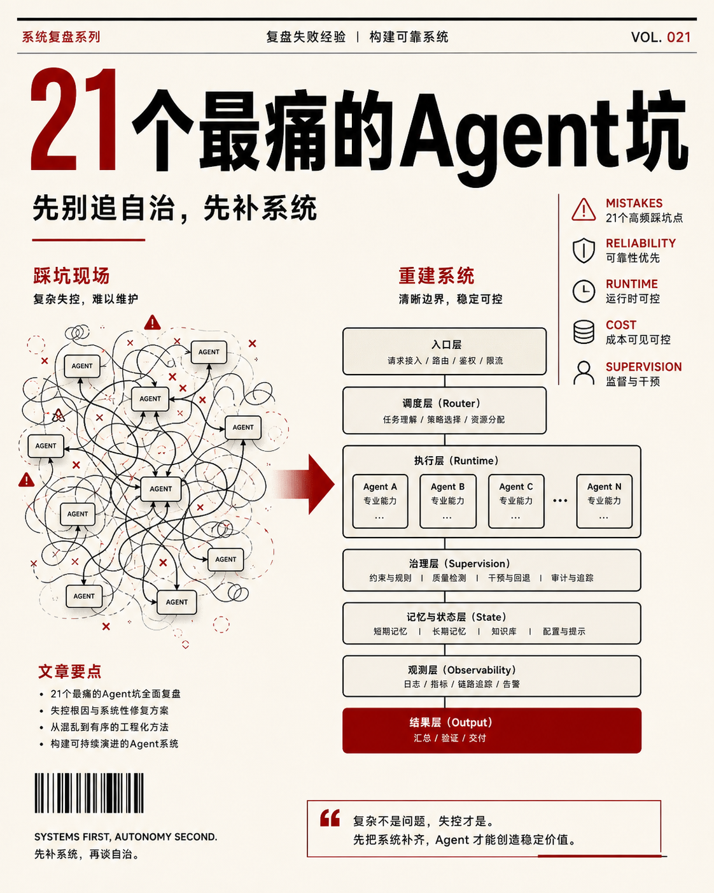
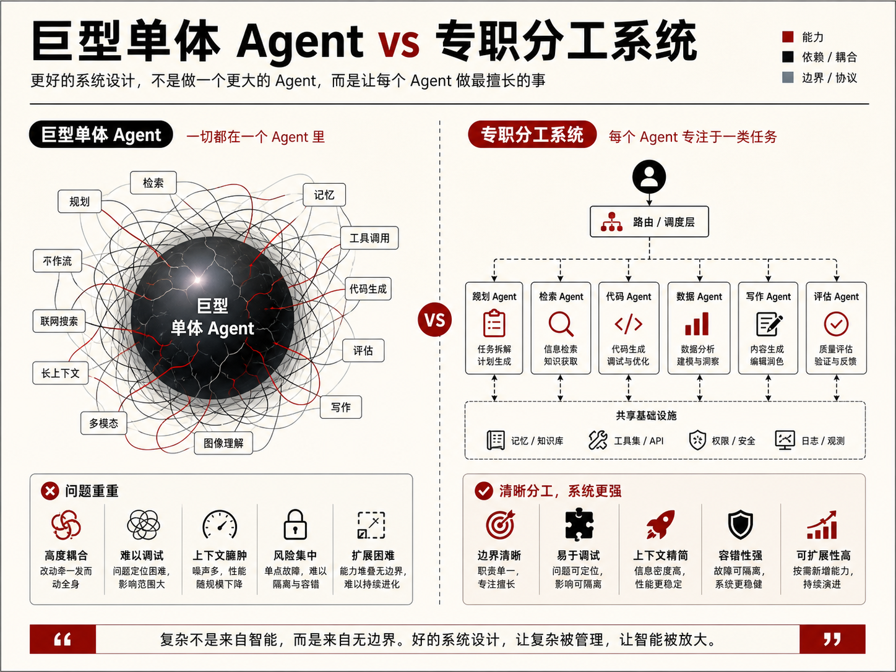
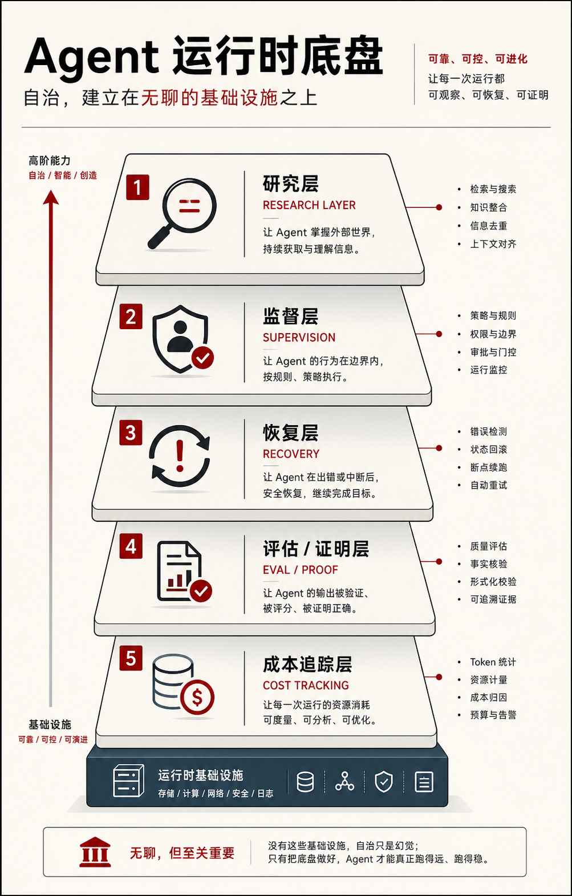
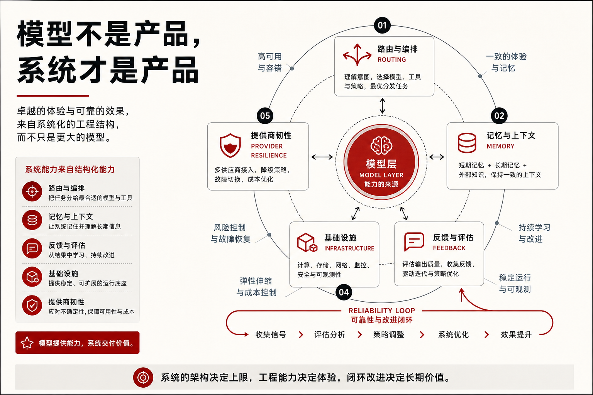

做 AI Agent 最容易发生的一件事，不是“做不出来”。

而是：

你很快就能做出一个“看起来能跑”的东西，  
然后开始在接下来的几周里，稳定地为它付出时间、信用额度和注意力税。

我最近越来越强烈地觉得，Agent 这件事真正难的，不是起步，而是绕坑。

因为很多坑都不是那种一眼能看出来的低级错误。  
它们通常长这样：

- 一开始还能跑
- demo 看起来也不错
- 甚至会让你误以为“已经快成了”

但只要使用频率一上来，问题就会一个接一个冒出来：

- 越用越贵
- 越跑越乱
- 越自动越不可控
- 越想扩展越发现底盘不稳

这篇原始内容里列了 21 条教训。  
如果逐条平铺开讲，会很像一串 checklist。

但我看完之后更强烈的感受是：

**这 21 个坑其实不是 21 个孤立错误，而是三类系统性误判。**

## 第一类错误：把 Agent 当成单体产品来堆

这是最常见、也最贵的一类错误。

很多人刚开始做 Agent，很自然会走向一个方向：

先把一个“大而全”的 agent 堆出来再说。

它什么都能做一点：

- 查资料
- 写代码
- 总结内容
- 跑流程
- 处理工具调用
- 做一点监督

表面上看，这样最省事。

但实际上一旦 agent 越来越肥，它就会越来越难：

- debug
- route
- 评估
- 信任
- 扩展

这也是为什么原文一上来就强调，不要做一个 giant agent。

更稳的做法通常是反过来：

**先把角色拆小，再把协作补上。**

也就是说，不是先造一个万能体，再想办法让它别失控；  
而是先定义几个职责清晰、ownership 明确的小 agent，再决定它们怎么配合。

这类分工有几个直接好处：

- 哪个 agent 出错，更容易定位
- 哪个 agent 该被替换，更容易决定
- 哪一层该升级模型，更容易判断
- 哪个 agent 该只读，哪个 agent 才能写，更容易控权

原文里还有几个相关提醒，其实都属于这一类：

- 不要给 agent 模糊目标
- 不要从 loose plans 直接开建
- 不要没有验收标准就让 agent 进实现
- 不要相信没有证据的输出

这些话本质上都在说同一件事：

**你不是在和一个聪明的聊天机器人合作，你是在调度一个会执行的系统。**

一旦是系统，就必须有角色边界、完成定义、验收条件和恢复逻辑。

否则所谓“自治”，很多时候只是把模糊放大而已。

## 第二类错误：太早追求自动化，太晚建设运行时

这是我觉得最容易被低估的一类错误。

很多人会天然地把 attention 放在“自动化”上。

比如：

- 自动抓数据
- 自动生成内容
- 自动跑工作流
- 自动修 bug
- 自动 self-build

这些听起来都很诱人。

但原文里真正值得反复看的，不是这些自动动作本身，而是作者一直在提醒你：

**不要让自治流程盲跑。**

因为只要流程一旦开始长时间运行，你真正缺的往往不是动作能力，而是运行时能力。

也就是：

- 研究层
- 监督层
- 恢复层
- 评估层
- 成本层

原文里有几条我觉得其实应该放在一起理解：

### 1. 不要先 auto-build，再去想 auto-think

这是一个很典型的顺序问题。

很多人一上来就想让系统自己搭系统。

但一个 self-building system 真正先需要的，是 self-thinking layer。

也就是它能不能先意识到：

- 哪个环节卡了
- 哪次运行失败了
- 哪个工具缺失
- 哪类错误在重复出现

如果没有这一层，自动化只会把错误自动化。

### 2. 不要把 scraping 当 research

这句话其实非常关键。

很多人会把 research 理解成：

- 抓链接
- 拉摘要
- 收文档

但这不叫 research。

这最多叫 scraping。

真正能进入 agent 系统的 research，应该是：

- 结构化
- 可验证
- 有来源
- 可以被下游 agent 调用

更重要的是，它不能只停在一个 doc 里。

它要进入工作流，变成别的 agent 的 input intelligence layer。

这一步如果没做，research agent 就不会变成系统资产，只会变成另一个内容堆积器。

### 3. 不要在没有监督和恢复的情况下跑自治循环

这是很多人后面觉得 agent “不稳定”的真正原因。

不是模型不强。  
不是 prompt 不好。  
而是根本没人盯运行时。

所谓 supervisor 或 runtime monitor 的价值，不是显得高级。

而是它能盯住：

- intended flow 和 actual flow 有没有偏离
- 某个节点失败后有没有回退
- 某些流程是不是在白白烧钱
- 某些错误是不是进入了重复循环

一旦你开始做 24/7 运行的 agent，cost tracking 也会立刻从“锦上添花”变成“基础设施”。

原文里那句很对：

**不要在没有成本追踪的情况下扩 autonomous loops。**

因为一旦系统进入常态化运行，真正危险的不是某次单独失败，而是你持续为低质量运行付费。

## 第三类错误：把模型能力当成产品能力

这是 AI 项目里一个极其常见的幻觉。

很多人会默认觉得，只要模型够强，系统自然会越来越好。

但原文里最成熟的一点恰恰在于，它不断提醒你：

**模型不是产品，模型只是系统里的一层。**

这也是为什么作者会反复讲这些事情：

- 不要把 frontier models 用在所有地方
- 不要依赖单一模型 / 单一 provider
- 不要忽视 local LLM
- 不要把别人的 setup 原封不动抄过来

这些看起来像几条分散建议，底层其实是一个判断：

**真正的产品能力，来自系统围绕模型搭出来的结构，而不是模型名字本身。**

这件事至少有四层现实含义。

### 1. 模型分层使用，才像工程

昂贵模型不应该什么活都做。

低风险扫描、摘要、粗分类、背景处理，可以用便宜模型或本地模型。  
真正困难的规划、debug、复杂推理，再上 frontier 模型。

这不是节俭。  
这是系统设计。

### 2. 多 provider 不是锦上添花，而是韧性

单一 provider 的问题非常现实：

- 宕机
- 限流
- 价格调整
- 质量漂移

只靠一个模型，看起来简单，实际上脆弱。

模型多样性真正提供的，不只是选择，而是生存性。

### 3. 本地模型不是“低配替代”，而是背景认知层

很多人一提 local LLM，默认是：

便宜，但弱。

这个理解太浅了。

本地模型真正重要的地方，不是和最强模型对比 benchmark。

而是它适合做：

- 24/7 背景运行
- 低成本筛查
- 持续监控
- 不间断认知层

一旦进入自治系统，这类 always-on layer 会非常关键。

### 4. 别人的 setup 不会替你长出自己的系统

这条其实很像最后的总提醒。

照抄别人 setup 的问题，不只是安全。

更大的问题是：

你会跳过本来应该通过亲手搭建才真正理解的那一段。

而 agent 系统偏偏就是一种：

**不亲手搭一遍，你就很难真正知道边界在哪、瓶颈在哪、适配点在哪的东西。**

所以“不要用别人的 setup 直接替代自己的系统”，这不是情怀建议。

它是工程建议。

## 这 21 个坑最后其实都指向同一个结论

如果把这份长清单再压缩，我觉得它真正想说的不是“别犯错”，而是：

**别把 Agent 当魔法，要把它当系统。**

一旦你把它当系统，很多判断就会变得更清晰：

- 不是先堆一个万能 agent，而是先拆角色和 ownership
- 不是先追自治，而是先补 research、supervision、recovery、cost
- 不是先追最强模型，而是先把 routing、memory、feedback、infra 搭好

这也是为什么原文里有一句我非常认同：

不要 chase AGI before reliability。

真正的魔法，往往出现在那些很无聊的基础设施补齐之后：

- clean inputs
- clear handoffs
- monitoring
- recovery
- evals
- cost control

这些东西看起来都不性感。

但没有它们，系统不会稳定；  
而一旦有了它们，很多原本看起来很难的事情，反而会自然变得可持续。

## 最后

如果你今天也在高频搭 Agent，我觉得最值得带走的一句话是：

**Agent 项目真正浪费你的，通常不是模型不够强，而是你太晚把它当成一个完整系统来看。**

所以真正该优先补的，不是更会写 prompt，也不是更快追新模型。

而是下面这些“听起来很无聊、实际上最贵”的东西：

- 角色分工
- research layer
- supervision
- runtime monitor
- acceptance criteria
- eval 与 proof
- 成本追踪
- provider 韧性
- local layer
- 持续维护与 weekly audit

当这些东西一层层补起来以后，你会慢慢发现：

Agent 真正的分水岭，不是“能不能跑起来”，而是“能不能长期可靠地跑下去”。  

而后者，永远比前者更值钱。
