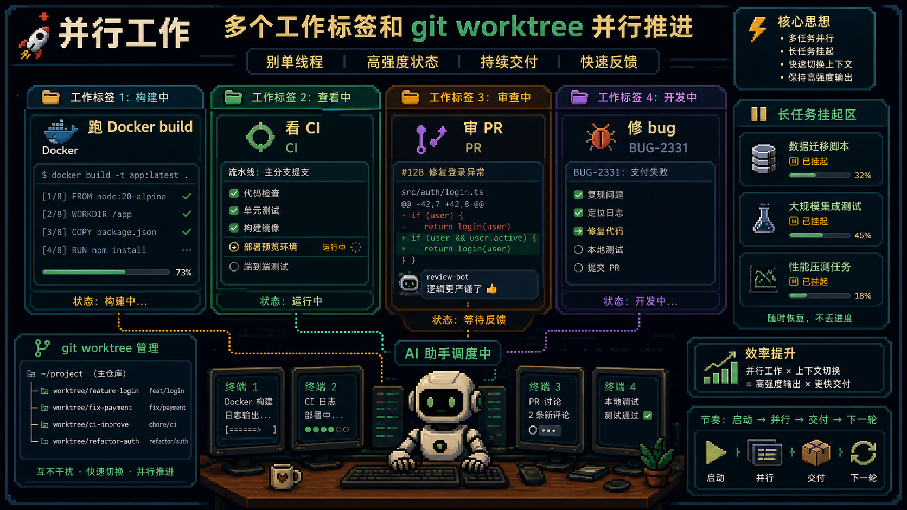

---
title: 'Claude Code 进阶：把那些人类不想盯着看的脏活累活交给 AI'
description: '基于一篇 Claude Code 高级技巧长文整理：真正高强度的 AI 工作流，不是让它多写代码，而是让它接手上下文管理、长任务等待、审查、验证和 DevOps 脏活。'
pubDate: 2026-05-18
category: AI与科技
tags:
  - Claude
  - AI Agent
  - AI工作流
draft: false
author: banghards
source: https://x.com/SuisPasDaVinci/status/2056222280665923793
heroImage: ../../assets/posts/cases/claude-code-advanced-dirty-work/cover.png
---

# Claude Code 进阶：把那些人类不想盯着看的脏活累活交给 AI

很多人使用 `Claude Code` 时最先看到的是写代码能力，但真正在工程里高频使用以后，你会发现它更大的价值，是替你接手那些人类根本不想盯着看的脏活累活。

比如长时间构建、CI 日志排查、PR 逐文件审查、上下文交接、输出验证和 `git bisect` 这类耐心活。

## AI 也会累：上下文必须主动管理

对话越长不一定越好。上下文一旦拖得太长，性能会下降，自动压缩还可能丢掉关键细节。

更成熟的做法是 handoff 文档：在上下文变重之前，让 Claude 先把当前状态、已做决策、关键文件和待办整理好，然后开一个新对话，只加载这份交接文档。

## 提示词要稳定，但要瘦

系统提示和 `CLAUDE.md` 不是越长越好。真正高频、稳定、必须的规则留在热路径里，其余拆到单独文档按需读取。

精简系统提示、控制 `CLAUDE.md` 体积、懒加载 MCP 工具，本质上都在做同一件事：给模型腾出生效空间。

## 进入高强度开发状态：并行而不是单线程

`git worktree` 和多标签页工作流的价值，是让多个任务真正隔离并并行推进。一个目录一个分支，一个标签一个现场，长任务挂着跑，短任务快速推进。

这不是“多开酷炫”，而是在把 AI 变成多个可持续工作的执行位。

## 最适合外包给 AI 的，其实是脏活

等待 Docker build、排查 CI、分析 PR、读日志、做回归定位，这些工作信息量大、机械重复、耗耐心，但又不能粗心。

Claude Code 在这些场景下特别强，因为它能做周期性检查、交互式审查和持续推进，不用人一直盯着终端。

## 真正自主的关键是验证闭环

只给任务，不给验证方式，AI 最后只能“感觉自己修好了”。

真正成熟的工作流，是先设计验证脚本，再让 Claude 自己跑、自己改、自己继续验证。`git bisect` 就是这类范式的代表。

高阶用法里，验证输出往往比生成输出更重要。

## 真正要学的不是技巧清单

这些技巧的共同指向只有一件事：把那些耗时、低成就感、机械重复、信息量大又不值得你亲自盯的工作系统性地分配给 AI。

当你开始这样分工时，Claude Code 才会真正从“代码聊天工具”变成工程搭子。

原文来源：[@SuisPasDaVinci](https://x.com/SuisPasDaVinci/status/2056222280665923793)

