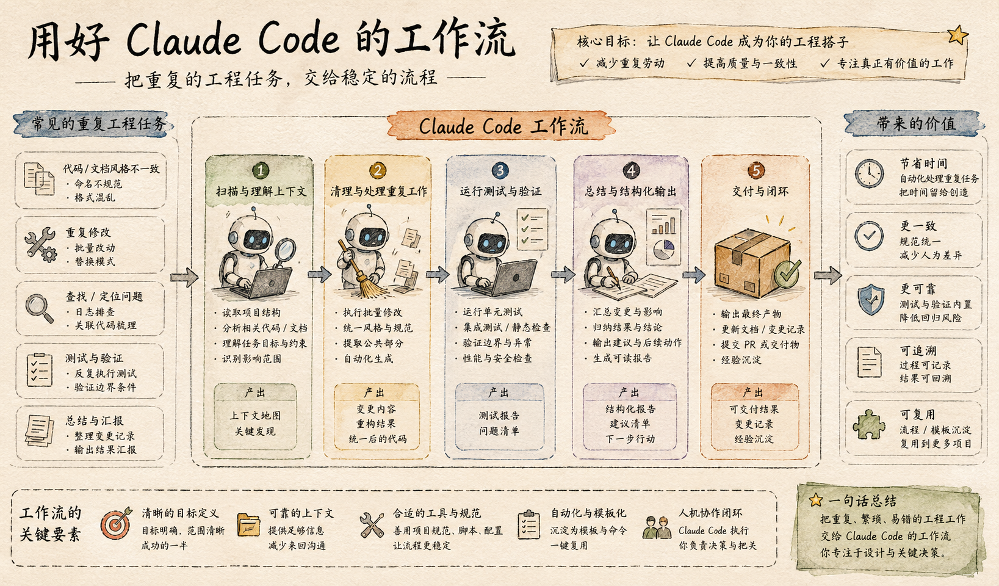
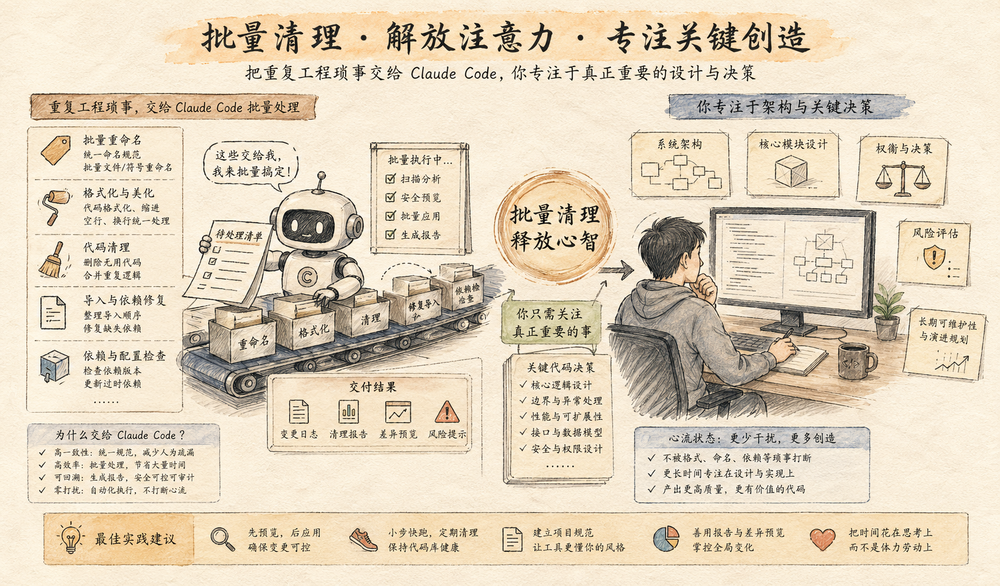

很多人刚开始用 `Claude Code`，最容易沉迷的是那种“它居然真能改代码”的新鲜感。

写个函数、改个 Bug、补个注释、顺手查个文件，确实已经很强。

但如果你真的每天都在用它，一段时间后会发现，真正最值钱的不是“它偶尔写出一段漂亮代码”，而是：

**它开始接手那些你明明会做、但真的很烦、很碎、很重复的 80% 枯燥工作。**

这篇文章，改写自 dev.to 上一篇关于 `Claude Code` 日常工作流的英文文，原标题是：

**5 Claude Code Workflows I Use Every Day for the Boring 80%**

我不准备照着原文逐段翻译，而是想把它整理成一个更适合中文读者快速吸收的版本。

因为这篇文章最值得学的，不是“作者具体敲了哪几条命令”，而是他已经把 Claude Code 用到了一个很成熟的阶段：

**不是偶尔叫 AI 来帮忙，而是让 AI 稳定接住那些重复、机械、容易打断注意力的日常链路。**

## 先说结论：Claude Code 最该接手的，不是难题，而是脏活累活

很多人直觉上会觉得，像 Claude Code 这种能力这么强的东西，最应该拿去解决高难度问题。

这当然没错。

但在真实工作里，真正最消耗人的，往往不是最难的 20%，而是那 80%：

- 到处翻文件找上下文
- 重复跑同样的检查
- 整理改动范围
- 写样板代码
- 补测试
- 做格式修正
- 把零散结果收拢成能交付的东西

这些事不一定难，但它们会持续打断节奏。

你每次都得自己切回来、自己补上下文、自己扫尾。

所以 Claude Code 真正高回报的用法，并不是“请它天降神力替你解决超级难题”，而是：

**把那些低判断密度、高重复度、会持续消耗心流的工作，系统性地交给它。**

## 为什么这类工作流最值得先搭

因为它们有 4 个共同特点：

1. 任务边界相对清楚
2. 成功标准容易判断
3. 错了也容易回滚
4. 一旦跑顺，就能反复复用

这意味着它特别适合作为日常工作流，而不是一次性表演。

如果你今天还在把 Claude Code 主要用成：

- “帮我写个函数”
- “帮我解释这段报错”
- “帮我看看这文件”

那其实还停留在“即时问答”层。

而这篇文章更有价值的地方，在于它提醒你：

**真正的生产力提升，不是问一次更聪明的问题，而是把一类问题变成稳定工作流。**

## 这 5 个工作流，基本覆盖了日常最烦的 80%

我把原文的思路重新整理后，觉得最适合中文开发者理解的，是下面这 5 类：

1. 先扫上下文，再动手修改
2. 先批量清理，再集中进入关键改动
3. 写代码的同时，把测试和验证接上
4. 把重复样板工作模板化
5. 把收尾工作交给 Claude Code

下面逐个说。

## 1. 先扫上下文，再动手修改

这是我觉得最容易立刻见效的一类。

很多人让 Claude Code 改东西时，习惯是直接说：

- 改这个组件
- 加这个字段
- 修这个接口

问题是，Claude 虽然能直接动，但如果没有先扫清上下文，它就容易只看局部，不看整体。

而真正成熟一点的做法，是先让它做一轮“轻量项目侦察”：

- 相关文件有哪些
- 调用链从哪里开始
- 数据结构在哪定义
- 哪些测试会受影响
- 有没有相似实现可以复用

也就是说，不是上来就写，而是先摸清地图。

### 这个工作流适合哪些场景

- 接手旧代码
- 改一个你自己也不熟的模块
- 改动可能影响多个文件
- 你想避免“改一处炸三处”

### 它真正省下来的是什么

不是“省下 5 分钟阅读代码”。

而是减少那种改到一半才发现理解错上下文、然后整段返工的成本。

## 2. 先批量清理，再集中进入关键改动

这是第二个非常值钱的习惯。

真实开发里，很多任务其实包含两部分：

- 一部分是低价值但必要的清理动作
- 一部分才是你真正该投入脑力的核心决策

比如：

- 调整 import
- 统一命名
- 批量格式修复
- 清掉废弃字段
- 替换旧 API 调用

这些动作本身不难，但如果你自己手动做，很容易把精力耗散掉。

更好的做法是：

**先让 Claude Code 把这些“施工前准备”做完，你再集中处理真正重要的逻辑。**

这类工作流的核心不是“让 AI 替你完成一切”，而是把你的注意力从杂务里解放出来。

## 3. 写代码的同时，把测试和验证接上

很多人用 Claude Code 最大的痛点不是“它不会写”，而是：

**它写完以后，你还得自己重新验证一轮。**

所以真正成熟的工作流，绝对不是“生成代码 -> 结束”。

而应该是：

`生成 -> 跑测试 -> 读报错 -> 修补 -> 再验证`

也就是说，让 Claude 不只是写，还要把反馈循环一并吃进去。

这件事的价值非常大。

因为一旦你把验证链接进去，Claude Code 就不再只是“输出内容”，而是在一个闭环里工作。

### 适合接入的验证动作

- 运行单测
- 跑 lint
- 类型检查
- 构建检查
- 读取失败日志
- 根据报错修复一轮

## 4. 把重复样板工作模板化

这是很多人一开始没意识到、但长期回报特别高的一类。

你会发现，很多日常任务虽然内容不同，但结构几乎一样。

比如：

- 新增一个 API endpoint
- 新加一个表单页
- 新写一个列表页
- 新补一套测试骨架
- 新做一个后台管理模块

这些工作不是完全没有思考，但其中很大一块其实是重复骨架。

如果每次都从零开始，你会不断把精力花在“复制那一套通用动作”上。

更高效的方式是把这类任务模板化，让 Claude Code 接手那部分重复结构。

### 这类模板通常包括

- 文件结构
- 命名规范
- 通用错误处理
- 基础校验逻辑
- 测试骨架
- 页面或接口的标准布局

## 5. 把收尾工作也交给 Claude Code

最后一个工作流，是很多人最容易低估的：

**收尾。**

很多开发任务真正让人烦的，不是中间实现，而是最后那些“必须做但很碎”的事：

- 整理改动说明
- 列出影响范围
- 写提交信息
- 总结测试结果
- 补一份变更说明
- 生成 reviewer 需要看的重点

如果这些都要你自己手工收拢，一天下来其实会非常消耗。

而 Claude Code 很适合接住这一层，因为它刚刚参与过整个过程，知道改了哪些文件、碰了哪些逻辑、跑了哪些检查。

### 它特别适合做的收尾动作

- 生成本次改动摘要
- 写 PR 描述初稿
- 列出潜在风险点
- 归纳测试覆盖情况
- 提醒还没做的后续工作

## 最后总结

如果你今天只记住一句话，我希望是这句：

**Claude Code 最该替你接手的，不是最炫的 20%，而是那 80% 你明明会做、但真的不值得亲自重复做的枯燥劳动。**

真正成熟的使用方式，不是不断追求“更神的单次输出”，而是慢慢把这些重复链路交出去：

- 先扫上下文
- 先做批量清理
- 把测试接进闭环
- 把样板变成模板
- 把收尾也一起交掉

当你开始这样用 Claude Code，它才会从“一个会写代码的 AI”，逐渐变成“一个真的在帮你省时间的工作流伙伴”。
