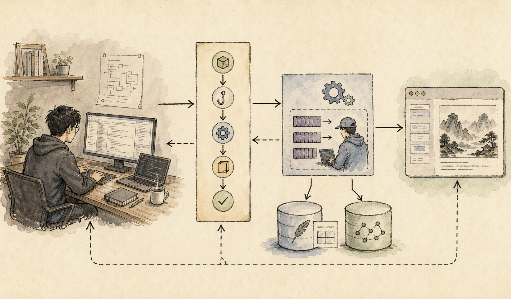

这两天我认真看了 [banghards/claude-mem](https://github.com/banghards/claude-mem) 这个仓库，结论很直接：

它不是一个“给 Claude 多塞一点 prompt”的小脚本，而是一整套围绕 `Claude Code` 做长期记忆压缩、检索和回注的插件系统。

如果你平时只是偶尔让 Claude 改一两个文件，可能还感受不到它的价值。

但只要你开始把 Claude Code 用在连续几天、连续几周、甚至跨多个项目的工作里，很快就会遇到一个问题：

**会话能结束，项目不会结束。**

Claude 在当前对话里理解了你的目录结构、命名习惯、任务进度、改动背景，但新会话一开，这些上下文很容易又掉回“重新介绍一遍”的状态。

`Claude Mem` 想解决的，就是这一层断裂。

## 先用一句话说清楚 Claude Mem 在做什么

按照仓库 README 的描述，它的核心思路是：

- 自动捕获 Claude Code 在编码过程中的工具使用和观察结果
- 把这些信息压缩成语义化摘要
- 在未来会话里按相关性把上下文重新注入回来

换句话说，它不是“把聊天记录原样保存”，而是做了一层**长期记忆压缩系统**。

这点很重要。

因为真正影响使用体验的，不是“记得越多越好”，而是：

**能不能把真正有价值的项目经验留下来，并在下一次需要时准确拿回来。**

## 它到底有哪些核心功能

从仓库主页和文档目录来看，`Claude Mem` 的功能并不只是“记忆”这一个词那么简单，它至少包含了下面几块。

### 1. 跨会话持久记忆

这是它最核心的卖点。

仓库把它描述成 `Persistent Memory`，也就是上下文不会随着当前会话结束而消失。

适合保存的内容包括：

- 项目结构和模块关系
- 之前已经踩过的坑
- 某些功能为什么这么设计
- 哪些文件不要乱动
- 团队里反复出现的约定

这类信息如果每次都靠手动重新解释，成本其实很高。

### 2. Progressive Disclosure

这是我觉得它比很多“记忆插件”更成熟的一点。

它不是粗暴地把所有历史内容一股脑塞回上下文，而是走分层回注。

仓库把这件事叫 `Progressive Disclosure`，可以理解成：

- 先给少量高相关的记忆
- 再根据任务需要继续展开
- 同时尽量可见 token 成本

这比“全量塞回去”更像一个可长期运行的工程方案。

### 3. mem-search 技能搜索

`Claude Mem` 不只是自动回忆，还提供了搜索能力。

仓库里把它描述成 `Skill-Based Search`，也就是通过 `mem-search` 这类 skill，用自然语言查项目历史。

这意味着它不只是“后台自动工作”，还可以在你明确有需要时主动查：

- 之前谁改过这块逻辑
- 某个功能的旧方案是什么
- 某段决策当时为什么这么做

### 4. 本地 Web Viewer

这个点很实用。

仓库里提到它会提供一个本地 Web Viewer UI，默认地址是 `http://localhost:37777`。

也就是说，你不是只能“相信它记住了”，而是可以直接打开本地界面看：

- 当前记忆流
- observation 数据
- 引文 ID
- 某些搜索结果

这类可视化对调试长期记忆系统特别重要。

### 5. 隐私控制和上下文注入配置

这套系统不是一股脑把所有内容都收进去。

仓库明确提到两个我觉得很关键的控制点：

- 可以用 `<private>` 标签排除敏感内容
- 可以细粒度配置哪些上下文会被注入

这意味着它并不只是“记得更多”，而是允许你决定：

**哪些东西值得记，哪些东西不该被长期保存。**

### 6. 引文和可追溯性

仓库里还提到 `Citations`，也就是过去的 observation 可以带着 ID 被引用。

对一个真正想用于工程场景的记忆系统来说，这个能力很值钱。

因为一旦 AI 说“我记得之前这样做过”，你总得能追问一句：

**你是从哪条历史里得出这个结论的？**

## 它是怎么工作的

从仓库 README 和文档目录能看出，这套系统已经不是一个简单的脚本，而是一套相对完整的运行架构。

官方概述里提到的核心组件包括：

- 多个生命周期 Hook
- 一个预检查安装逻辑
- 一个由 `Bun` 管理的 Worker Service
- 本地 `SQLite` 数据库
- `mem-search` 技能
- `Chroma` 向量数据库，用来做混合检索

这套结构说明了两件事。

第一，它并不是把所有工作都塞进 Claude 本体里做。

第二，它把“记忆采集、压缩、检索、展示、回注”拆成了不同组件。

这才是比较像工程系统的做法。

如果用更通俗的话说，大概是这样：

1. Claude Code 在工作时通过 hook 记录关键观察
2. Worker 把这些观察整理进本地数据库
3. 需要时通过关键词 + 语义检索找回相关历史
4. 再把高相关信息压缩后喂回未来会话

所以，`Claude Mem` 真正做的不是“替 Claude 增加一点缓存”，而是：

**在 Claude Code 外面搭了一个长期记忆运行层。**

## 它适合什么样的使用环境

如果只看 README 的“Quick Start”和 `package.json`，它的使用环境其实已经很清楚了。

### 1. 主要面向 Claude Code

仓库标题本身就把它定义成 `Persistent memory compression system built for Claude Code`。

也就是说，它最核心的使用场景还是：

- 你在本地长期使用 Claude Code
- 会持续在同一个项目里开发
- 希望跨会话延续项目上下文

如果你只是网页端随便聊两句，它的价值不会完全发挥出来。

### 2. 也支持 Gemini CLI、OpenCode、OpenClaw

README 里给了几种安装方式：

- `npx claude-mem install`
- `npx claude-mem install --ide gemini-cli`
- `npx claude-mem install --ide opencode`
- OpenClaw 的一键安装脚本

这说明它不是只绑定单一入口，而是在往“多 Agent CLI 环境复用记忆层”这个方向走。

### 3. 运行时环境要求

从 `package.json` 可以直接看到它要求：

- `Node >= 18`
- `Bun >= 1`

这意味着它更适合下面这类环境：

- 本地开发机
- 熟悉命令行的工程师环境
- 能接受本地服务和数据库常驻的使用方式

它不是那种“纯浏览器插件、零环境依赖”的产品形态。

### 4. 更适合重度用户，而不是浅尝型用户

我会把适合人群概括成这几类：

- 长时间用 Claude Code 做开发的人
- 需要跨多天推进复杂任务的人
- 希望把项目经验逐渐沉淀下来的人
- 对 AI 可追溯性和上下文质量有要求的人

反过来说，如果你只是偶尔让 Claude 改个文案、看个单文件 bug，这套系统可能显得有点重。

## 它和普通“聊天记忆”插件最大的区别

很多人第一次看这类项目，会误以为它只是“把历史会话记下来”。

但我觉得 `Claude Mem` 更像是在做三件事的组合：

- 采集
- 压缩
- 检索式回注

这比简单保存 transcript 更接近生产可用方案。

因为真正难的地方不是“存下来”，而是：

- 存什么
- 怎么压缩
- 什么时候取
- 取多少

如果只做第一步，系统很快就会变成“上下文垃圾场”。

而 `Claude Mem` 之所以值得写一篇文章，恰恰是因为它已经开始认真处理后面三步。

## 安装时最值得注意的一点

README 里有一个很容易被忽略、但实际上非常关键的提醒：

`npm install -g claude-mem` 安装的是 SDK / library，不会自动把插件 hook 和 worker 服务都装好。

真正推荐的方式是：

- 用 `npx claude-mem install`
- 或者在 Claude Code 里走 `/plugin` 安装

这说明它不是一个单文件 CLI，而是一个需要正确注册插件机制和后台服务的系统。

很多人如果按普通 npm 包的直觉去装，第一步就会装偏。

## 我怎么评价这个项目

如果只从“功能列表”看，它已经很强。

但我更看重的是它体现出来的方法论：

### 1. 它承认长期记忆不能靠大模型原生解决

也就是说，它没有幻想“模型本身变强就能自动记住一切”，而是老老实实做外部系统。

这很工程。

### 2. 它在意 token 成本和上下文污染

`Progressive Disclosure` 这类设计说明作者不是只想做“能跑”的 demo，而是在考虑长期使用成本。

### 3. 它把可追溯性和可视化也放进来了

本地 Web Viewer、引用 ID、搜索接口，这些东西会让系统更像产品，而不是黑盒。

## 一句话总结

如果你想要的是一句最短结论，我会这么说：

**Claude Mem 是一个围绕 Claude Code 构建的长期记忆插件系统，它通过 hook、worker、本地数据库和检索回注机制，让 Claude 在新会话里尽量“记得”项目真正重要的上下文。**

它最适合的不是轻量聊天场景，而是：

**本地、长期、连续、多任务、重度依赖 Claude Code 的开发环境。**

如果你已经开始把 Claude Code 当成日常协作对象，而不只是临时问答工具，那这个项目非常值得你认真看一遍。

