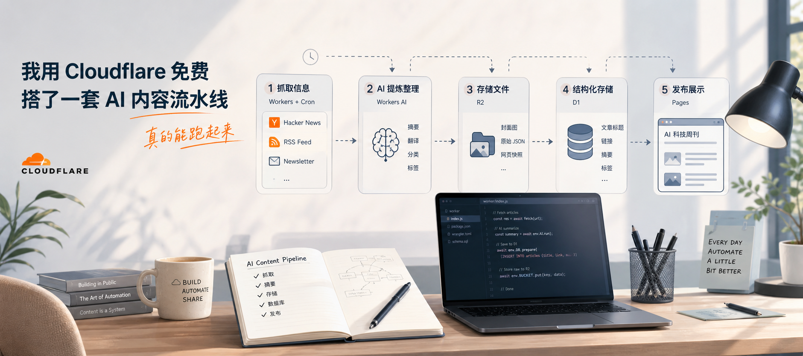
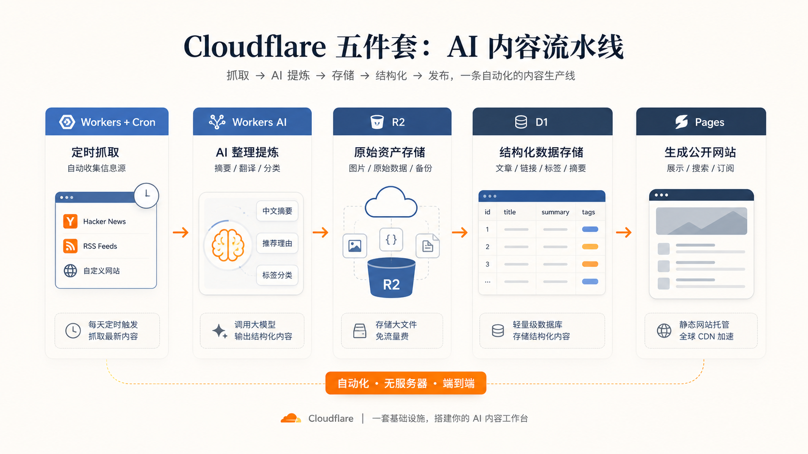
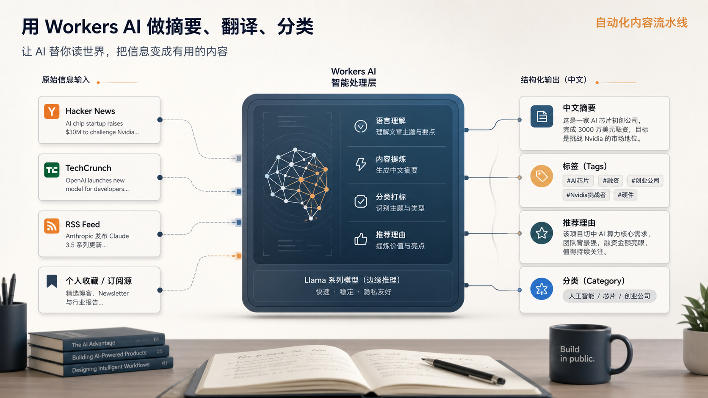
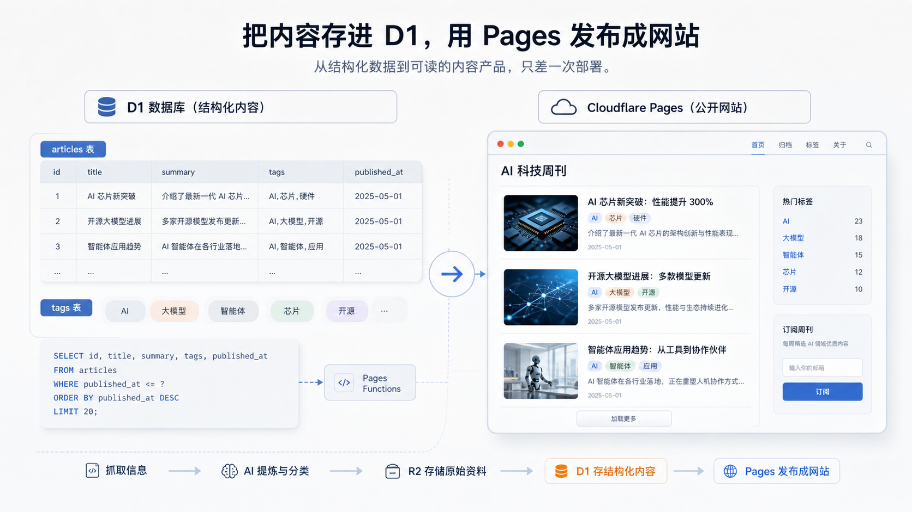

每天看那么多信息，真正的问题往往不是“没东西可看”，而是：

- 收藏了一堆，回头根本找不到
- 想做周刊，靠手工复制粘贴根本坚持不下去
- 明明有很多素材，却始终没有一套能稳定运转的内容工作流

这几年大家聊 AI，聊得最多的是“生成能力”。

但对个人创作者、研究者，甚至做行业观察的人来说，真正能拉开差距的，很多时候不是模型本身，而是你有没有把 **信息抓取、清洗、摘要、归档、发布** 这条链路自动化。

如果这条链路还是手工的，再强的模型也只是一个高级翻译器。

如果这条链路跑顺了，你就等于给自己搭了一个不会下班的编辑部。

这篇文章讲的，就是这样一套系统：

**不用自己买服务器，不额外掏月租，直接用 Cloudflare 免费套餐，把“AI 科技周刊自动生成器”拼起来。**

它每天自动抓信息、自动做中文整理、自动入库、自动变成网页。你要做的，不再是每天重复劳动，而是定义你想看什么、想产出什么。

这套东西当然不只适合做周刊。

你也可以把它改造成：

- 个人第二大脑的信息流入口
- 某个垂直行业的资讯聚合站
- 给自己准备的研究材料池
- 甚至是团队内部的轻量知识分发系统

## 先看全局：这套“AI 内容流水线”到底在干嘛

如果你把它拆开看，其实就 5 个动作：

1. 去外面抓内容
2. 让 AI 先读一遍
3. 把原始资料和整理结果分开存
4. 把结构化内容塞进数据库
5. 再把数据库里的内容渲染成网页

Cloudflare 的好处在于，这 5 件事它家刚好都有现成积木。

对应关系非常清楚：

1. `Workers + Cron`
负责定时抓内容。你可以把它理解成“打工人 + 闹钟”。

2. `Workers AI`
负责先做一轮中文整理。比如摘要、分类、推荐理由、标签。

3. `R2`
负责存大块头资料。像原始 JSON、封面图、网页快照，都适合放这里。

4. `D1`
负责存结构化结果。文章标题、链接、摘要、标签，放进数据库以后，后面就很好调。

5. `Pages`
负责对外展示。把内容变成一个公开可访问的网站。

换句话说，这套系统不是“Cloudflare 很能打”的展示，而是：

**你用一套免费基础设施，把“抓取 -> AI 提炼 -> 存储 -> 发布”接成了一个完整闭环。**

这才是重点。

## Step 1：先让 Worker 每天按时去打工

整条链路里，第一件必须稳定的事不是 AI，而是抓取。

因为如果入口不稳定，后面所有自动化都会变成空转。

这里最合适的组合就是：

- `Workers` 负责执行
- `Cron` 负责定时

你可以把它理解成：每天固定时间，Cloudflare 边缘节点上有个小工人，会自动出去帮你收集今天的素材。

这个阶段不要一上来就追求复杂。

最小可用版本只要做到两件事：

1. 能定时触发
2. 能稳定抓回一批你指定的信息源

比如：

- Hacker News
- 一组 RSS
- 你长期关注的行业站点

这一步一旦跑顺，你就已经跨过了“手动去找内容”的门槛。

很多人做到这里会第一次意识到：

原来最值钱的不是“有 AI”，而是 **AI 开始接到持续稳定的上游输入**。

## Step 2：让 AI 先替你读一遍

信息抓回来之后，如果还是一堆英文标题和链接，那离“可消费内容”还差得很远。

这时候，Workers AI 才真正开始发挥作用。

它的意义不是炫技，而是先替你做掉最消耗注意力的那一层：

- 中文摘要
- 基础翻译
- 标签分类
- 推荐理由
- 主题归档

这一步你完全可以先从“轻处理”开始。

也就是说，不一定一上来就抓全文、做超长总结。你先让模型基于：

- 标题
- 链接
- 一小段描述

做第一轮中文整理，就已经能显著降低后续人工筛选的成本了。

如果后面你想升级，再往下加：

- 正文抽取
- 深度总结
- 多维分类
- 垂直主题重写

这套结构也是成立的。

真正关键的是，你得先接受一个思路：

**AI 在这条流水线里，不是“最后出稿的人”，而是“第一轮编辑”。**

这个定位非常重要。

因为它决定了你后面怎么设计 prompt、怎么控成本、怎么拆任务。

你不是让 AI 一次性写完全部内容，而是先让它把一堆嘈杂原料，变成可管理、可筛选、可归档的中间层。

## Step 3：原始资料别乱塞，R2 专门用来装“大东西”

一旦开始自动抓内容，你很快就会遇到一个问题：

不是所有东西都适合丢进数据库。

比如：

- 原始抓取下来的长 JSON
- 文章配图
- 网页快照
- 以后要做回溯分析的原始数据

这些内容如果直接塞进 D1，会显得很笨重。

这时候 R2 就特别顺手。

它更像是你的原始素材仓库。

数据库里只放“整理过、结构化、方便检索”的东西；R2 里放“以后可能还要回头用，但现在不适合进数据库”的大对象。

这一层很多人会忽略，但它其实很重要。

因为一旦你后面想做：

- 历史回溯
- 数据复算
- 不同 prompt 重新处理旧资料
- 给前端补图

有没有一层原始资料存档，差别非常大。

可以把它理解成：

- `D1` 是账本
- `R2` 是仓库

账本记条目，仓库放货物。

## Step 4：真正有用的内容，最后都应该落进 D1

到了这一步，整条流水线才真正开始“有产出”。

因为前面不管是抓取、翻译、摘要，还是分类，最终都要落成结构化数据，不然你后面没法做展示，也没法做检索。

这就是 D1 的价值。

它很轻，够用，而且足够适合这类个人内容系统。

放进去的字段也很直白：

- 标题
- 原始链接
- 中文摘要
- 推荐理由
- 标签
- 时间戳
- 来源

如果你想做得更完整一点，还可以继续加：

- 分类
- 封面图地址
- 原文快照地址
- 是否推荐
- 人工二次编辑状态

一旦这些数据结构化了，你就不再只是“攒了一堆文章”，而是拥有了一套随时可以被前端调用、被筛选、被重组、被二次加工的内容底座。

这时候你做周刊，和以前最大的不同是：以前你每周都在重新干一遍重复劳动。现在你是在 **消费一条已经在后台持续运转的数据流**。

这就是工作流和工具的本质区别。

## Step 5：最后用 Pages 把它变成一个真的网站

很多自动化项目最后都死在这里：

后台流程是跑通了，但结果没人看，也没法用。

所以最后一步一定得补上：把 D1 里的内容公开展示出来。

Cloudflare Pages 刚好适合干这个事。

它让这套系统有了一个“门面”。

你可以做得很简单：

- 一个列表页
- 一些标签筛选
- 一点基础的前端样式

也可以做得更完整：

- 分类页
- 时间轴
- 搜索
- 推荐位
- 周刊归档页

重点不在于前端多花哨，而在于：

**你的自动化流程终于有了一个稳定出口。**

内容不再只是数据库里的一堆记录，而是一个别人真的能访问、能阅读、能传播的页面。

一旦到了这一步，这套系统就从“个人小玩具”开始往“真正的内容产品”靠了。

## 这套东西为什么值钱：它不是帮你省 10 分钟，而是帮你摆脱重复劳动

很多人会低估这种流水线的价值，因为表面看起来，它只是在帮你：

- 自动抓文
- 自动翻译
- 自动做摘要
- 自动发网页

但真正的收益不是“节省几个动作”，而是：

**你终于不用每周重新做一次一样的事。**

这点非常关键。

因为创作者最容易被消耗掉的，不是灵感，而是重复劳动。

你每周都手动复制粘贴、翻译、整理、分类、排版，很快就会烦。一烦，这个系统就停。一停，内容积累也停。

而自动化流水线真正解决的是：它把那些不值得你反复亲自做的动作，从你的工作记忆里拿走了。

你可以把精力放回更值得做的地方：

- 选题判断
- 观点输出
- 深度评论
- 最终呈现

说白了，这套系统不是替代创作，而是把“创作前那堆低价值准备动作”自动化。

## 免费额度到底够不够：对个人项目，通常够起步

大多数人最担心的不是能不能搭，而是搭完会不会开始持续烧钱。

这个担心完全合理。

但如果你做的是个人项目，或者一个规模不大的内容流自动化，Cloudflare 免费套餐通常是够你起步的。

核心原因有两个：

1. 这类内容流水线的频率，本来就不需要高到夸张
2. 真正消耗资源的环节，主要集中在抓取量和 AI 调用量，而这两项都可以控

比如你一天只处理几十篇内容：

- 定时抓取压力不大
- 数据库存储压力不大
- 前端访问量也不至于高得离谱

真正需要你提前想清楚的，是两个地方：

1. 你一天准备抓多少内容
2. 你给 AI 喂多长的文本

如果你一上来就：

- 全文抓取
- 长摘要
- 高频跑批
- 还想做 embedding 和语义搜索

那成本当然会上去。

所以最好的策略不是一开始就全开，而是：

**先做最小可用版本，再逐步加功能。**

## 真的想把它跑稳，最值得提前防的 4 个坑

### 1. 不要一批抓太多，Cron 很容易超时

免费版最大的现实限制，不是“不能用”，而是不能太贪。

如果你一次性抓很多篇文章，再每篇都让 AI 深度处理，很容易把一次任务跑得太重。

更稳的做法通常是：

- 少量多次
- 分批抓取
- 把抓取和 AI 处理拆开

也就是把“一个大任务”，拆成多个更短、更轻、更容易成功的小任务。

### 2. 模型别一上来就选最重的

在这类流水线里，模型不是拿来写史诗长文的。

它更像流水线上的整理工。

所以优先考虑：

- 小一点
- 快一点
- 成本更低

够用，往往比最强更重要。

### 3. 如果后面要做搜索，最好早点考虑向量层

当你的内容开始积累，后面很自然会想要一个功能：

**不是按关键词搜，而是按意思搜。**

这时候你就会开始需要 embedding 和向量检索。

所以如果你一开始就知道自己以后会做“语义搜索”或者 RAG，最好在数据结构上提前留位置，不然后面会补得比较痛苦。

### 4. 邮件分发不是“顺手加一下”那么简单

很多人做到网页之后，下一步就想做成邮件版周刊。

这当然是合理的，但邮件不是一个顺手勾选的功能。

它会牵扯到：

- 发信能力
- 模板
- 发送稳定性
- 退订逻辑
- 账号可用权限

所以建议把它当成第二阶段，不要和第一版一起上。

## 这套系统最迷人的地方，是你真的能一个人拼出一个小编辑部

回头看这条链路，其实非常有代表性。

从抓取，到 AI 清洗，到存储，到展示，你并没有做什么惊天动地的工程。

但你做成了一件很重要的事：

**把原本需要人手反复执行的信息处理流程，变成了一条能自己转起来的流水线。**

这件事的意义，远远大于“又搭了一个 AI demo”。

因为它开始真的接管工作。

它开始在你睡觉的时候抓内容，在你不看屏幕的时候做第一轮整理，在你还没打开后台的时候把数据已经准备好。

你再上场的时候，不再是从零开始，而是在一个已经被整理过的现场里工作。

这就是 AI 和 Serverless 真正结合起来之后，最让人上瘾的地方：

不是更炫，而是更省命。

## 最后一句话总结

这套 Cloudflare 内容流水线真正厉害的地方，不是“免费”，也不是“用了几个 AI 服务”，而是它把个人创作者最容易放弃的那部分重复劳动，真正自动化了。
一旦抓取、整理、存储、发布这条链路自己跑起来，你手里的内容系统就不再是临时项目，而会慢慢长成一个能持续产出的基础设施。
