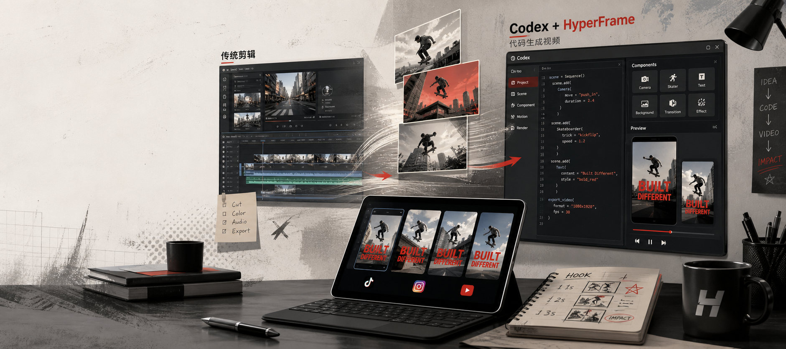
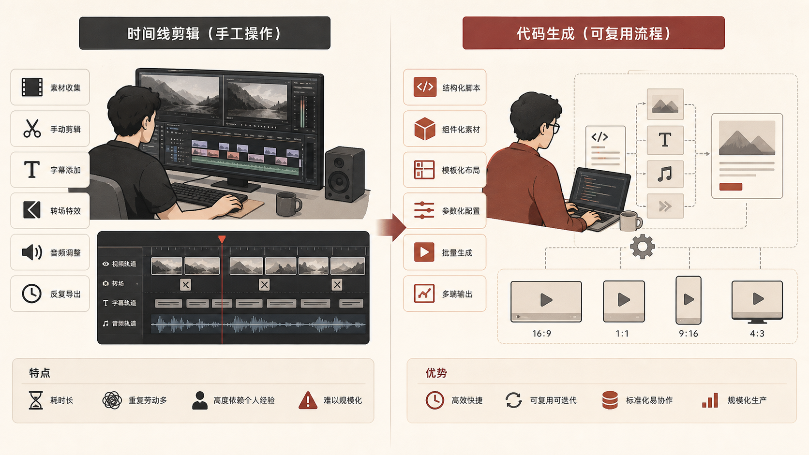
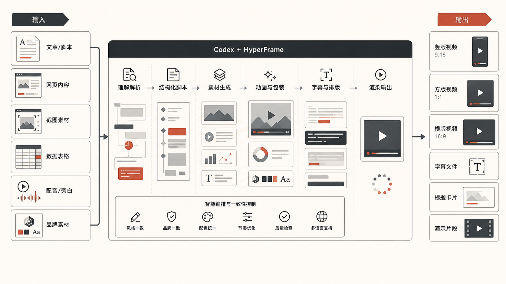
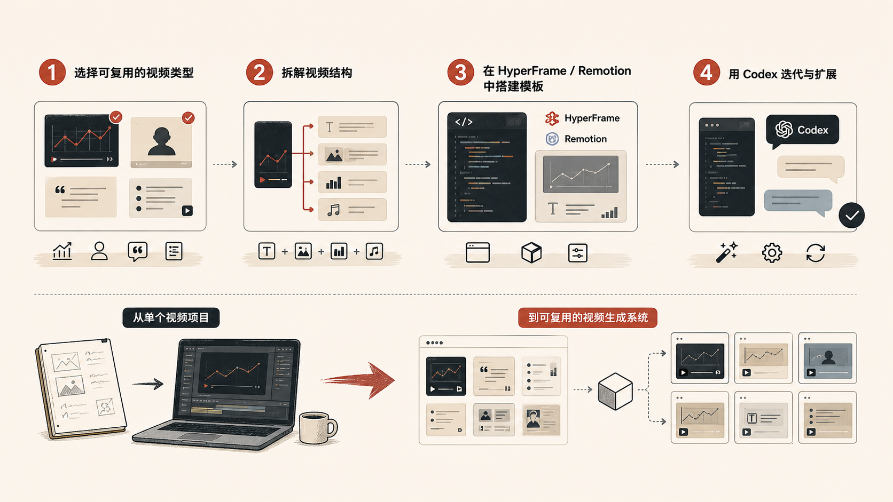

---
title: 'Codex + HyperFrame 正在吃掉视频剪辑的很多工作'
description: '基于一条关于 Codex、HyperFrame 和 Remotion 的推文，整理成适合中文读者理解的版本：视频生产正在从时间线剪辑，转向代码化生成。'
pubDate: 2026-05-07
category: AI与科技
tags:
  - Codex
  - AI Agent
  - AI工作流
draft: false
author: banghards
source: https://x.com/Saccc_c/status/2051145377865204222
heroImage: ../../assets/posts/cases/codex-hyperframe-video-editors/cover.png
---

过去很长一段时间，做视频基本意味着打开一个时间线工具。

你要拖素材、切片段、调转场、对字幕、卡点、动画、音乐和导出格式反复折腾。

这些事情当然还是重要。

但现在，一个新的变化已经很明显了：

**一部分视频，不再需要先从剪辑软件开始，而是可以直接从代码开始。**

这就是 `Codex + HyperFrame`、`Remotion` 这类工具真正让人兴奋的地方。

它们不是简单地“帮你剪快一点”。

而是把视频生产，从手工时间线操作，改造成一套可以被编程、复用、自动化和批量生成的流程。

## 为什么这件事会让内容人兴奋

很多人第一次看到“用代码做视频”，反应可能是：

这不是给程序员玩的吗？

但真正上手以后，你会发现它击中的并不是“会不会写代码”这个点。

它击中的是视频生产里最痛的那部分：

- 同一套动画要反复做
- 同一类封面、字幕、标题卡要反复改
- 一个模板要适配不同平台比例
- 一条素材要拆成多条短视频
- 数据、文案、截图要不断替换
- 品牌风格要保持一致

传统剪辑工具很适合做“单条精剪”。

但当你要持续生产内容时，真正消耗人的往往不是创意本身，而是大量重复性的制作动作。

而代码化视频的优势，就是把这些重复动作变成组件、参数和脚本。

## HyperFrame 和 Remotion 改变的不是剪辑，而是生产方式

`Remotion` 的思路很直接：

用 React 写视频。

你把画面、动画、字幕、转场、数据和组件都写成代码，然后渲染成视频。

`HyperFrame` 更进一步，把 HTML、动画、语音、字幕、网页捕获、组件化视频这套流程做得更贴近 Agent 和自动化工作流。

这意味着视频开始具备几个传统剪辑流程很难同时做到的能力：

## 1. 模板可以复用

一套视频结构写好之后，可以不断换内容。

比如每周产品更新视频、每日数据快报、课程片头、发布会切片、App 功能演示、社媒广告素材。

以前这些东西都要在剪辑软件里反复打开项目、替换素材、重新导出。

现在它们可以变成一个可重复运行的生成流程。

## 2. 内容可以批量生成

当视频结构变成代码以后，你可以把一份数据源变成多条视频。

比如 10 个产品功能点变成 10 条短视频，1 篇文章变成 5 条不同平台版本，1 个网站变成 1 条产品介绍视频。

这不是简单的“自动剪辑”。

这是把视频生产变成内容管线。

## 3. 风格可以稳定

对品牌和运营团队来说，风格稳定非常重要。

字体、间距、转场、颜色、节奏、字幕位置，如果每条都靠人工拖，很容易漂。

但如果这些东西都写在组件和样式里，就会稳定得多。

## 4. Agent 可以参与生产

这才是 Codex 加进来以后最有意思的地方。

以前你让 AI “帮我做个视频”，它最多给你脚本、分镜、文案。

但如果视频本身就是代码，Agent 就可以继续往下走：生成视频结构、改组件、调动画、替换素材、生成字幕、调整尺寸、批量渲染、修复报错。

这时候，AI 不只是视频前期助手。

它开始进入真正的制作链路。

## 这会吃掉哪些视频编辑工作

说“吃掉视频编辑”容易显得夸张。

更准确的说法是：

**它会吃掉很多重复型、模板型、结构化的视频制作工作。**

比如产品功能介绍、SaaS 更新视频、数据报告视频、课程片头和章节卡、App 操作演示、新闻摘要短视频、社媒广告变体、活动宣传素材、带字幕的讲解型视频。

这些视频不一定需要每次都手工精剪。

它们更适合被拆成结构、素材、文案、动画和输出格式，然后用代码统一生产。

这并不意味着优秀剪辑师不重要。

相反，真正懂节奏、懂镜头、懂情绪、懂品牌的人会更值钱。

因为他们可以把经验沉淀成模板、组件和系统。

被压缩掉的，是那些每次都重复做、但并不需要重新判断的工作。

## 为什么自媒体人、运营人和市场人都该学一点

这件事不是只和程序员有关。

真正应该警觉的，是所有需要持续产出视频内容的人：自媒体人、运营、市场、增长团队、创始人、产品团队、教育内容团队。

因为视频正在从“作品”越来越多地变成“系统输出”。

以前你做一条视频，重点是把这一条做好。

以后你要想的是这条视频结构能不能复用、能不能变成多个平台版本、能不能自动换标题和字幕、能不能接文章、网页、数据源、能不能让 Agent 帮你迭代。

## 一个最小可行的上手路径

如果你想试，不需要一开始就做复杂宣传片。

可以从最简单的 4 步开始。

## 第一步：选一种重复视频

不要选“年度品牌大片”。

先选一种你经常要做、结构稳定的视频：每周产品更新、文章转短视频、工具推荐、数据快报、App 演示、课程片头。

## 第二步：把它拆成固定结构

比如一条 30 秒产品更新视频，可以拆成开场标题、问题说明、功能演示、三个亮点、结尾行动提示。

这一步不是写代码，而是把视频变成结构。

## 第三步：用 HyperFrame 或 Remotion 做成模板

先不要追求完美。

只要能换标题、换素材、换字幕、换颜色、改时长、导出视频，你就已经从“剪一条视频”走向“生成一类视频”了。

## 第四步：让 Codex 帮你迭代

当模板变成代码以后，你就可以让 Codex 介入：改动画、调布局、加字幕、改比例、生成多个版本、修复渲染错误。

这时候，你会明显感觉到：

**视频不再是一个封闭的剪辑项目，而是一套可以持续迭代的工程。**

## 最后想说

`Codex + HyperFrame` 真正让人上头的地方，不只是“能用代码做视频”。

而是它让视频第一次变得像软件一样：

- 可以组件化
- 可以复用
- 可以自动化
- 可以批量生成
- 可以被 Agent 修改
- 可以接入内容和数据管线

对内容行业来说，这个变化很大。

未来一部分视频编辑工作，不会消失，但会被重新分层。

手工精剪还会存在。

但大量模板化、运营型、数据型、社媒型视频，会越来越多地交给代码和 Agent。

所以，如果你是自媒体人、运营人、市场人，真的值得花时间学一学。

不是为了变成程序员。

而是为了让你的视频生产，不再每次都从零开始。

