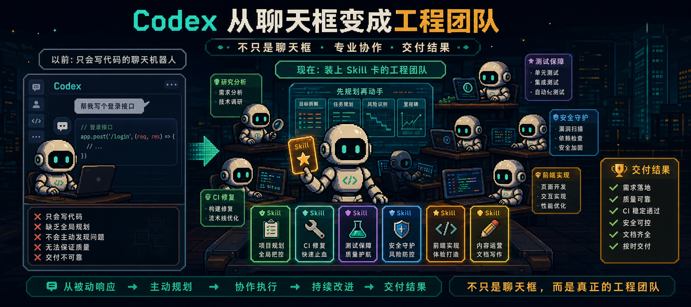
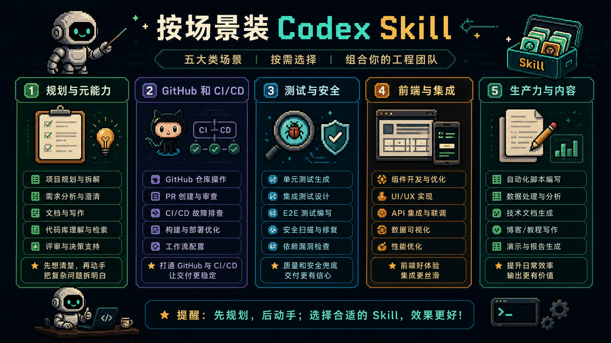
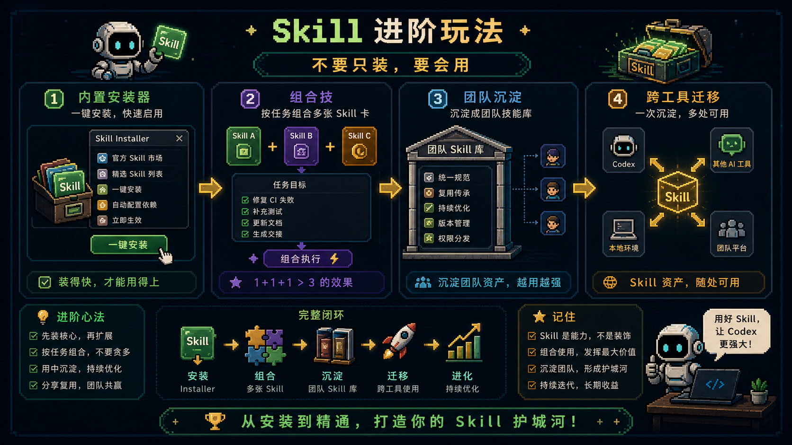

很多人手里的 `Codex`，其实只发挥了一半能力。

你让它写代码，它会写。
你让它改 bug，它也会改。

但它经常该先规划的时候不规划，该查文档的时候靠记忆瞎猜，CI 挂了还得你一行行贴日志喂给它，最后整体体验还是很像一个更聪明一点的聊天框。

如果你也有这种感觉，问题大概率不在模型本身。

真正没打通的那层，通常叫做：**Skill**。

你可以把 Skill 理解成一张张“岗位 SOP 卡”。某一类任务来了，Codex 不用每次都听你重新念一遍咒语，而是会在合适的时候掏出对应的流程卡，按固定方法把活干完。

## Skill 真正在解决什么问题

很多人会把 Skill 理解成 Prompt 模板，但它更接近一套可复用的做事标准：

- 遇到什么场景该触发
- 按什么流程做
- 需要看什么参考资料
- 哪些脚本和资源可以直接复用
- 交付前怎么检查

Prompt 更像临时说的话，Skill 更像固化下来的方法论。

## 真正最该先装的，是元能力卡

如果只能先装很少几个 Skill，优先级应该是那些会改变 Codex **工作方式** 的元能力卡，而不是只解决某个局部场景的小卡。

像 `create-plan`、`gh-fix-ci` 这类卡，解决的是：

- 它会不会先想清楚再动手
- CI 红了以后，它能不能自己读日志、定位问题、推进修复

这类 Skill 装上以后，Codex 会明显更像一个有经验的工程师，而不是接到任务就立刻扑上去写。

## Skill 生态别瞎找

最值得长期盯的源头，其实就几个：

- `openai/skills`
- `ComposioHQ/awesome-codex-skills`
- 少量补充性的社区仓库和聚合站

核心仓库的价值，不只是内容多，而是能给你一条相对稳定的主航道：知道去哪找、哪些是官方 curated、哪些是实验性、哪些是社区高赞但要自己验证。

## 真正高频有用的 Skill，通常分五类

1. 规划和元能力
2. GitHub 和 CI/CD
3. 测试、质量与安全
4. 前端、设计与集成
5. 生产力与内容

从这个视角看，Skill 不是“程序员装饰品”，而是在给 Codex 补全一个完整团队会有的角色卡。

## 安装最稳的思路：先用内置安装器

如果只是想稳稳装上、马上能用，优先走内置安装器。手动安装依然有价值，特别是在批量装、团队共享、目录迁移时更灵活，但那是第二步。

真正重要的不是“会多少安装姿势”，而是后面你会不会调用、会不会组合、会不会沉淀、会不会淘汰过时的卡。

## 更高阶的玩法：组合、沉淀、迁移

真正高阶的玩法，不是卡越多越好，而是：

- 会组合：同一任务里让多张卡协同工作
- 会沉淀：把团队高频流程写成自己的 Skill
- 会迁移：让好方法不只活在一个工具里

这样 Skill 才不只是“装饰”，而是团队能力的可移植封装。

## 最后

Skill 会一直更新，今天的神卡，半年后可能就被官方内置了。真正不会贬值的，是你怎么判断这活该拆几步、该上哪张卡、它给的方案到底靠不靠谱。

工具会变，但你的工作流判断力不会。
