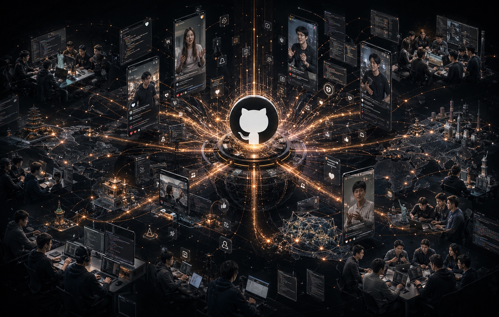

过去几年，科技圈有一种很明显的分化。

一类 CEO 更擅长讲故事，发布会上永远站在最亮的位置，负责把趋势说对、把方向讲大。

另一类 CEO 会更深入产品，但多数时候，真正的大规模开源交付还是交给工程团队去完成。

但 Garry Tan 这段时间的状态，有点不一样。

他不是在“支持团队做开源 AI”，也不是在“为 AI 产品站台”，而是直接把自己推到了交付一线：亲自写、亲自合、亲自迭代，而且频率高到让人很难忽视。

如果只看公开互联网上的可验证痕迹，这几乎已经不是“一个 CEO 偶尔开源几个项目”的故事了，而更像是一个持续高压运转的 AI 工程机器。

更重要的是，这种高密度交付并不是单点爆发，而是同时出现在代码、传播、社区反馈和产品方法论几个层面上。

## 最值得看的，不只是 Star 数，而是连续交付能力

很多人看开源项目，第一反应都是 Star。

当然，Star 很重要。它代表关注，代表扩散，代表某种意义上的市场注意力。

但如果我们真的想判断一个人是不是在“持续地推动开源 AI”，单看 Star 其实远远不够。

真正更有分量的，是这几个问题：

- 他是不是在持续提交，而不是一次性放出后就沉寂
- 他是不是在亲自合并 PR，而不是只挂个名字
- 社区是不是围绕这些项目形成了真实讨论
- 这些项目是不是已经进入了更大范围的开发者传播链路

放在 Garry Tan 身上，这几个问题的答案都相当明确。

他最出圈的两个仓库，一个是 `gstack`，一个是 `GBrain`。前者更像是把 AI 编程工作流重新做了一次工程化打包，后者则是在尝试把“长期记忆”这件事做成真正能被 Agent 使用的基础设施。

单看定位，你会觉得它们已经很强。

但真正让这两个项目变得危险的，不只是想法，而是推进速度。

## 两个 MIT 仓库，把“AI 工具链”推成了现象级产品

先说 `gstack`。

这不是一个轻飘飘的提示词仓库，也不是那种“整理一下自己常用配置”级别的小工具。

它更像是一套带有强烈方法论的 Claude Code 工程系统，把一整套角色分工、工具链调用和任务编排打成了可复用的开源工作流。

很多人第一次看到它，都会把它理解成“Garry Tan 的个人 Claude Code 配置”。

但它真正吸引人的地方在于，它把“一个 AI 编程助手”往“一个多角色工程团队”这个方向硬推了一步。

这一步特别关键。

因为过去很多 AI 编程工作流，最后都会卡在一个问题上：模型很强，但组织方式太松散。

你可以拿它写代码，但很难把它稳定地变成一个协作系统。

`gstack` 之所以爆，是因为它给出了一种更接近真实工程团队分工的答案。

而另一个仓库 `GBrain`，则对应了 Agent 时代另一个更底层的问题：长期记忆。

不是“聊过什么就存什么”的那种浅层记忆，而是把人、公司、邮件、会议、交易、日历事件这些长期上下文，真正沉到一个可以持续更新、可检索、可交叉关联的系统里。

它最打动人的地方，是把“睡觉时也在变聪明”这件事做成了一个具体产品想象。

白天你在沟通、开会、发邮件、推进合作。

晚上系统自动处理这些上下文，把关系、实体、事件、脉络整理进知识结构里。

第二天醒来，Agent 已经不再是昨天那个只会临时调用上下文的助手，而是一个真正开始积累长期判断素材的系统。

这也是为什么很多人看到 `GBrain` 后，第一反应不是“又一个 AI 记忆项目”，而是“这可能是个人认知基础设施的一个雏形”。

## 真正夸张的，是它背后的工程节奏

如果一个项目爆了，可能是运气。

如果两个项目一起爆，还能解释成品牌势能。

但如果在同一个 30 天窗口里，你看到的是：

- 大量提交
- 大量 PR 合并
- 明显的筛选机制
- 几乎每天都在推进

那这件事就已经不能只用“流量”来解释了。

它背后反映的是一种非常清晰的工作状态：

**不是做了一次开源发布，而是在持续经营一个高活跃度的工程现场。**

这和很多“声量很大、更新很少”的项目，完全不是一个级别。

更值得注意的是，它并不是那种把所有内容都无差别合进来的“高速但松散”。

从公开迹象看，项目有明显的过滤和取舍。

也就是说，这套系统不是一边疯狂生长、一边快速失控，而是保持着一种很少见的平衡：

速度很快，但不是乱跑。

活跃度很高，但不是无门槛堆积。

这才是最难的地方。

很多团队能做到“快”，少数团队能做到“稳”。

而 Garry Tan 这波更像是在证明：一个拥有足够强方法论的人，可以把“快”和“稳”同时拉起来。

## 这已经不是 GitHub 里的事，而是一场完整分发

很多开发者对工具传播的理解，还停留在旧互联网逻辑里。

他们默认一个开发工具如果要火，路径应该是：

- GitHub 被看到
- X 上被讨论
- Hacker News 上被顶起来
- 然后慢慢进入主流视野

但现在显然不是这样了。

真正推动工具扩散的，越来越多来自短视频和内容切片。

TikTok、Instagram Reels、YouTube 短讲解、开发者向的剪辑账号，正在接管新一代工具教育。

这意味着一个项目如果真的开始进入传播飞轮，看到的不会只是 GitHub Star 增长。

你还会看到：

- 不同创作者开始分别讲解它
- 用户开始在评论区互相交流安装和使用经验
- 项目被拆成不同角度反复转述
- 工具本身进入“被二次教学”的阶段

这是特别危险的信号。

因为一旦一个工具开始被别人教，它就不再只是一个项目，而是在向“新默认工作方式”迁移。

从这个角度看，`gstack` 和 `GBrain` 最厉害的地方，不只是项目本身做出来了，而是它们已经同时具备了：

- 工程可验证性
- 社区讨论度
- 传播可复制性
- 方法论外溢能力

这四件事叠在一起，才是现象级工具真正形成的前兆。

## “MCP sucks” 之所以打中人，是因为他不是只在评论，而是在给替代方案

很多行业争论，最后都会变成立场秀。

谁声音大，谁话讲得狠，谁就先拿到注意力。

但真正能让一句话变成行业事件的，不是情绪，而是你有没有配套的工程现实。

Garry Tan 那句关于 MCP 的判断之所以会被放大，不是因为它够刺耳，而是因为他说这句话的时候，手上已经拿出了另一条路线。

这才有杀伤力。

你不是站在场边说“这套东西不行”。

你是边说“这套东西不行”，边把更高效的工作流、更直接的工具组织方式、更能落地的工程路径做出来给大家看。

这种发言方式，在技术圈里是最难反驳的。

因为它不是抽象观点，而是带着交付记录的判断。

## 这件事最值得创业者学的，不是工具，而是姿态

如果把这整件事缩成一句话，我觉得最值得注意的不是：

“Garry Tan 做了两个很火的开源 AI 项目。”

而是：

**一个 YC 总裁，正在用接近独立开发者的方式亲自下场，并且把这件事做成了公共互联网上最可见的工程现场之一。**

这会改变很多人的预期。

过去我们默认，做到 CEO 这个位置，最主要的工作是判断方向、选人、融资、做组织。

现在看起来，至少在 AI 时代，顶级操盘手还可以再加一个角色：

**亲自构建最关键的工具和方法论原型。**

这不是为了显得勤奋。

而是因为 AI 这轮技术变化太快，很多最关键的认知，只有真正做、真正用、真正反复迭代的人，才拿得到一手体感。

谁离工具最近，谁就更可能先理解下一轮变化会从哪里长出来。

## 最后

开源世界里从来不缺明星项目。

真正稀缺的，是那种同时具备领导力、产品判断、工程推进和公共传播能力的人。

Garry Tan 这段时间的状态，本质上是在证明一件事：

在 AI 时代，最有竞争力的 CEO，可能不再只是最会讲愿景的人。

他们还会是最愿意把自己扔进一线、亲手搭系统、亲自交付结果的人。

当越来越多 CEO 还在讲“我们很重视 AI”的时候，

另一类人已经直接把 AI 时代的工作方式开源出来了。
