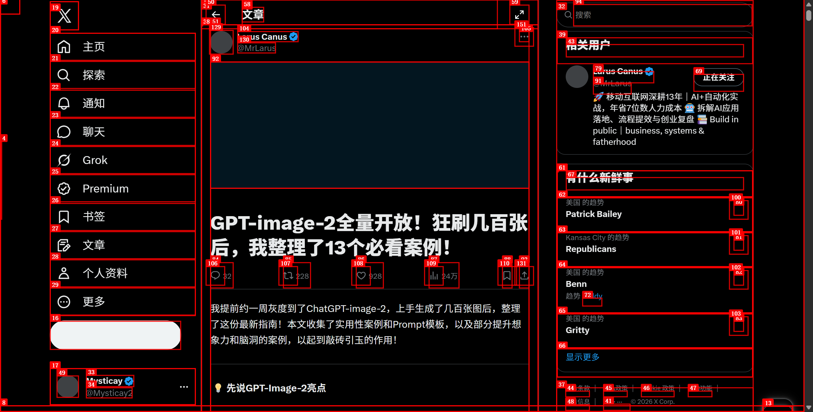

这篇内容整理了大量高价值案例，这里先保留最核心的场景总结，并补上一张总览图，方便继续扩写。

## GPT-Image-2 的几个关键亮点

- 中文渲染能力明显提升
- 能自动补全设计意图和版式逻辑
- 极简提示词也能出可用结果
- 支持连续追问微调，不需要每次从零来过

## 13 个值得重点看的场景

1. 图鉴式拆解图
2. 古文真迹与书法临摹帖
3. 轮廓宇宙图
4. 科普百科图
5. 电商详情图
6. 健身信息图
7. 高考真题试卷
8. 旅游攻略图
9. 古人穿越现代社交平台梗图
10. 游戏实机截图
11. 人物关系图
12. 密集中文排版
13. 中西医手写药方

## 为什么这 13 个场景有代表性

它们几乎把 GPT-Image-2 当前最强的几个能力都覆盖了：

- 中文排版
- 信息密度管理
- 场景脑补
- 写实感
- 版式设计
- 商业图像可用性

## 几个特别适合普通用户上手的方向

如果你不是专业设计师，最适合先尝试这些：

- 旅游攻略信息图
- 人物关系图
- 电商详情图
- 科普百科图
- 密集中文排版

这些方向最容易快速产出“立刻能用”的成果。
