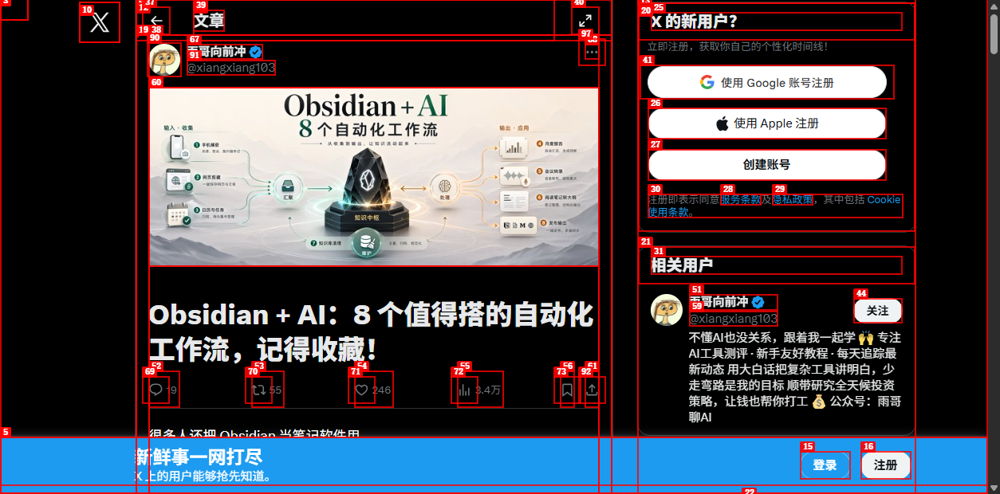

## 这份合集有什么用

它不是单纯展示效果图，而是把高赞案例背后的提示词场景抽成了可复用模板。你可以直接复制，再根据自己的主题替换关键词。

## 10 类高频场景

| 类别 | 应用场景 |
|------|----------|
| 便利店主题摄影 | 场景感人像 |
| 游戏截图风 | 趣味图片 |
| 美食地图 | 攻略图 |
| 短剧分镜 | 故事板 |
| 建筑分析图 | 建筑类内容 |
| 宣传海报 | 城市 / 活动海报 |
| 偶像风格 | 偶像写真 |
| 大师风格 | 建筑大师风格实验 |
| 美食指南 | 美食合集图 |
| 接单卡片 | 自由职业接单素材 |

## 这类资料最适合怎么用

- 当作灵感库，而不是固定答案
- 提取“场景 + 风格 + 版式 + 文案要求”的四段式结构
- 先跑简版提示词，再逐步补细节

## 亮点

- 可复制：提示词可直接改写使用
- 高赞验证：来自 X 上传播效果较好的帖子
- 场景全：人像、海报、美食、建筑、游戏都有
- 可变现：适合内容生产和商业图像需求
