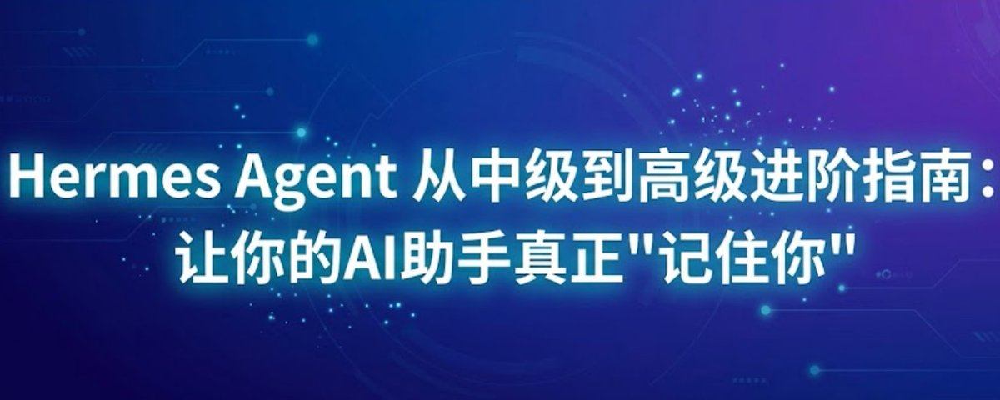

很多人刚开始用 Hermes Agent 时，都会遇到同一个困惑：

明明已经告诉过它不少偏好和背景，下一次开新会话，它却像什么都没发生过一样。

问题通常不在于它“记性差”，而在于我们没有理解 Hermes 的记忆机制到底是怎么设计的。



## 这篇文章最值得先抓住的结论

Hermes 的长期记忆不是“全量记录”，而是“高密度筛选”。

它的目标不是把你说过的每一句话都存下来，而是尽量只保留对后续任务真正有价值的信息。这样做有两个直接好处：

- 节省 token，保持系统前缀稳定
- 避免低价值信息污染长期记忆

所以，Hermes 看起来像“不是每件事都记得”，其实更接近“不值得记的就不记”。

## 一、Hermes 记忆系统的三层架构

### 1. 内置记忆

内置记忆通常由 `MEMORY.md` 和 `USER.md` 组成，默认在 `~/.hermes/memories/` 目录里。

可以把它们理解成：

- `MEMORY.md`：Agent 的工作笔记，记录环境事实、项目约定、学到的技巧
- `USER.md`：用户画像，记录你的偏好、沟通风格、工作习惯

这两份内容在新会话开始时更像一份“冻结快照”，会被注入上下文，但并不是每一轮对话都实时重写。

### 2. 外部记忆提供商

Hermes 支持把外部记忆系统叠加进来，用来补充内置记忆，而不是替代它。

文章里提到的两个方向很典型：

- `Mem0`：更自动化，适合希望少手动维护的人
- `Holographic`：更本地化，更适合注重隐私的使用场景

这层的价值在于：Agent 可以在需要时主动提取相关长期信息，而不是只依赖固定文件。

### 3. 运行时上下文

当前会话里的对话历史，属于运行时上下文。它对当下推理最重要，但并不会自动等价于长期记忆。

这点很关键：

你在当前会话里提到的内容，不代表下一次一定还会被记住。

## 二、为什么你会觉得 Hermes “不记得”

文章里对这个误区解释得很透：很多人把 Hermes 当成了“全量录音机”。

但它的记忆机制本质上更像：

- 定期整理
- 主动筛选
- 保持高密度

这意味着只有下面几类信息，更容易被保留下来：

1. 你明确表达的长期偏好
2. 稳定的环境事实
3. 对错误做法的纠正
4. 重要任务里程碑
5. 你明确要求它“记住”的内容

如果一段会话很短，或者任务太零碎，Agent 甚至可能没有足够机会去做一次有效的记忆整理。

## 三、最有效的正确姿势：明确下达记忆指令

这篇文章里最实用的一条建议其实很简单：

不要默认它会自动知道什么值得长期保留，你要明确说出来。

例如：

```text
记住我的偏好：所有代码统一使用 Python 3.11，不要用 3.12 或 3.13。
```

这种表达方式比泛泛而谈更容易触发长期记忆。

## 四、几个核心文件分别该放什么

这里最容易混淆。

更稳的理解方式是按职责区分：

- `MEMORY.md`：工作记忆，适合放环境事实、项目约定、技术经验
- `USER.md`：用户画像，适合放偏好、习惯、沟通方式
- `SOUL.md`：人格与固定行为准则，更适合你主动维护
- `AGENTS.md`：项目级规范，适合放仓库约束和执行规则

其中一个很重要的提醒是：

不要把应该放在 `SOUL.md` 或 `AGENTS.md` 里的长期规则，错误地塞进 `MEMORY.md`。因为 `MEMORY.md` 更像工作笔记，后续可能被整理、压缩甚至替换。

## 五、怎么让长任务不丢上下文

对于长链路任务，文章给出的思路很实用：

### 方法 1：手动插入 checkpoint

当任务进行到中段时，主动要求 Agent 写一段阶段总结，并明确说“请记住这段进度”。

### 方法 2：维护状态文件

对于特别长的任务，可以让 Agent 在项目目录下维护一个类似 `TASK_STATUS.md` 的状态文件。

这样即便会话中断，后面恢复时也能先读取这个文件，迅速找回上下文。

## 六、Profile 的价值：不是子 Agent，而是多个独立分身

这篇文章还提到了一个很有价值的实践：把 Hermes 当成多个长期分工明确的“分身”，而不是一次性派生几个临时子 Agent。

它们的差别在于：

- `Sub-Agent`：临时并行干活，用完就结束
- `Profile / 分身`：长期存在，拥有独立记忆、配置和渠道

如果你要做长期内容生产、自动摘要、投研、日报等，这种 Profile 化管理会比临时子 Agent 更稳定。

## 七、生产化部署时最容易忽略的几个点

文章最后一部分很适合已经跑起来的人看，尤其是这几个提醒：

- 定时任务一定要检查服务器时区
- 多实例运行时不要共用同一个数据目录
- 多个 Profile 最好使用独立 Token，避免冲突
- 高风险命令要根据场景配置审批模式
- 在上线前用 `hermes doctor`、`hermes memory status`、`hermes mcp status` 做基础检查

## 我觉得这篇文章真正讲透的一点

它不是单纯在教你“怎么开记忆”，而是在帮你建立一种更正确的预期：

Hermes 的记忆系统不是为了无脑记住一切，而是为了在性能、成本和长期可用性之间找到平衡。

从这个角度看，它的“失忆”很多时候不是 bug，而是筛选逻辑的一部分。

## 一句话总结

如果你想让 Hermes 真正变成长期协作的 AI 助手，关键不是一味增加记忆量，而是：

- 理解记忆的三层结构
- 主动标记什么值得长期保留
- 把规则放到对的位置
- 给长任务配状态文件或 checkpoint

这样它才会越来越像“理解你”，而不是只是“陪你聊过”。