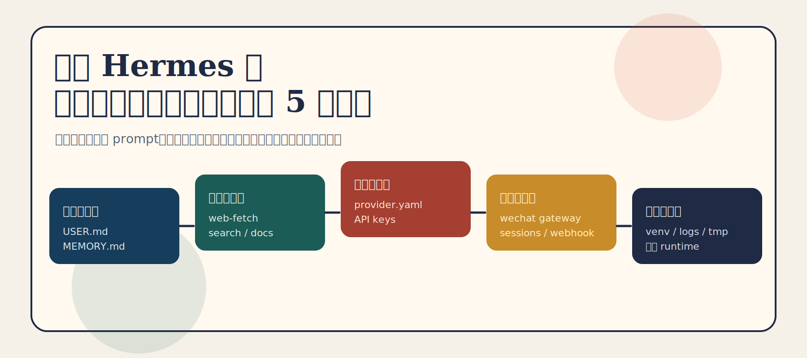
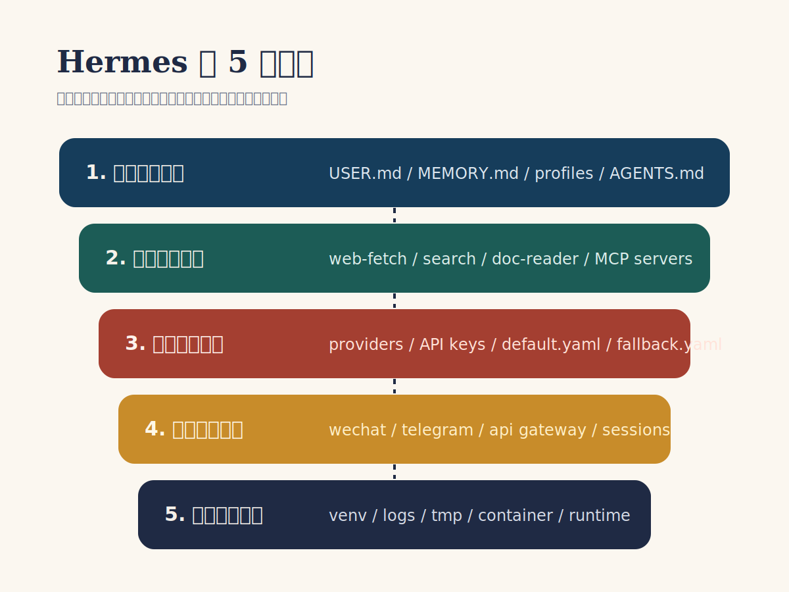
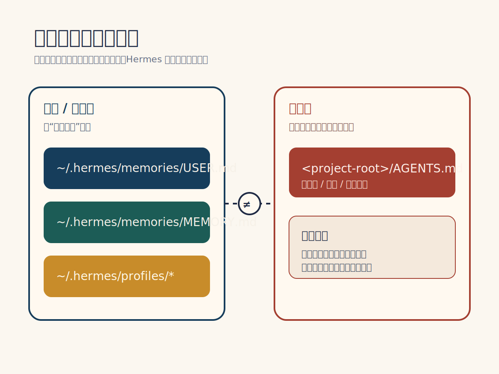
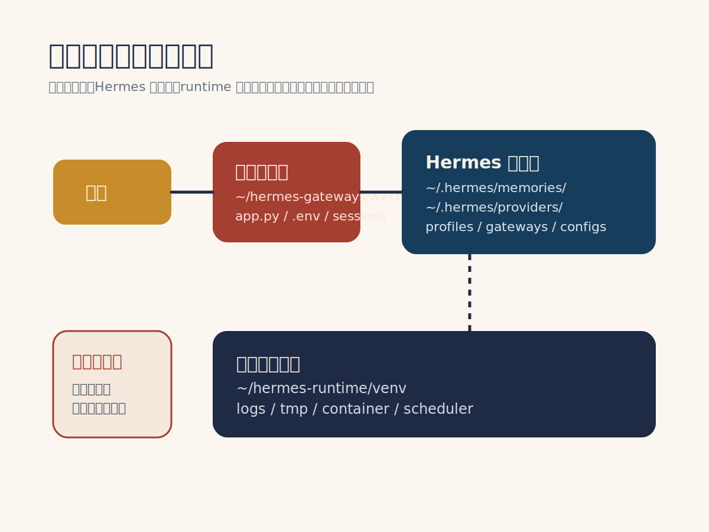

很多人第一次装好 Hermes，都会有一种错觉：

“已经能跑起来了，后面慢慢用就行。”

但真到开始高频使用时，问题马上就会出来：

- 记不住你是谁
- 捞不到外部信息
- 模型能接上，但成本和稳定性都不舒服
- 想接微信，却不知道入口该放哪
- 跑了几天之后，环境又乱了

这时候你会发现，**Hermes 裸装版和真正能长期用的 Hermes，根本不是一回事。**

差距不在模型本身，而在于你有没有把它背后的系统补齐。

更关键的是，很多文章会讲“要配长期记忆、要接微信、要加感知能力”，但不会直接告诉你：

**这些东西到底应该装在哪。**

这篇就把这件事讲清楚。

不是泛泛聊概念，而是直接回答一个更实用的问题：

**Hermes 后面那几套关键系统，分别应该放在哪一层、哪个目录、哪个入口。**



先把最常用的两个官方链接放前面，方便你边看边配：

- Hermes 官方仓库：<https://github.com/NousResearch/hermes-agent>
- `uv` 官方仓库：<https://github.com/astral-sh/uv>

## 先给结论：Hermes 最好按 5 层来放

如果你想让 Hermes 长期稳定可用，我建议把整套系统按下面这 5 层来理解：

1. 身份与记忆层
2. 感知与抓取层
3. 模型与调用层
4. 入口与连接层
5. 运行与隔离层

这 5 层不要混着放。

很多人后面越配越乱，本质上就是把“该放在配置目录里的东西”塞进了项目目录，把“该独立运行的服务”塞进了 Hermes 主环境，再把“该放入口层的东西”当成了核心逻辑层。

最稳的做法，是一开始就分层。



## 一张表看懂：每套系统该装在哪里

如果你只想先抓重点，先看这张总表：

| 系统 | 作用 | 推荐安装/放置位置 |
|---|---|---|
| 身份与记忆 | 让 Hermes 记住你、记住偏好、记住长期规则 | `~/.hermes/memories/`、`~/.hermes/profiles/`、项目根目录的 `AGENTS.md` |
| 感知与抓取 | 让 Hermes 能读网页、读文档、读外部资料 | 独立工具目录，例如 `~/hermes-tools/`，再通过 MCP / CLI 接到 Hermes |
| 模型与调用 | 接 OpenAI / Claude / Gemini 等模型 | 环境变量、provider 配置文件、Hermes 的模型配置目录 |
| 入口与连接 | 微信、Telegram、Webhook、聊天入口 | 独立接入服务目录，例如 `~/hermes-gateways/wechat/` |
| 运行与隔离 | 保证环境稳定、依赖不打架 | 独立虚拟环境，例如 `~/hermes-runtime/venv/` 或单独容器 |

你可以把它理解成一句话：

**记忆放配置层，抓取放工具层，模型放 provider 层，微信放入口层，环境放运行层。**

下面展开讲。

## 1. 身份与记忆系统：不要放得到处都是，要集中放在 Hermes 的记忆层

这是最容易被配乱的一层。

很多人会把自己的偏好、项目规则、临时进度、长期习惯，全都随手扔进一个文件里。结果就是：

- 该长期保留的没有沉淀下来
- 该临时记录的反而污染了长期记忆
- 下次重启后自己都找不到哪份文件才是“主脑”

更稳的放法是分三类。

### 第一类：用户长期偏好

比如：

- 你是谁
- 你的工作方向
- 你的语言偏好
- 你的输出风格
- 你长期不想重复解释的背景

这类内容建议放在：

`~/.hermes/memories/USER.md`

或者等价的用户级 profile 文件里。

这层的特点是：
**和某个单一项目无关，而是和“你这个人”有关。**

### 第二类：Hermes 的工作记忆

比如：

- 当前已经验证过的环境事实
- 反复确认过的技术约束
- 长期有用的执行经验

这类内容建议放在：

`~/.hermes/memories/MEMORY.md`

这层更像 Hermes 的长期工作笔记。

如果你想看 Hermes 官方对不同记忆 provider 的说明，可以直接看这里：

- Hermes Memory Providers 文档：<https://hermes-agent.nousresearch.com/docs/user-guide/features/memory-providers/>

### 第三类：项目级规则

比如：

- 这个项目用什么技术栈
- 哪些目录不能碰
- 哪些命令是标准验证方式
- 团队约定的开发规范

这类内容不要放在全局记忆里。

它应该放在项目根目录：

`<project-root>/AGENTS.md`

或者你项目里专门的项目规则文件中。

这一步非常重要。

因为很多人一上来就把项目规则写进全局记忆，结果换项目时 Hermes 还带着旧习惯工作，越用越乱。

### 这一层最推荐的目录结构

```text
~/.hermes/
  memories/
    USER.md
    MEMORY.md
  profiles/
    main/
    research/
    content/

<project-root>/
  AGENTS.md
```

这里的逻辑是：

- `USER.md` 记你是谁
- `MEMORY.md` 记 Hermes 学到了什么
- `profiles/` 记不同分身
- `AGENTS.md` 记这个项目自己的规则

如果你准备把外部长期记忆接进来，这几个链接最值得放进收藏夹：

- Mem0 官方仓库：<https://github.com/mem0ai/mem0>
- Mem0 开源文档：<https://docs.mem0.ai/open-source/overview>
- Hindsight 官方仓库：<https://github.com/vectorize-io/hindsight>



## 2. 感知与抓取系统：不要直接塞进主目录，最好单独做成工具层

很多人想给 Hermes 加网页抓取、搜索、文档读取能力时，第一反应是：

“是不是直接装进 Hermes 就行？”

不建议这么做。

因为这类能力本质上不是“记忆”，也不是“模型”，而是**外部工具能力**。

最稳的方式，是把它们放进一个独立工具层，再接给 Hermes。

推荐做法是单独建目录：

`~/hermes-tools/`

里面再按能力拆：

```text
~/hermes-tools/
  web-fetch/
  search/
  doc-reader/
  notes-sync/
```

然后通过下面任一方式接入 Hermes：

- MCP
- CLI tool
- 本地 HTTP service

如果你准备走 MCP 这条路，最常用的官方入口是：

- MCP 官方组织：<https://github.com/modelcontextprotocol>
- MCP Servers 仓库：<https://github.com/modelcontextprotocol/servers>

为什么要单独放？

因为抓取能力更新频率高，依赖复杂，最容易和主环境打架。

如果你把它们全部混装进 Hermes 主运行环境，后面一升级，坏的通常不是单个抓取工具，而是整套系统。

### 这一层你真正要避免的坑

不要把下面这些东西直接当成记忆系统的一部分：

- 网页抓取脚本
- 搜索适配器
- RSS / API 拉取器
- PDF / Markdown 解析器

它们不是记忆本身。

它们是记忆和推理的“上游供给层”。

所以它们应该住在工具层，而不是住进 `~/.hermes/memories/`。

## 3. 模型与调用系统：不要写死在脚本里，要集中放到 provider 配置层

第三层是模型。

这里最常见的错误，是把各种 key、provider 地址、默认模型、fallback 模型，直接写死在启动脚本里。

短期看好像方便，长期一定会出问题。

更稳的方式是把模型调用独立成一层，至少做到两件事：

1. 凭证走环境变量
2. 模型选择走配置文件

### 推荐放置方式

#### 凭证

放进环境变量，例如：

```text
OPENAI_API_KEY
ANTHROPIC_API_KEY
GEMINI_API_KEY
```

#### Hermes 的模型配置

放到 Hermes 的配置目录，或者 provider 配置文件中。

如果你自己维护多模型路由，建议单独放在：

`~/.hermes/providers/`

例如：

```text
~/.hermes/
  providers/
    default.yaml
    fallback.yaml
    cheap-models.yaml
```

这样做的好处是，你后面要换模型、换路由、换默认策略时，不需要动主逻辑文件。

### 这一层最重要的原则

**模型接入属于 provider 层，不属于业务层。**

也就是说：

- 不要把模型 key 写在微信机器人代码里
- 不要把默认模型写在网页抓取脚本里
- 不要让某个记忆模块偷偷绑死某个 provider

模型应该是可替换的。

否则后面你想做：

- 高成本任务走强模型
- 高频任务走便宜模型
- 非英语任务切别的模型

就会非常痛苦。

## 4. 入口与连接系统：微信不该装在 Hermes 核心目录里，而该作为独立网关

这是很多人最容易误判的一层。

大家都想把 Hermes 接进微信，但微信入口并不等于 Hermes 本体。

更准确地说：

**微信是 Hermes 的入口层，不是 Hermes 的核心层。**

所以最好的方式，不是把微信逻辑硬塞进主项目里，而是做成一个独立 gateway。

推荐放在：

`~/hermes-gateways/wechat/`

目录大概可以长这样：

```text
~/hermes-gateways/
  wechat/
    app.py
    .env
    webhook/
    sessions/
```

如果你后面还想接别的入口，也按这个思路来：

```text
~/hermes-gateways/
  wechat/
  telegram/
  api/
```

### 为什么要独立？

因为入口层解决的是这些问题：

- 用户消息怎么进来
- 会话怎么映射
- 授权怎么做
- 回调怎么处理
- 多入口怎么并存

这些都不是 Hermes 核心推理逻辑。

如果你把它和主逻辑混在一起，后面一旦微信那边变动，你就会被迫一起动 Hermes 本体。

这会让维护成本直线上升。

如果你是按微信入口来配，最值得直接参考的是 Hermes 的 Weixin 文档：

- Hermes Weixin 文档：<https://hermes-agent.lzw.me/docs/en/user-guide/messaging/weixin>

里面已经明确写了几件关键事：

- `hermes gateway setup`
- 账号凭证会保存到 `~/.hermes/weixin/accounts/`
- 环境变量建议放在 `~/.hermes/.env`
- 网关启动命令是 `hermes gateway`



### 这一层的关键理解

你接的是“入口”，不是“本体”。

所以微信适合放在：

- 独立服务目录
- 独立 `.env`
- 独立 session 状态

而不是放进 `~/.hermes/memories/` 或 Hermes 主运行目录里。

## 5. 运行与隔离系统：给 Hermes 单独一套环境，不要和别的项目混住

最后这一层最不显眼，但最决定长期稳定性。

如果你前面四层都配得不错，但运行层一团乱，最后一样会崩。

最常见的错误是：

- 直接往系统 Python 里装
- 把 Hermes、抓取工具、微信入口全装在同一个环境
- 项目 A 的依赖和项目 B 的依赖互相污染

长期看，这基本必炸。

### 推荐放法

给 Hermes 单独准备运行环境，例如：

`~/hermes-runtime/`

里面再放：

```text
~/hermes-runtime/
  venv/
  logs/
  tmp/
```

如果你用容器，也一样遵循这个原则：

- Hermes 主服务一个容器
- 微信入口一个容器
- 抓取工具按需拆分

### 为什么这一层必须单独放

因为这一层负责的是：

- 依赖隔离
- 日志
- 临时文件
- 任务运行稳定性

它和记忆层、入口层、工具层都不是一回事。

最怕的就是所有东西都堆在一个目录里，最后你连哪部分坏了都分不清。

## 如果你现在就要开始配，最推荐的目录结构是这样

这是我更推荐的一种长期可维护布局：

```text
~/
  .hermes/
    memories/
      USER.md
      MEMORY.md
    profiles/
      main/
      research/
      content/
    providers/
      default.yaml
      fallback.yaml

  hermes-runtime/
    venv/
    logs/
    tmp/

  hermes-tools/
    web-fetch/
    search/
    doc-reader/

  hermes-gateways/
    wechat/
      .env
      app.py
      sessions/

<project-root>/
  AGENTS.md
```

这个结构最大的好处是：

- 用户记忆、项目规则、工具能力、模型配置、入口服务，彼此不混
- 出问题时更容易定位
- 后面你要扩展 Telegram、网页端、知识库同步，也不会推倒重来

## 如果你现在就要开装，最短入口就这两个链接

很多人看完文章，最想知道的其实不是原理，而是“我第一步该点哪里”。

那就先从这两个开始：

### 1. Hermes 主仓库

<https://github.com/NousResearch/hermes-agent>

这是 Hermes 本体。

你后面无论是：

- 克隆源码
- 看安装说明
- 看 `README`
- 查 gateway、memory、provider 支持情况

基本都绕不开这个仓库。

### 2. `uv` 官方仓库

<https://github.com/astral-sh/uv>

如果你准备按“独立环境、不污染系统 Python”的方式装 Hermes，那么 `uv` 基本就是最省心的起点。

你可以把它理解成：

**先用 `uv` 把环境隔离干净，再把 Hermes 装进去。**

## 最后一句话总结

Hermes 真正难的，不是“装上它”。

而是装完之后，你有没有把它放进一个长期可维护的结构里。

如果你只是想体验一下，裸装当然够。

但如果你想把它接进日常工作流，真正开始承担记忆、抓取、模型调用、微信入口这些任务，那最重要的不是再找一个神 prompt，而是先把这 5 套系统放对位置。

说得更直白一点：

**记忆归记忆，工具归工具，模型归模型，微信归微信，环境归环境。**

只要这件事一开始就分清楚，后面的 Hermes 基本就不会越配越乱。
