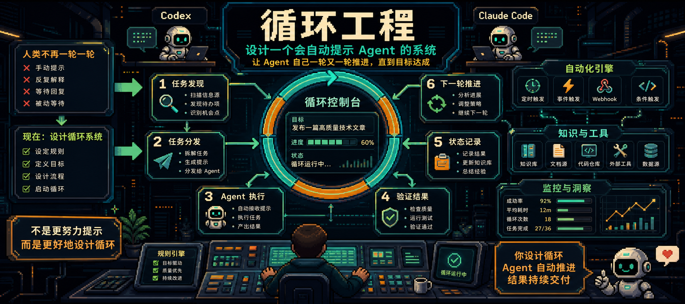
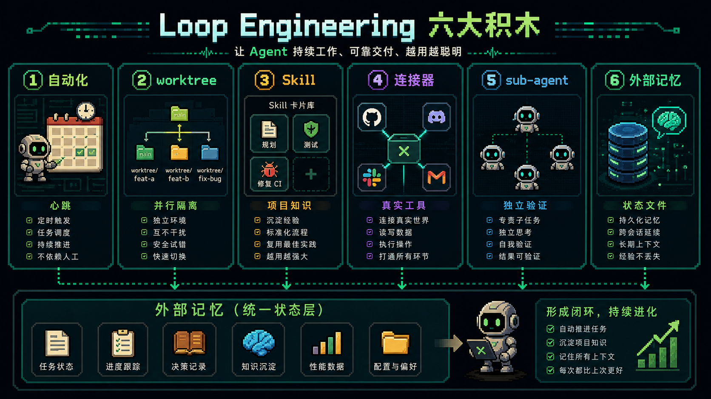

过去两年，我们和 coding agent 协作的方式，基本还是“人类一轮一轮提示”。

你写一个 prompt，它回一个结果；你读完，再补上下文；它继续改。

Addy Osmani 的 [Loop Engineering](https://x.com/addyosmani/status/2064127981161959567) 讲的是另一种变化：你不再把自己放在每一轮 prompt 的位置上，而是设计一个会自动提示 agent、分发任务、检查结果、记录状态、继续下一轮的系统。

## 一个 loop 需要五块积木

一个 loop 通常需要五件事，再加一个外部记忆层：

- 自动化
- worktree
- skill
- 插件和连接器
- sub-agent

第六块是记忆，可以是 Markdown 文件，也可以是 Linear 看板。关键是它必须活在单次对话之外，记录“做了什么”和“下一步是什么”。

## 自动化是心跳，worktree 是隔离

自动化让 loop 按时醒来，去扫 issue、汇总 CI 失败、写 commit briefing、找 bug。

worktree 则解决并行时的文件冲突，让多个 agent 在各自 checkout 里工作。

但 worktree 只能解决机械冲突，不能解决你的 review 带宽。

## Skill 和 connector 让 loop 不再瞎猜

Skill 把项目规则、构建步骤、历史坑位和任务流程写到外部，避免 agent 每轮都从零推断。

Connector 则让 loop 进入你的真实工作环境：issue tracker、数据库、staging API、Slack、GitHub、Linear。

有了它们，loop 才能从“建议你怎么做”，变成“开 PR、关联 ticket、CI 绿了以后通知频道”。

## sub-agent 让写的人和检查的人分开

loop 里最重要的结构之一，是把 maker 和 checker 分开。写代码的 agent 不应该自己给自己打分。

一个不同角色的 verifier，往往能抓到第一个 agent 说服自己接受的问题。

## 最后

Loop Engineering 不是让你退出工程，而是把你的杠杆点从“写 prompt”移动到“设计系统”。

真正成熟的态度不是让 loop 替你思考，而是设计 loop 放大你的判断，同时仍然承担工程责任。

原文来源：[@addyosmani](https://x.com/addyosmani/status/2064127981161959567)
