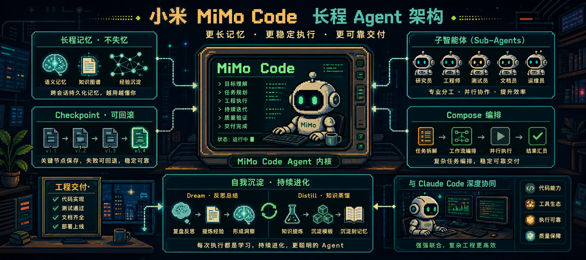
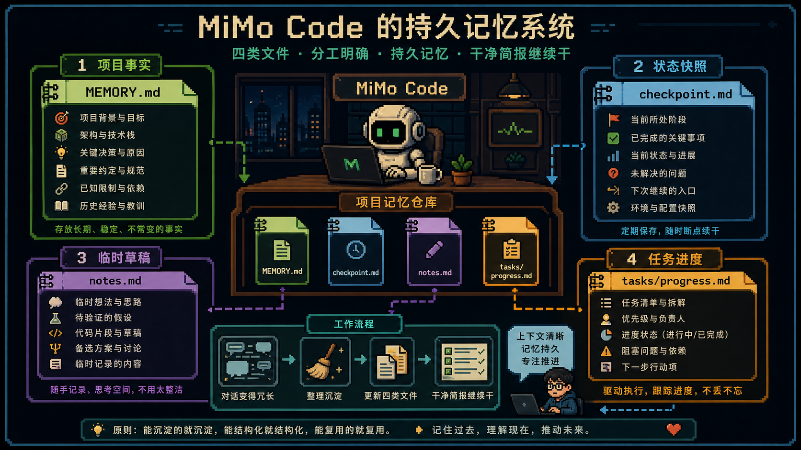

小米最近把 `MiMo Code` 推上了 GitHub。项目地址是 [`XiaomiMiMo/MiMo-Code`](https://github.com/XiaomiMiMo/MiMo-Code)。

它真正值得看的，不是“能不能写代码”，而是它把长程 Agent 最容易崩的几层拿出来正面打：记忆、状态、子智能体、编排和自我沉淀。



## 持久记忆：不是上下文越长越好，而是状态要留下

MiMo Code 把记忆拆成 `MEMORY.md`、`checkpoint.md`、`notes.md`、`tasks/progress.md` 这类文件。

这比简单压缩对话更可靠，因为它明确区分了项目事实、当前状态、临时草稿和任务进度。



## 子智能体：写的人和判断完成的人要分开

长程任务里最危险的问题之一，是 Agent 自己觉得做完了，但实际上没做完。

MiMo Code 的 subagent 和 judge model 设计，核心就是让主 Agent 专注干活，把状态维护、后台执行和完成判断拆出去。

## Compose：从一个想法到工程交付

`Compose` 模式把一个想法放进结构化工作流：规划、执行、代码审查、TDD、调试、验证、合并。

这说明它卷的不只是模型输出，而是 Agent harness 和工程流程。


## dream / distill：把重复经验沉淀下来

`/dream` 负责合并、去重、验证和压缩历史记忆。

`/distill` 负责发现重复手动工作流，并打包成可复用的 skill、subagent 或 command。

这才是“越用越懂项目”的关键。

## 真比 Claude Code 强吗

官方 benchmark 值得关注，但不能直接等同于全面更强。

更稳的判断是：MiMo Code 把 AI 编程 Agent 的下一轮竞争点摆出来了。真正的竞争不只在模型，而在长程任务架构。


## 项目链接和安装方式

项目地址：[`XiaomiMiMo/MiMo-Code`](https://github.com/XiaomiMiMo/MiMo-Code)

Mac / Linux：

```bash
curl -fsSL https://mimo.xiaomi.com/install | bash
```

Windows：

```bash
npm install -g @mimo-ai/cli
```

启动：

```bash
mimo
```

原文来源：本地粘贴文本整理
