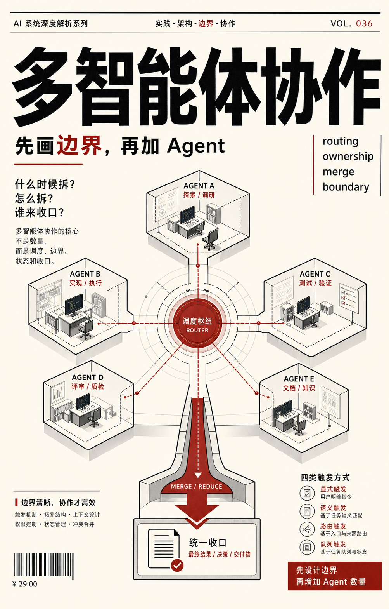
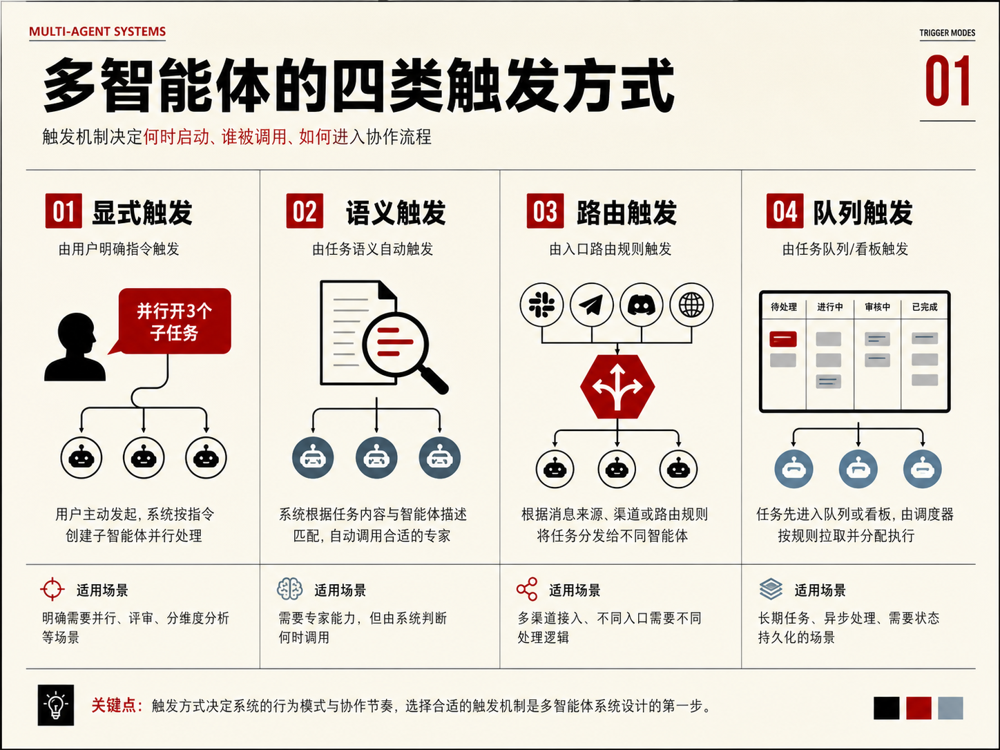
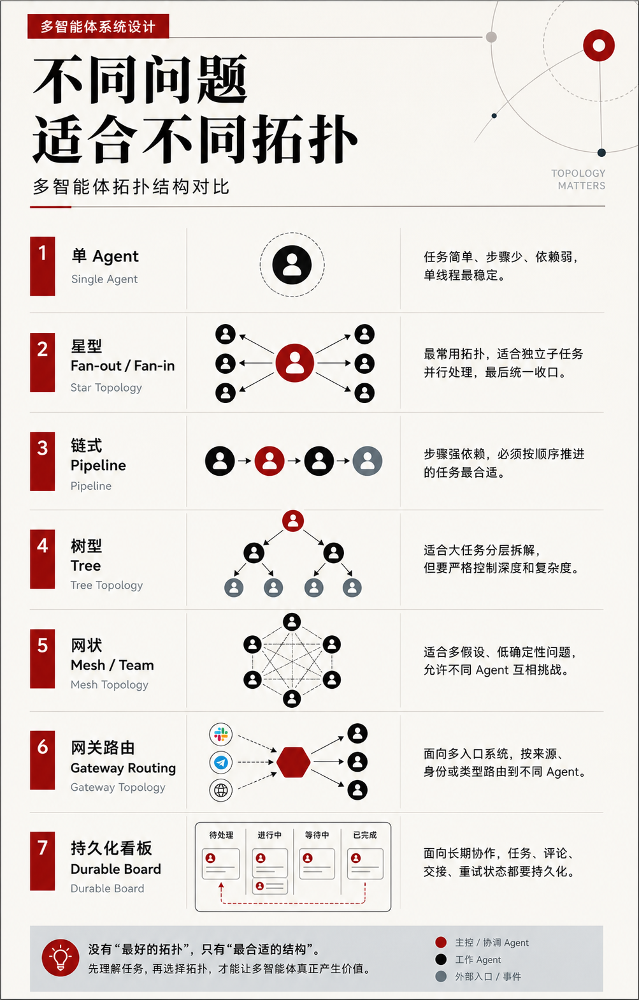
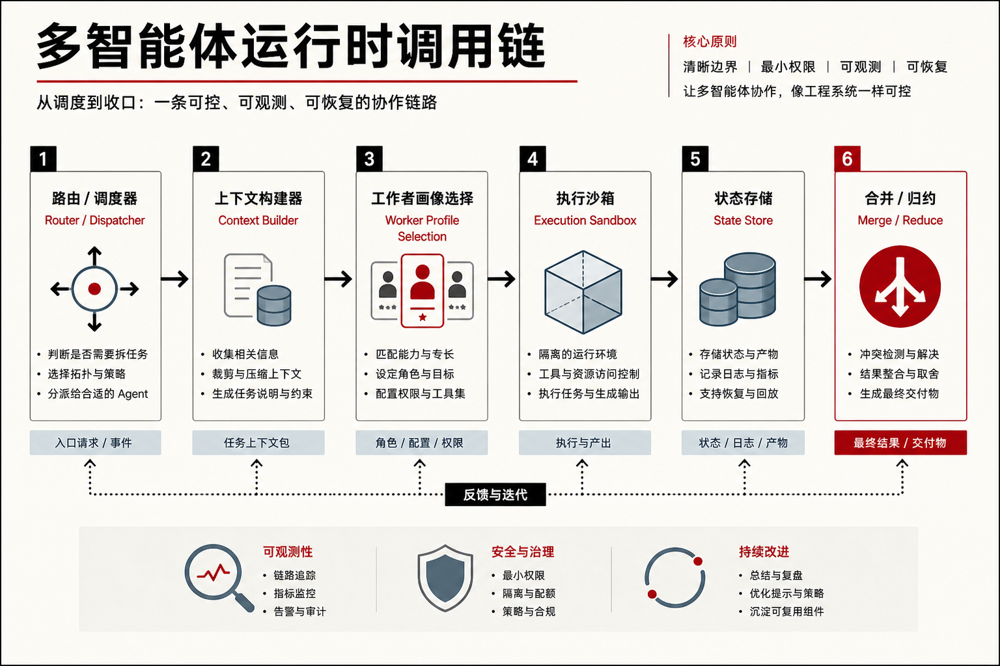

现在一提多智能体，很多内容都会讲成一个很热闹的团队故事。

一个 agent 查资料。  
一个 agent 写代码。  
一个 agent 跑测试。  
一个 agent 做 review。  
最后主 agent 像项目经理一样把结果收回来。

这个画面当然很吸引人。

但只要你真的用过多智能体，而且不是玩具 demo，而是拿它做过几次像样的工程任务，你很快就会发现：

**多智能体的难点，从来不是“能不能多开几个模型实例”，而是这些实例之间到底该怎么分工。**

因为真实环境里，问题马上就会变成：

- 谁决定要不要拆任务
- 拆给谁
- 每个 worker 拿到多少上下文
- 它能不能写文件
- 多个 worker 写到同一块代码怎么办
- 子任务失败、超时、被中断之后怎么恢复
- 结果回来以后谁判断冲突
- 谁承担最后的 merge 责任

这些都不是模型“聪不聪明”的问题。

它们是运行时设计问题。

所以如果你真想把多智能体用好，一个更有用的切入方式不是继续幻想“AI 团队协作”的画面，而是先回到工程常识：

**什么时候该拆，怎么拆，拆完以后谁负责收口。**

## 先别急着谈协作，先把两个问题分开

大多数关于多智能体的讨论之所以越聊越乱，是因为一开始就把两个问题混在了一起。

第一个问题是：

**什么时候从单 agent 变成多 agent？**

第二个问题是：

**一旦变成多 agent，它们怎么组织？**

前者是触发。  
后者是拓扑。

如果这两个层次不分开，你最后很容易得到一种看起来很忙、实际很乱的系统：

- 该单线程的任务被硬拆成并行
- 该强顺序推进的任务被搞成多人会战
- 该持久化排队的任务被塞进一次性对话
- 该只读调研的 worker 被赋予了写权限

于是 agent 数量上去了，但系统可控性下来了。

## 多智能体的第一层，其实不是协作，而是触发

文章里把触发方式分成四类，我觉得这个框架非常有帮助。

- **显式触发**：用户明确说“并行开几个 subagent”或“按几个 review 维度分别开 worker”。Codex 很大程度上就是这个思路。
- **语义触发**：系统根据任务内容和 agent description 判断是否调用某个专家。Claude Code 的普通 subagent 更接近这一类。
- **路由触发**：系统不是先看任务复杂不复杂，而是先看消息从哪里来。OpenClaw 更像这一类。
- **队列触发**：任务先被写进 board、queue 或 background job，再由 dispatcher 处理。Hermes 的 Kanban 很典型。

这个分类最有价值的地方在于，它会逼你承认一件事：

**多智能体根本不是一个统一技术，而是一组完全不同的运行时选择。**

有的系统追求当前回合立刻拆分。  
有的系统追求长期路由。  
有的系统更像即时并行器。  
有的系统本质上是任务队列。

如果不先分清这一层，后面的所有“团队协作想象”都会变得非常模糊。

## 第二层才是拓扑：不是所有任务都该 fan-out

触发决定“要不要拆”。  
拓扑决定“拆完怎么排”。

很多人一聊多智能体，就默认“越多越高级”。

但真实工程里，很多任务根本不值得拆。

比如：

- 修改很小
- 需求还模糊
- 步骤强依赖
- 反馈循环要求很短

这类任务用单 agent 往往最稳。

而一旦需要拆，也不是只有一种拆法。

- **星型 fan-out / fan-in**：最常见也最实用，一个主 agent 派多个 worker，最后统一收口。
- **链式 pipeline**：适合强顺序任务，比如先定位 bug，再写修复，再补测试，再 review。
- **树型**：适合大任务分层，但必须严格控制深度。
- **网状 mesh / team**：适合多假设问题，比如生产故障排查，需要不同线索互相挑战。
- **Gateway routing**：适合常驻多入口系统，不同消息进入不同 agent。
- **Durable board**：适合长期协作，任务、评论、handoff、重试状态都要持久化。

这个层最容易被忽略的一点是：

**多智能体里最值钱的分工，不一定是“谁负责什么能力”，而往往是“谁负责哪块边界”。**

很多 repo-wide migration 就是典型例子。

按“一个负责思考、一个负责实现、一个负责测试”去拆，常常会打架。  
按目录边界、模块边界、文件 ownership 去拆，反而更稳。

## 把系统拆开看，你会发现多智能体其实是一条调用链

如果把一个多智能体系统当成运行时来看，它大致可以拆成这样一条链：

- router / dispatcher
- context builder
- worker profile selection
- execution sandbox
- state store
- merge / reduce

这个拆法最大的好处是，它会逼你意识到：

**多智能体的成败，不发生在“开 worker 的那一刻”，而是分散在整条链路里。**

### 1. Router / dispatcher

决定要不要拆，以及拆给谁。

Codex 更偏显式授权。  
Claude Code 更受 description 匹配影响。  
OpenClaw 很多时候先看入口路由。  
Hermes 的短任务和长任务甚至走两套机制。

### 2. Context builder

决定 worker 知道什么。

这是多智能体最容易出错的地方。

很多人把 worker 拉起来，只丢一句“修一下”。  
这几乎等于没给需求。

对 worker 来说，委派信息不是补充说明，而是它的全部任务文档。

项目路径、错误现场、相关文件、验收标准、禁止事项、输出格式，这些不给，它就只能猜。

### 3. Worker profile selection

决定它是什么角色。

是 explorer，还是 implementer，还是 reviewer，还是一次性 child？

角色不同，意味着：

- 权限不同
- 输出不同
- 出错成本不同

### 4. Execution sandbox

决定它能做什么。

能不能跑 shell？  
能不能联网？  
能不能写文件？  
能不能继续 spawn child？  
能不能访问用户凭据？

这些不只是安全问题，也会直接改变协作模式本身。

### 5. State store

决定状态放在哪里。

只活在本轮对话里，还是能跨 turn 保存？  
是 ephemeral summary，还是 task/comment/handoff/blocked 状态？

这一步决定了系统能不能长期运行。

### 6. Merge / reduce

决定最后谁收口。

多个 worker 给出结果以后：

- 谁判断冲突
- 谁做取舍
- 谁写最终 patch
- 谁对用户负责

很多多智能体 demo 看起来漂亮，就是因为它跳过了这一步。

但真实工程里，**merge 才是多智能体最难的地方。**

## 看四个系统，最值得学的不是“谁更强”，而是谁在哪一层做了取舍

把 Codex、Claude Code、OpenClaw、Hermes 放在一起看，它们的区别并不在“会不会多智能体”。

而在：

**它们把重点押在哪一层。**

### Codex：显式 fan-out，默认克制

Codex 的特点就是克制。

它默认不会因为任务听起来复杂，就自动开很多 worker。

你得显式授权并行。

这个取舍背后非常现实：

- 多开 agent 会增加 token
- 会增加延迟
- 会增加日志量
- 会增加 merge 成本
- 会增加文件冲突风险

所以 Codex 更像一个强调可控性的星型系统。

### Claude Code：description 驱动专家委派，也支持 team / batch / worktree

Claude Code 的普通 subagent 更像本地专家注册表。

这里 description 非常关键。

它不是“自我介绍”，而是“触发规则”。

写得像触发条件，系统才更容易在对的时候叫到它。  
写得太泛，系统就会变成到处乱调人。

### OpenClaw：重点不是并行，而是 Gateway 和长期隔离

OpenClaw 和前两个工具最大的差别在于，它先面对的是多渠道事件流。

Slack、Telegram、Discord、家庭入口、私人入口，不同来源意味着不同身份、不同权限、不同上下文。

所以 OpenClaw 的第一层不是 subagent，而是 routing。

它更像在追求：

**像操作系统一样稳定区分边界。**

### Hermes：把短程并行和长期协作拆成两套原语

Hermes 最值得学的地方，是它没有把所有多智能体场景混成一种。

它把短程并行交给 `delegate_task`。  
把长期协作交给 `Kanban`。

前者像 RPC。  
后者像 durable queue + state machine。

这个边界特别重要。

因为很多系统的混乱，恰恰来自：把需要跨天的事塞进一次性子任务，把几分钟能跑完的事做成一个沉重的 board。

## 真正决定效果的，不是角色多不多，而是场景有没有选对结构

这篇文章后面给的几个场景，其实都在说明同一件事：

### PR review

通常不需要复杂 mesh。

安全、测试、性能各开一个只读 worker，最后主 agent 汇总就够了。

### 生产登录故障

更适合并行探索，甚至适合带反证关系的 team。

但这里最稳的方式通常不是一上来让多个 worker 一起写修复。

而是：

先只读并行定位，  
再单点写 patch，  
最后再做 review。

### 多渠道个人助理

这不是“多个 agent 一起完成一件事”的问题。  
这是入口路由和权限隔离的问题。

### 两天的调研报告

这类任务不应该只靠一次性 subagent。

你需要的是：

- 任务拆分
- 状态记录
- 交接
- 评论
- 重试
- 等待人类介入

所以 durable board 更合适。

### Repo-wide migration

按文件边界或目录边界拆，通常比按抽象角色拆更稳。

这再次说明：

**真正有价值的分工，往往不是能力分工，而是边界分工。**

## 最后

如果把这篇文章压缩成一句话，我会这样总结：

**多智能体协作的核心不是 agent 数量，而是调度、边界、状态和收口。**

Codex 更适合显式、可控的星型并行。  
Claude Code 更适合 description 驱动的专家委派，也能扩展到 team、worktree 和 batch。  
OpenClaw 更适合多入口、常驻、权限隔离的 agent 网络。  
Hermes 更适合把短程并行和长期工作流拆开，分别处理。

而对大多数人来说，真正值得学的并不是“怎么把画面做得更像一个 AI 团队”。

真正值得学的是：

- 什么时候其实不该拆
- 什么时候该用星型
- 什么时候需要 team
- 什么时候应该用 Gateway
- 什么时候必须落 durable board
- 什么时候该先停下来，把 ownership 写清楚

多智能体不是越多越高级，也不是越自动越高级。

它更像一门调度学。

先设计边界，再增加 agent 数量。

这个顺序不炫，但它更接近真实工程。
