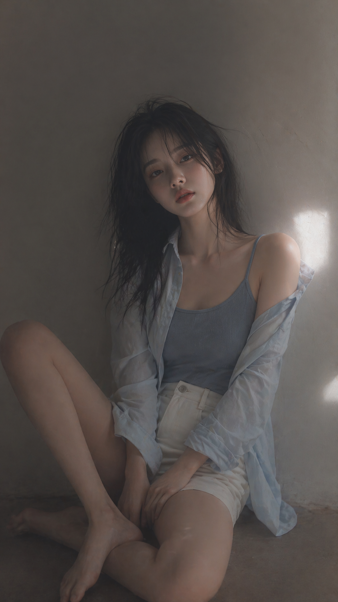

这是一条很适合做“杂志感韩系人像”的提示词。

它的核心不是堆很多形容词，而是把画面的 5 个关键维度一次说清楚：画幅、人物状态、服装材质、光线方向、情绪氛围。模型拿到这类提示后，更容易生成统一感强、气质稳定的成片。



## 这条提示词的成片气质

这张图的几个特点非常明确：

- 9:16 竖向构图，天然适合小红书、公众号头图、短视频封面
- 主体偏心站位，留出大面积负空间，画面更安静
- 柔和侧光加轻微高光泛光，让脸部和肩颈更立体
- 服装是贴身内搭加宽松外层，松弛感会比“完整穿搭”更强
- 坐姿不是完全对称，肩膀和头部都有轻微倾斜，所以不会显得僵

## 原始提示词

```text
9：16 竖向——编辑肖像，单人主体柔和黑雾滤镜，细微朦胧，柔和的高光泛光，柔和色调，室内空间极简，背景干净，轻微质感的年轻韩国女性，简约妆容，自然肤质
服装：紧身罗纹针织上衣或柔软吊带衫叠穿宽松衬衫，搭配高腰短裤或裙子；布料略微贴合身形，柔软自然，无暴露元素
头发：略显凌乱，自然蓬松
姿势：坐在地上，一条腿弯曲，一条腿放松，身体微倾，肩膀不对齐，头部倾斜
构图：主体略偏心，负空间
当前表情：平静，略显疏离，自然
光线：柔和侧光，柔和阴影
情绪：低调、安静，通过自然的身体线条隐约传达感官，放松且不做作
质感：细腻纹理，微柔，逼真的外观
```

## 为什么这条提示词有效

### 1. 画幅先锁死了使用场景

很多人写提示词会先写人物和风格，但这条先给出 `9:16 竖向`，等于先告诉模型这张图大概率是内容平台分发图，而不是横版海报或电商主图。

### 2. 风格词没有走“硬时尚大片”路线

这里用的是：

- 柔和黑雾滤镜
- 细微朦胧
- 柔和高光泛光
- 柔和色调

这几组词会把整体往低饱和、低攻击性、偏安静的编辑感方向推，而不是强反差、强锐化、强戏剧化。

### 3. 姿势描述很具体

真正让画面自然的，不是“坐着”两个字，而是这些小描述：

- 一条腿弯曲，一条腿放松
- 身体微倾
- 肩膀不对齐
- 头部倾斜

模型一旦拿到这种细节，通常比只写“自然坐姿”更容易出片。

### 4. 情绪词和身体语言是一致的

如果你写“安静、低调、疏离”，但姿势又是直视镜头、正肩正背、端坐中央，最后就容易互相打架。这条提示词的情绪和姿态是一套的，所以成图统一。

## 最适合拿来改写的部分

你以后可以把这条提示词当模板，重点替换这几个区块。

### 换服装

可以把这段替换成：

- 奶油色针织开衫 + 浅灰吊带
- 宽松白 T + 牛仔短裙
- 亚麻衬衫 + 高腰半裙

如果想保持“安静感”，尽量还是选柔软材质、低饱和颜色。

### 换场景

当前是极简室内空间。你也可以改成：

- 靠窗卧室
- 水泥墙工作室
- 清晨酒店房间
- 木地板公寓角落

场景一换，气质会变，但提示词骨架还能继续用。

### 换情绪

这一版是“平静、疏离、安静”。

如果你想更亲近一点，可以改成：

- 温柔，略带松弛笑意
- 慵懒，像刚起床
- 放空，像在发呆

## 一条更适合直接复制的精简版

如果你不想一次写这么长，可以直接用这个短版本：

```text
9:16 vertical editorial portrait of a young Korean woman, soft black mist filter, subtle haze, soft side lighting, minimal indoor background, clean negative space, natural skin texture, slightly messy voluminous hair, ribbed knit camisole layered with a loose shirt, high-waisted shorts, sitting on the floor with one leg bent and one leg relaxed, body slightly leaning, uneven shoulders, tilted head, calm and slightly distant expression, soft shadows, quiet and understated mood, delicate texture, realistic look
```

## 适合发布到哪里

这类图很适合这些用途：

- AI 绘图案例分享
- 提示词拆解文章头图
- 小红书封面图
- 视觉灵感集
- 个人博客里的“Prompt Case Study”栏目

如果你后面想继续做这种栏目，我建议我们就按这个格式沉淀：

1. 一张成图
2. 一段原始提示词
3. 一个拆解
4. 一条精简可复制版

这样越写越像你自己的案例库。