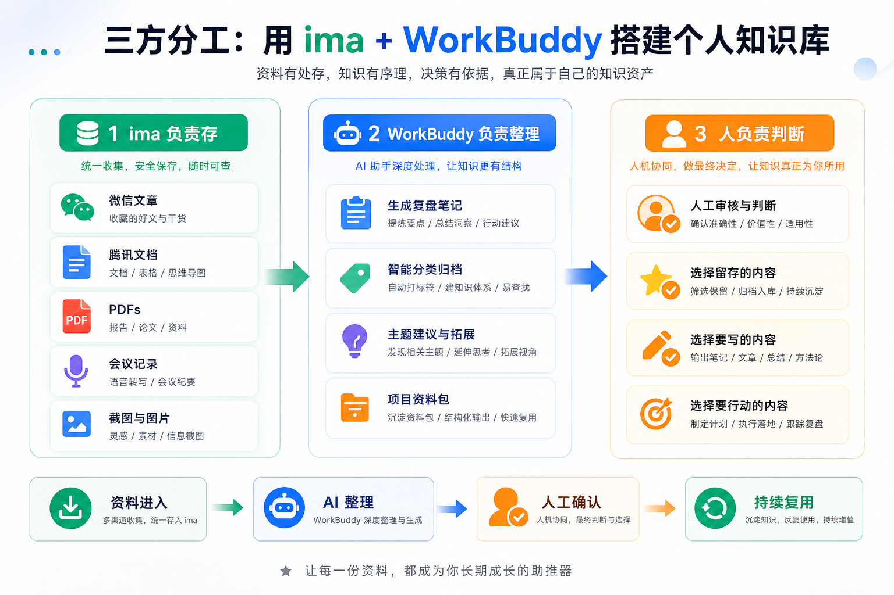
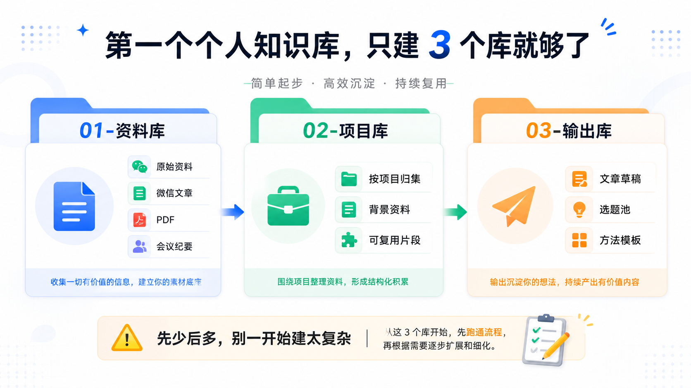
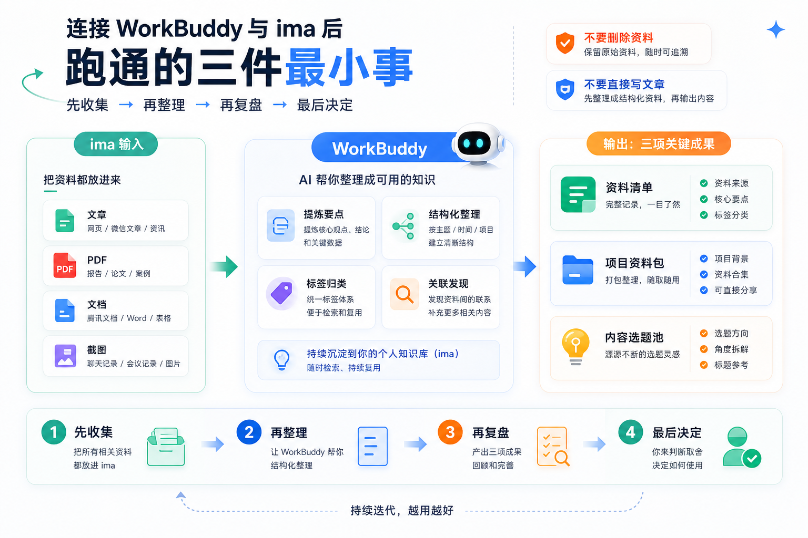
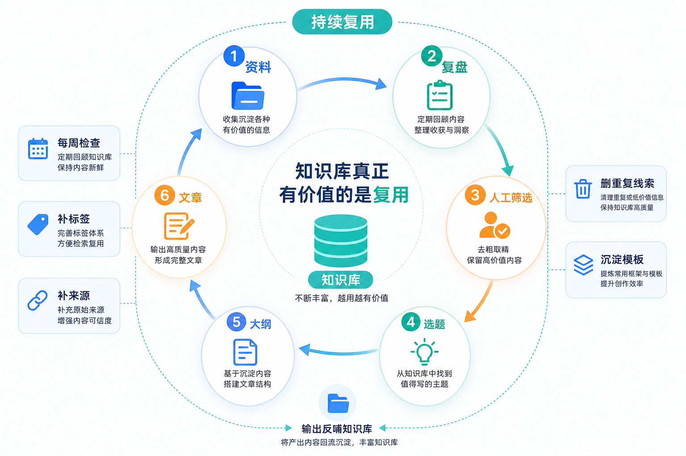

# 用 WorkBuddy + ima 搭个人知识库：小白也能跑通的从 0 到 1 教程

很多人一提到个人知识库，第一反应就是 `Obsidian`。它当然强，但很多普通人真正卡住的不是知识库不够高级，而是资料太散：微信收藏、腾讯文档、PDF、会议纪要、视频字幕、灵感备忘录到处都是，最后谁也找不到。

如果你的资料主要在中文办公环境里，`WorkBuddy + ima` 是一个更适合从 0 开始的组合：`ima` 负责存资料，`WorkBuddy` 负责读取、整理、归类、摘要和生成 review，人负责最后判断哪些内容值得沉淀。

## 为什么不是一上来就用 Obsidian

Obsidian 更像一个很强的仓库，但仓库本身不会整理货架。很多人的知识库最后变成第二垃圾桶：网页、PDF、每日笔记、会议纪要都进去了，但没人处理第二步。

普通人搭知识库，第一步不要追求高级，而是先追求资料进来以后能被初步处理。



## 三个角色怎么分工

`ima` 负责把文章、PDF、本地文件、会议资料、视频字幕、截图 OCR 放进知识库。`WorkBuddy` 负责摘要、分类、提炼观点、生成 review、整理项目资料包和选题候选。人负责判断哪些值得留下，哪些只是临时素材。

顺序不要乱：**WorkBuddy 负责预处理，ima 负责沉淀，人负责确认。**

## 从 0 开始怎么连接

先安装并登录 ima，电脑端打开 `https://ima.qq.com/`，手机端用「IMA 知识库」小程序。然后在 WorkBuddy 左侧「资料库」里选择「ima 知识库」，按提示授权。

关键点：`ima` 和 `WorkBuddy` 必须用同一个微信账号登录，否则知识库可能读不到。

连接后可以用一句话验证：

```text
帮我列出 ima 知识库中所有的知识库名称
```

## 第一版只建三个知识库

小白第一版不要设计太复杂，只建三个：



`01-资料库`：放文章、PDF、报告、网页、课程、视频字幕、访谈稿、会议录音转写。

`02-项目库`：放正在推进的公众号选题、客户项目、产品想法、课程计划、商业方案。

`03-输出库`：放自己的文章草稿、选题库、复盘、总结、观点卡片、方法论沉淀。

第一阶段最重要的不是分类精细，而是资料进来以后不要到处乱放。

## 第一批资料不要太多

第一天不要把所有收藏和 PDF 倒进去。建议只放 20 条以内：5 篇文章、3 份 PDF、3 条视频字幕、5 条灵感笔记、3 份项目资料。

第一阶段是验证三件事：ima 能不能存好，WorkBuddy 能不能读出来并整理好，你看完 AI 生成的结果以后是否愿意继续用。

## 先跑三个最小任务



第一个任务是整理资料库：让 WorkBuddy 读取 `01-资料库`，按主题分组输出标题、摘要、核心观点、适合主题、是否值得精读。不要让它删除、移动或覆盖资料。

第二个任务是生成项目资料包：围绕一个项目整理项目背景、已有资料、关键问题、可用素材、缺失信息和下一步行动。不要让它直接替你做最终决策。

第三个任务是生成内容选题：读取 `01-资料库` 和 `03-输出库`，生成 10 个选题，每个选题包含标题、核心观点、可引用资料、适合角度和风险点。不要直接写完整文章。

## 资料不是直接变文章

更稳的流程是：



```text
资料进入 ima
    ↓
WorkBuddy 生成 review
    ↓
人筛选有价值内容
    ↓
再生成选题
    ↓
再生成大纲
    ↓
最后才写正文
```

资料不等于观点，观点不等于文章，文章也不等于可以发布的内容。尤其涉及商业、法律、医疗、投资等高风险内容，最后判断必须由人确认。

## 每周复盘才是知识库开始运转

个人知识库最重要的不是存，而是复用。建议每周让 WorkBuddy 读取本周新增资料，生成 weekly review：新增内容、重复主题、值得精读的资料、可发展成文章的选题、需要补充的信息和下周行动建议。

这一步会逼你每周处理资料，而不是一直往里扔。

## 远程触发只做低风险任务

WorkBuddy 可以通过微信、企微、QQ、钉钉、飞书等入口远程触发任务。适合做低风险读取和整理，比如查找某个主题资料、整理会议记录、生成 review。

原则是：远程只做低风险处理，正式修改必须回到电脑前确认。

## 哪些内容不要直接放进去

未脱敏的客户资料、合同报价、身份证手机号银行卡、公司内部机密、医疗法律投资最终判断材料、未经核实的二手信息、没有明确用途的大量网页收藏，都不要直接放进自动化知识库。

AI 知识库不是保险柜。如果必须处理敏感资料，先脱敏。

## 先跑小流程，再做 Skill

正确进阶顺序是：

```text
一次性任务 → 固定指令 → 固定模板 → 每周复盘 → 自动化 → Skill
```

第一个 Skill 不要全能，只解决一个明确问题，比如 ima 资料库整理、会议纪要 review、PDF 阅读笔记、内容选题整理或项目资料包。

## 结语

第二大脑不是资料越多越好。真正的问题是资料进去以后，谁来处理、谁来筛选、谁来复盘、谁来判断未来有没有用。

`WorkBuddy + ima` 的价值不是做一个更花哨的收藏夹，而是把知识库拆成一个更适合小白的流程：

**ima 负责存，WorkBuddy 负责整理，人负责判断。**

先让每一批进入系统的资料都有人处理、有人筛选、有人决定是否值得沉淀，这才是个人知识库从 0 到 1。
