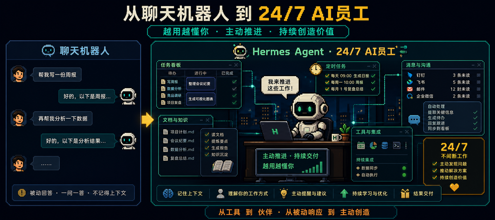
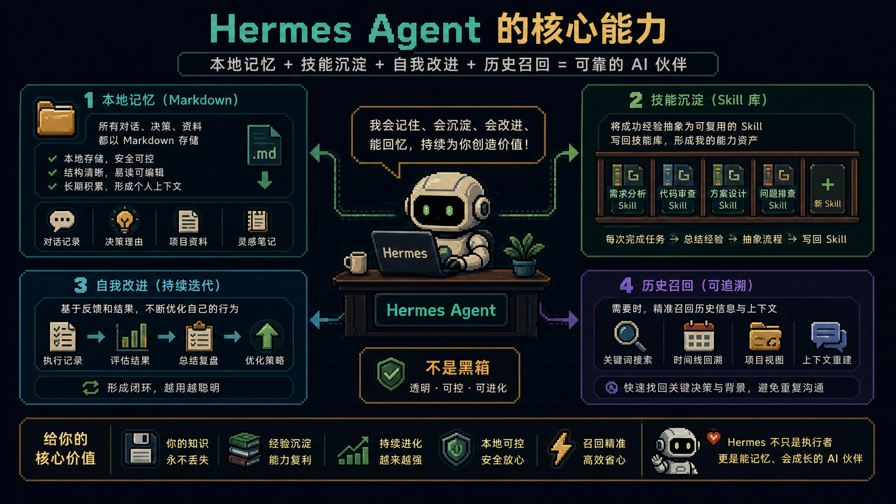
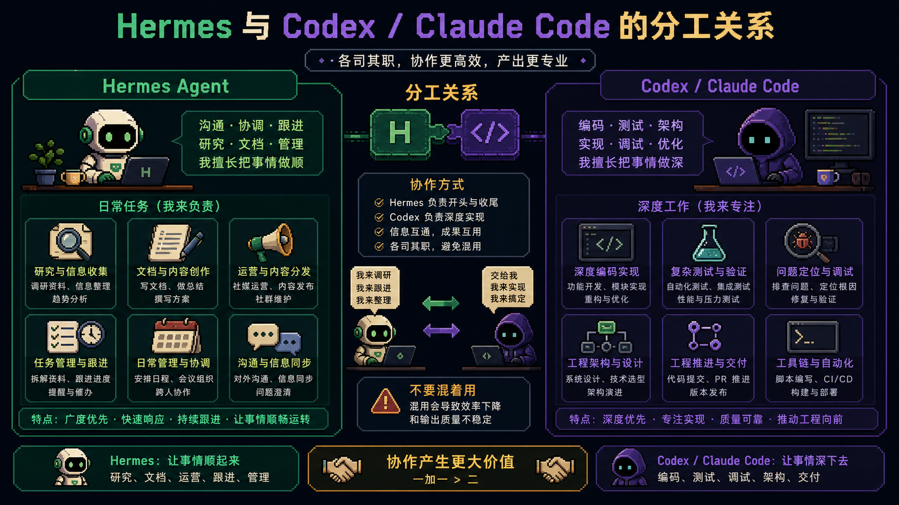
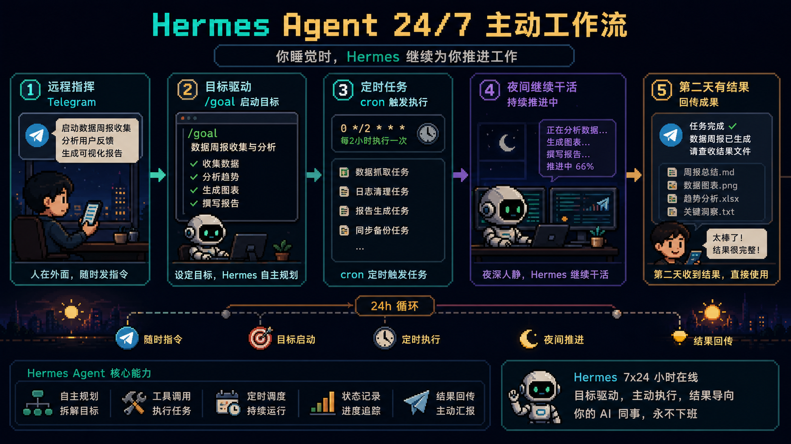

# 跑了几个月 Hermes Agent 之后，我发现 99% 的人根本没用对 AI Agent

很多人嘴上在用 AI Agent，手上其实还是在用聊天机器人。问一句、回一句、再补一句背景、再追一句“继续”，整个过程看起来像在让 AI 干活，实际上还是人类一直在牵着走。

真正拉开差距的，不是 Agent 会不会执行任务，而是它会不会记住你、会不会沉淀经验、会不会在你不盯着的时候继续推进工作。

## 大多数人用错的地方，不在技术，而在心态

很多人关心的是 Agent 会不会自己点按钮、自己查资料、自己写代码，但这些都只是表层能力。更关键的是三个问题：

- 它会不会记住你的上下文
- 它做完一轮事情以后会不会更懂你
- 它下次再遇到同类任务时能不能直接沿用之前的方法

如果这三点做不到，Agent 很容易退化成“会执行任务的聊天框”。

## Hermes 的核心是“越用越懂你”

普通聊天 AI 更像每次重新认识你一次。Hermes 更像一个持续运行的系统，会积累你是谁、你在做什么、你偏好什么、哪些方式对你有效。

更重要的是，这些记忆存在本地 Markdown 文件里，你可以打开、修改、删除。它不只是记住历史，还会把做过的任务经验写回技能库。

## 别拿 Hermes 去替代 Codex

Hermes 和 Codex / Claude Code 不是一个工种。

Hermes 更像 `Chief of Staff`，适合日常任务、研究、文档、运营、内容和长期跟进。Codex / Claude Code 更像深度编程搭子，适合大型项目、复杂调试和深度工程任务。

真正成熟的用法是分工，而不是替代。

## 真正像员工的地方，是它会在你睡觉时继续干活

Hermes 的分水岭不只是 `/goal` 命令本身，而是它和 Telegram、cron、长期记忆、技能沉淀结合以后形成的工作方式。

你白天给方向，夜里它继续推进。第二天你看到的不是一句建议，而是已经往前跑了一段的结果。

## 第一天别急着让它干活，先让它认识你

装好 Hermes 以后，第一步不应该是盲派任务，而应该是 onboarding：告诉它你是谁、做什么、现在最重要的目标是什么、正在推进哪些项目、你的工作偏好是什么。

很多人觉得 Agent 不够聪明，其实问题常常不是模型，而是根本没有认真建立工作上下文。

## 最后

99% 的人不是没用 Agent，而是没真正让 Agent 上班。他们还在把 Agent 当作等待自己提问的对象，而不是一个会持续保留上下文、记住工作方式、沉淀经验、主动推进任务的长期系统。

原文来源：本地粘贴文本整理
