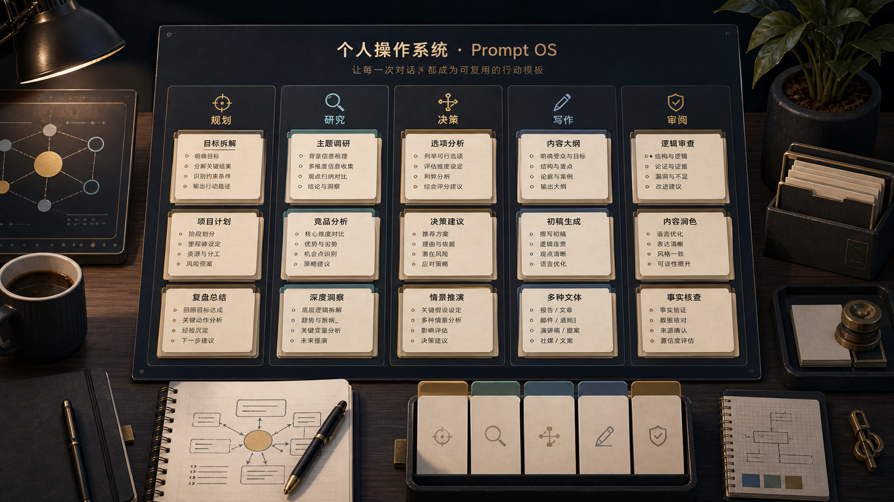

# 我用这 18 个提示词，少走了至少三年的弯路

很多人聊 Claude，还是停留在“它会不会写”“它聪不聪明”“这个模型值不值得升级”。

但如果你真的高频用了很久，你会慢慢发现一件更重要的事：

**真正拉开差距的，不是你会不会和 AI 聊天，而是你有没有把它训练成自己工作流的一部分。**

这两者差别非常大。

前者是偶尔打开一个聊天框，问几个问题。  
后者是你每天起床、开工、研究、写作、开会、做判断、做复盘的时候，Claude 都在你那条工作链路里。

这篇文章里最值钱的，不是“18 个万能提示词”这个噱头。

真正值钱的是它背后那套思路：

**你不是在收集 prompt，你是在积累一套可以反复调用的工作动作模板。**

也正因为这样，这些东西才有复利。

---

## 先说结论：你需要的不是更多 prompt，而是更稳定的“动作模板”

大多数人用 AI 的问题，不是提示词写得不够花，而是每次都从零开始。

今天想研究一个新赛道，就临时想怎么问。  
明天要写一篇文章，又换一种问法。  
后天要做决策，脑子一乱，连问题怎么表述都说不清。

这种用法当然也能出结果，但非常耗神。

因为你每次不只是让模型工作，你还在重复做一层额外劳动：

- 先想自己到底要什么
- 再想该怎么问
- 再想输出要什么格式

而真正高频用户最后都会自然进化到另一种状态：

把常见任务都压缩成固定模板。

比如：

- 早晨的任务拆解模板
- 研究赛道的骨架模板
- 脑子混乱时的思路清洗模板
- 看项目时的反方审查模板
- 周末复盘模板
- 写内容的开头模板

你一旦有了这些模板，AI 就不再只是聊天对象，而开始变成一个可以反复调用的工作系统。

这才是这篇文章真正想告诉你的东西。

---

## 第一类最值钱的用法：把“混乱”快速压成结构

如果你观察这 18 个提示词，会发现有一大类其实都在干同一件事：

**把一团混乱的输入，压缩成一个能行动的结构。**

这是最容易被低估的能力。

因为很多人以为生产力来自“做得更快”，其实更常见的瓶颈是：

你根本还没把问题定义清楚。

比如早上开工时：

- 任务一堆
- 会议穿插
- 截止日期挤在一起
- 情绪上已经先焦虑了

这时候 Claude 最有价值的，不是替你写东西，而是替你先把今天的战场整理出来。

同样的逻辑也适用于：

- 研究一个新赛道
- 消化十份 BP 之后的大脑过载
- 对一个商业判断说不清、但直觉觉得有问题

你会发现，很多所谓“高手感”，本质上不是知道更多，而是能更快把信息压成结构。

如果你把 Claude 用在这一步，它对你的帮助会远远大于让它帮你润色一段客套话。

---

## 第二类最值钱的用法：把“模糊焦虑”翻译成“可管理变量”

这类提示词里，我觉得最强的一类，是决策类。

原因很简单。

人真正难处理的，从来不是清晰问题，而是那种：

- 隐隐不安
- 知道重要
- 但又说不清到底卡在哪

比如：

- 要不要跳槽
- 要不要转方向
- 要不要投这个项目
- 要不要继续投入一个已经开始失速的机会

这些问题最折磨人的地方，在于它们会在脑子里以“情绪”的形式存在很久。

而好的提示词能做的事情是：

**把情绪翻译成变量。**

比如：

- 机会成本是什么
- 最坏情景能不能承受
- 哪个假设是目前最脆弱的
- 哪个信息缺口不补，根本不该做判断

这就是为什么很多高频用户会越来越依赖 Claude 做决策压力测试。

不是因为它替你做决定。

而是因为它能帮你把那种模糊的“怕”，拆成一组能讨论、能验证、能准备预案的结构。

一旦问题进入这个状态，焦虑感本身就会下降很多。

---

## 第三类最值钱的用法：把“输入”变成“判断”

还有一类提示词非常值得注意，它们都不是在追求更多信息，而是在训练更好的判断。

比如：

- 看研报时，不是让 AI 帮你总结，而是逼它指出作者故意模糊了什么
- 看项目时，不是让 AI 帮你写投资理由，而是先写“死亡笔记”
- 学一个新领域时，不是追求百科全书式解释，而是优先拿到对话资格

这类用法和普通用户最大的区别是：

**它不是在向 AI 索取答案，而是在借 AI 逼自己更快接近判断。**

这点非常重要。

因为信息本身的价值越来越低，判断的价值越来越高。

现在谁都能让模型生成一份看起来不错的行业分析。  
但真正稀缺的是：

- 哪个变量最关键
- 哪个风险最容易被忽略
- 哪个论点只是包装
- 哪个趋势是真拐点，不是热闹

也就是说，真正高价值的提示词，往往不是“帮我多知道一点”，而是：

**帮我更快看见真正重要的那一层。**

---

## 第四类最值钱的用法：把 AI 从“助手”变成“工作流操作系统”

这篇文章最后一段其实特别关键。

作者提到一个判断：

提示词正在慢慢变成“智能体编排语言”。

我非常认同。

因为以前 prompt 更像一次性指令。

你问一个问题，它回答一次，结束。

但现在越来越多高频用户的真实用法已经变了：

- Claude 连上数据库
- Claude 连上日历
- Claude 连上邮件
- Claude 能写脚本
- Claude 能调用 MCP 工具
- Claude 能接进完整项目流程

这时候你写的就不再只是“让模型回答一句话”，而是：

**在指挥一条工作流。**

这也是为什么很多旧时代的 prompt 技巧会慢慢贬值。

真正值得积累的，不再是那些“神奇措辞”，而是能稳定调用结果的动作指令。

比如：

- 帮我做今天的作战地图
- 帮我把这个赛道拆成可判断的产业地图
- 帮我做一次反方尽调
- 帮我把这段垃圾初稿打磨成能发的文章
- 帮我做周复盘，并指出重复出现的坑

这些东西一旦接上工具，接上记忆，接上你自己的工作环境，它就不再是提示词，而开始像一层操作系统。

---

## 真正该学的，不是 18 个模板本身，而是它们背后的 5 种任务类型

如果你想把这篇文章真正用起来，我反而不建议你只复制粘贴 18 个原版。

更好的做法是先理解，它们其实可以被压缩成 5 类：

### 1. 清晰化

适合：

- 早上排优先级
- 脑子很乱
- 信息太多
- 不知道先做什么

### 2. 研究与判断

适合：

- 研究赛道
- 看项目
- 看研报
- 学新主题

### 3. 决策压力测试

适合：

- 重大选择
- 风险评估
- 机会成本分析
- 反方视角拆解

### 4. 输出打磨

适合：

- 写文章
- 写开头
- 写销售文案
- 写报价

### 5. 复盘与优化

适合：

- 周复盘
- 工作流减负
- 技能缺口盘点
- 用户画像分析

你真正应该做的，是从这 5 类里各选 1-2 个最适合你当前工作的，先改成你自己的版本。

不要追求一下子全部学会。

你只需要先把最常用的那几类固定下来，先跑一周。

跑着跑着，你就会开始拥有自己的“肌肉记忆提示词库”。

---

## 最后一句话：这不是工具升级，而是你开始重新分配自己的注意力

我很喜欢这篇文章最后的落点。

它真正想表达的，不是 Claude 多强，也不是提示词多神。

而是：

**你开始把重复劳动、低价值整理、基础结构化工作，系统性地交给 AI。**

这样你自己才能把时间重新拿回来，放到那些真正只有你能做的事上：

- 判断
- 决策
- 建立关系
- 承担风险
- 输出观点

从这个角度看，这 18 个提示词真正值钱的地方，不是省了几个小时，而是它们在慢慢改写你把注意力放在哪里。

而注意力怎么分配，最后决定的往往不是效率，而是你会成为什么样的人。

---

## 一句话总结

这 18 个提示词表面上是在教你怎么更好地用 Claude，实际上是在教你怎么把 Claude 变成自己的工作流操作系统。  
真正该学的，不是“神 prompt”，而是如何把高频任务压成稳定模板，把 AI 从聊天工具升级成一套能长期复用的动作系统。
