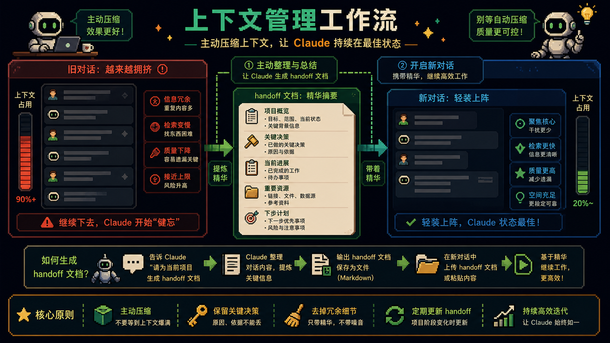
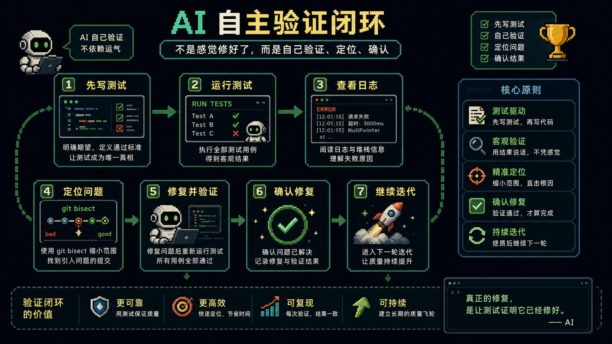

# Claude Code 进阶：把那些人类不想盯着看的脏活累活交给 AI

很多人刚接触 `Claude Code` 的时候，注意力都放在“它会不会写代码”上。

这当然重要。

但真正在高频使用以后，你会慢慢发现一件更现实的事：

它最有价值的地方，往往不是替你敲出某个函数。

而是替你接手那些**人类根本不想盯着看的脏活累活**。

比如长时间构建。

比如 CI 挂了以后的日志排查。

比如大 PR 的逐文件审查。

比如上下文爆炸以后怎么优雅交接。

比如你明明已经很累了，但还得一项项验证 AI 刚才到底有没有真的做对。

这些工作不一定复杂。

但极其消耗注意力。

而真正会玩 `Claude Code` 的人，已经开始把这些注意力黑洞系统性地外包给 AI 了。

---

## 第一层升级：别把 AI 当无限记忆，它也会累

很多人默认觉得，对话越长越好，上下文越多越安全。

但现实恰恰相反。

对话一旦拖得太长，性能会下降，注意力会漂移，自动压缩还可能把最关键的细节丢掉。

所以高阶用法里，第一个核心能力不是“多聊”，而是**主动管理 AI 的记忆**。

一个非常实用的做法就是 handoff 文档。

在对话快变重之前，让 Claude 先把当前任务状态、已做决策、关键文件、待办事项整理成一份交接文档。

然后你开一个新对话，只把这份 handoff 文档喂进去。

这样做的价值很直接：

- 新对话更轻
- 响应更稳
- 你能控制保留什么信息
- 不会把上下文命运交给自动压缩

很多人以为上下文是 AI 的记忆。

更准确地说，它只是一个临时工作台。

真正成熟的用法，是你自己设计 AI 的记忆结构。

---

## 第二层升级：别让系统提示胖成负担

很多人喜欢把 `CLAUDE.md`、系统提示、项目规则写得越来越长，觉得信息越全越安全。

但这个方向很容易失控。

因为提示词本身也在消耗上下文预算。

当系统提示过长，Claude 每次启动都要先背一大段“祖训”，真正能用来解决问题的上下文空间反而被压缩了。

所以第二个重要原则是：

**规则要稳定，但提示要瘦。**

重复出现的硬规则，留在核心提示里。

展开细节、长说明、案例、参考材料，应该拆到单独文档里，按需读取。

这背后其实是一个很经典的工程判断：

不要把所有东西都塞进热路径。

真正高频、必需、稳定的，留在热路径。

其余放在冷路径，按需加载。

这也是为什么懒加载 MCP 工具、精简系统提示、控制 `CLAUDE.md` 体积，本质上是在做同一件事：

给模型腾出生效空间。

---

## 第三层升级：进入高强度开发状态，不要只开一个工作线程

当你开始用 `Claude Code` 处理真实工程任务时，单线程工作流很快会成为瓶颈。

因为你的任务并不总是线性的。

一个功能在等构建。

一个分支要修 bug。

一个 PR 正在审查。

另一个想法你又不想丢。

这时候，`git worktree` 和多标签页工作流就特别重要。

`worktree` 的价值不是新鲜，而是让多个任务真正物理隔离。

一个目录就是一个分支。

一个问题就是一个现场。

你不需要来回切换、反复 stash、担心污染当前状态。

再配合多标签页管理，整个人的工作方式会完全不一样：

- 老任务放左边
- 新任务开右边
- 从左到右扫进度
- 长任务挂着跑
- 短任务快速清掉

这种模式看起来像“多开”，但本质上是在把 AI 变成多个并行执行位。

不是让它更聪明。

而是让它更像一个真正能持续上班的系统。

---

## 第四层升级：等待、排查、审查，这些才是最适合外包给 AI 的脏活

很多人以为 AI 最适合生成代码。

我反而越来越觉得，它最适合接管那些人类本能想逃避的环节。

例如等待长任务。

Docker build 跑 8 分钟，CI workflow 还在排队，测试挂起又没有结果，这些事情人类最容易变得心不在焉。

但 AI 很适合做这种“周期性检查但不需要持续盯屏”的工作。

你只要让它按指数退避去看状态，不要疯狂刷屏，也不要浪费 token。

再比如 PR 审查。

复杂 PR 真正累人的，不是有没有能力看懂，而是你要在几十个文件之间来回切换、保持一致的审查标准、记住前面发现的问题。

Claude Code 在这里很强，因为它可以做交互式审查。

不是一次性吐一段评论，而是能围绕具体文件、具体改动、具体风险，跟你来回推。

再比如 DevOps。

CI 失败、日志爆炸、回归来源不明、需要 bisect 定位问题，这些都特别适合给 Claude 做第一轮脏活处理。

因为这些任务的共同点是：

- 信息量大
- 人类不想逐行看
- 需要耐心
- 需要机械执行
- 但又必须保持一定推理能力

而这正是 Claude Code 在工程场景里最实用的甜点区。

---

## 第五层升级：想让 AI 真正自主，就必须给它验证闭环

很多人让 AI 做事时最大的误区，是只给任务，不给验证方式。

你说“帮我修这个问题”。

Claude 可以改代码。

但如果没有办法自己验证，它最后就只能“感觉应该修好了”。

这很危险。

所以真正能让 AI 自主工作的关键，不是提示词更花，而是：

**你有没有把验证方法一起设计进去。**

最典型的例子就是 write-test 循环。

先写验证脚本。

再让 Claude 自己跑。

再根据结果继续改。

比如 `git bisect` 定位 bug，就是一个很好的范式。

一旦你给了它明确的“好 / 坏”判断标准，Claude 就不再只是会写代码，而是能持续推进问题，直到找到答案。

这也是为什么高阶工作流里，“验证输出”几乎比“生成输出”更重要。

因为真正难的从来不是写出点什么。

而是确认你写出来的东西是真的对。

---

## 最后真正要掌握的，不是 14 个技巧，而是一种分工意识

这篇文章列了很多技巧。

上下文管理、系统提示瘦身、懒加载工具、历史检索、worktree、多标签、指数退避、PR 审查、DevOps、写作、测试闭环、提示精简、输出验证、抽象层级控制。

这些当然都重要。

但如果只把它们当成“技巧清单”，你很快又会回到原点。

更重要的是看清它们共同指向的那件事：

Claude Code 最强的地方，不是替你完成一个完美答案。

而是替你接住那些：

- 耗时但低成就感
- 机械但不能出错
- 信息量大但不值得你亲自盯
- 需要耐心检查和持续推进

的人类脏活累活。

一旦你开始用这种方式给 AI 分工，它就不再只是一个“代码聊天工具”。

它会越来越像一个真正的工程搭子。

不是取代你。

而是把你从最消耗精力的那部分劳动里解放出来。

这才是高强度 AI 开发状态真正值得追求的地方。

---

原文来源：[@SuisPasDaVinci](https://x.com/SuisPasDaVinci/status/2056222280665923793)
