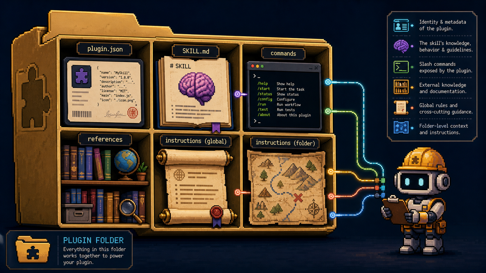

# Claude Cowork 插件：把 AI 从文件助手变成你的数字员工

很多人使用 Claude Cowork 的方式，还停留在“智能文件助手”阶段。

让它整理文件。

让它转换表格。

让它批量重命名文件夹。

这些当然有用。

但这只是入门版。

真正高级的用法，是为 Cowork 构建一个插件：把一个具体岗位的工作方法、行业知识、输出模板、执行规则和质量检查全部封装进去。

换句话说，你不是在写一个提示词。

你是在做一个会按你的流程工作的数字员工。

它知道自己扮演什么角色，知道什么时候该启动，知道每一步该怎么做，知道输出长什么样，也知道交付前要检查什么。


---

## 插件本质上是什么

不要把插件想复杂。

一个 Cowork 插件，本质上就是一个有固定结构的文件夹。

这个文件夹告诉 Claude：

- 我是谁
- 我负责什么工作
- 什么场景下应该调用我
- 工作流程是什么
- 需要参考哪些资料
- 输出格式是什么
- 交付前要检查哪些质量项

一个典型结构大概是这样：

```text
my-plugin/
├── .claude-plugin/
│   └── plugin.json
├── skills/
│   └── primary-task/
│       └── SKILL.md
├── commands/
│   └── run-task.md
├── references/
│   └── templates.md
├── global-instructions.md
└── folder-instructions.md
```

`plugin.json` 是身份信息，告诉 Cowork 这个插件叫什么、做什么、什么时候应该出现。

`SKILL.md` 是大脑，写清楚具体工作流程。

`commands` 是快捷入口，你可以通过斜杠命令直接触发一套流程。

`references` 是参考材料，比如模板、案例、行业标准、基准数据。

`global-instructions.md` 是长期指令，规定这个数字员工的语气、偏好、质量标准和默认判断。

`folder-instructions.md` 则是项目上下文，告诉它当前文件夹里有什么、优先级是什么、如何处理这里的数据。

如果说普通聊天是“临时请一个 AI 帮忙”，插件就是“把一个岗位的 SOP 写进系统里”。



---

## 第一步：先研究岗位，而不是先写文件

很多人一上来就想写插件。

这反而容易做坏。

因为你还没定义清楚这个“员工”到底要负责什么。

正确顺序是先研究岗位。

比如你想做一个“内容研究员插件”，你要先弄清楚：

- 这个岗位完整工作流是什么
- 常用工具和数据源有哪些
- 判断质量的指标是什么
- 常见输出格式是什么
- 专家会注意哪些边界情况
- 新手最容易犯什么错误

你可以先让 Claude 帮你调研一版通用流程，再把它改成你自己的版本。

关键在于第二步：采访你自己。

你平时到底怎么做这件事？

你有哪些默认判断？

你有哪些偷懒但有效的捷径？

你每次都会检查什么？

你心里的“好结果”和“差结果”差在哪里？

最好的 AI 员工，不是用通用最佳实践堆出来的，而是用你的真实经验训练出来的。

---

## 第二步：写好 SKILL.md

整个插件里，最重要的文件就是 `SKILL.md`。

它决定了这个数字员工到底会不会干活。

一个可用的 `SKILL.md`，至少要包含这些部分：

- `name`：技能名称
- `description`：什么时候应该触发，什么时候不应该触发
- `Overview`：这个技能做什么，产出什么
- `Process`：逐步流程
- `Output Format`：交付物格式
- `Rules`：不可违反的质量标准
- `Edge Cases`：遇到异常情况怎么办
- `Quality Checklist`：交付前检查清单

这里最容易被低估的是 `description`。

它不是一句随便的简介。

它决定了这个技能能不能被正确唤醒。

如果写得太模糊，技能不会启动。

如果写得太宽，技能会乱抢任务。

所以你要明确写出 5 到 7 个触发短语，也要写清楚哪些相似场景不要触发。

这就像招聘时写岗位职责。

职责越清晰，员工越不容易跑偏。


---

## 第三步：补齐支持文件

只写一个技能文件还不够。

如果你真的想把它做成“员工”，还需要补齐周边文件。

`plugin.json` 负责身份。

里面至少要写插件名称、描述、版本。

斜杠命令负责触发。

比如你可以做一个 `/employee:run`，让它自动读取当前文件夹、执行指定技能、跑质量检查、保存输出，并给你一个摘要。

全局指令负责风格和默认规则。

比如：

- 先给建议，再解释原因
- 永远使用具体数字，不要说“很多”“较好”
- 数据缺失时必须标注，不允许猜
- 默认输出为 Markdown
- 沟通风格直接、简洁、可执行

参考资料负责专业度。

模板、示例、行业标准、过往优秀案例，都应该放进去。

因为 AI 员工的水平，很大程度取决于你给它的参考材料有多具体。

不要只告诉它“写一份报告”。

要告诉它“我们的好报告长什么样”。

---

## 第四步：安装、测试、迭代

插件写完以后，不要直接假设它能用。

你要像验收新人一样测试它。

先让 Cowork 检查插件结构：

- `plugin.json` 是否有效
- `SKILL.md` frontmatter 是否正确
- command 文件是否能触发
- 引用路径是否能读到
- 输出是否符合预期

然后拿真实工作测试。

不要只用样例数据。

真实数据才会暴露问题。

至少跑 5 次，每次都问：

- 它有没有按步骤执行
- 它有没有遵守规则
- 输出格式对不对
- 结果能不能直接用
- 哪些地方还需要人工大改

每发现一个问题，就回到 `SKILL.md` 里加规则、改步骤、补示例。

这个循环才是关键。

第 1 次跑出来的结果可能只是能用。

第 10 次以后，它才会开始接近你真正想要的交付标准。

---

## 第五步：扩展成真正的工作系统

当第一个技能稳定以后，你就可以继续扩展。

比如一个研究分析员插件，最开始只会写研究简报。

后面可以增加竞品监控、趋势扫描、周报生成、资料归档。

一个内容策略插件，最开始只会做选题。

后面可以增加脚本改写、短视频拆条、公众号转小红书、标题测试。

真正有价值的不是某一个技能，而是一条可重复运行的工作链：

研究。

分析。

生成。

检查。

分发。

复盘。

一旦这些流程被封装成插件、命令、计划任务和检查清单，AI 就不再只是聊天窗口，而是一个能持续交付结果的系统。


---

## 每周做一次绩效复盘

数字员工不会自己变好。

变好的是你的指令。

所以每周花 15 分钟复盘一次很重要。

看它这一周产出的结果：

- 哪些地方完全符合预期
- 哪些地方需要你修
- 哪些地方你不得不重做
- 哪些判断经常出错
- 哪些格式总是不稳定

然后把这些发现写回 `SKILL.md`。

两个月后，你会发现这不是在“调提示词”，而是在沉淀一套越来越稳定的工作系统。

第一周，它只是一个能用的助手。

第四周，它会变成一个可靠的执行者。

第八周，它可能已经能完成很多初级员工需要几个月培训才能做稳的工作。

---

## 从哪里开始

不要一上来就做一个万能员工。

先选一个你每周最耗时间、最重复、最不想做，但流程又相对固定的任务。

用 2 小时把它做成一个插件。

先不要追求完美。

先让它跑起来。

然后每周复盘、每周修正、每周加一点能力。

AI 员工的核心不是“自动化一切”。

而是把你已经理解的工作，变成可以复用、可以检查、可以持续改进的流程。

这才是 Claude Cowork 插件真正值得学的地方。

---

原文来源：[@eng_khairallah1](https://x.com/eng_khairallah1/status/2052319978662347226)
