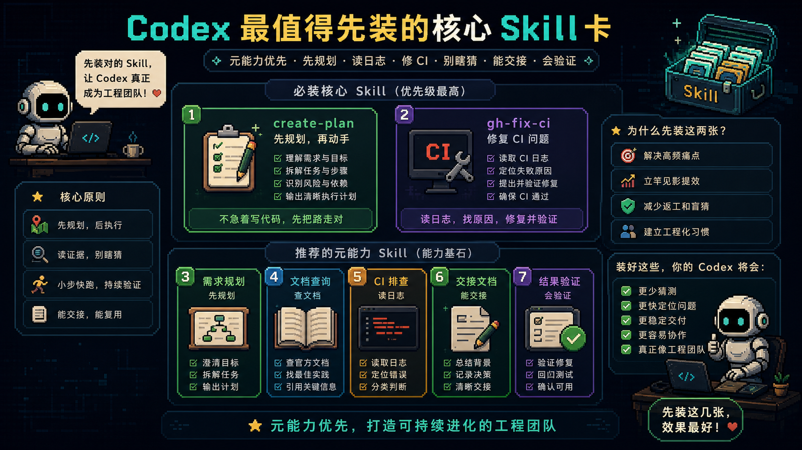

# 我把全网 Codex Skill 扒了一遍，真正最该先装的是这几类

很多人手里的 `Codex`，其实只发挥了一半能力。问题大概率不在模型本身，而在于你还没把真正改变工作方式的那层装上：**Skill**。

Skill 可以理解成一张张岗位 SOP 卡。某一类任务来了，Codex 不用每次都听你重念一遍要求，而是能自动掏出对应方法，把活按固定流程干完。

## 最该先装的，不是最多的，而是元能力卡

如果只能先装很少几个，优先级应该放在那些会改变 Codex **工作方式** 的卡上，比如 `create-plan`、`gh-fix-ci` 和几个核心 curated Skill。

它们解决的不是“多一个功能”，而是让 Codex 开始先规划、先查证、先定位，再动手。

## Skill 生态别瞎找

真正值得长期盯的源头并不多：`openai/skills`、`ComposioHQ/awesome-codex-skills`，再加少量社区补充仓库和聚合站。

核心仓库的价值，是给你一条稳定的主航道：知道去哪找、哪些是官方 curated、哪些是实验性、哪些需要自己验证。

## 高频有用的 Skill，大致分五类

- 规划和元能力
- GitHub 和 CI/CD
- 测试、质量与安全
- 前端、设计与集成
- 生产力与内容

从这个角度看，Skill 不是“程序员小玩具”，而是在给 Codex 补齐一个完整团队会有的角色卡。

## 真正高阶的玩法：组合、沉淀、迁移

装 Skill 的终点不是“我装了很多张卡”，而是：

- 会组合：一个任务里让多张卡协同
- 会沉淀：把高频流程写成团队自己的 Skill
- 会迁移：把好方法从一个工具带到另一个工具

## 最后

Skill 会一直变，真正不会贬值的是你的判断力：这活该不该拆、该先上哪张卡、它给的方案靠不靠谱、什么时候该组合、什么时候该淘汰。

原文来源：[@AYi_AInotes](https://x.com/AYi_AInotes/status/2063283898419749193)
