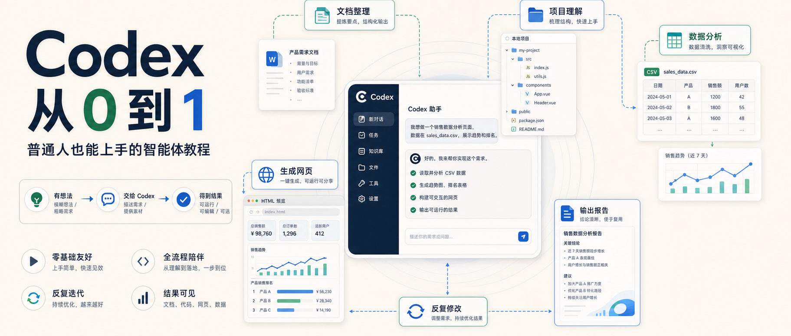
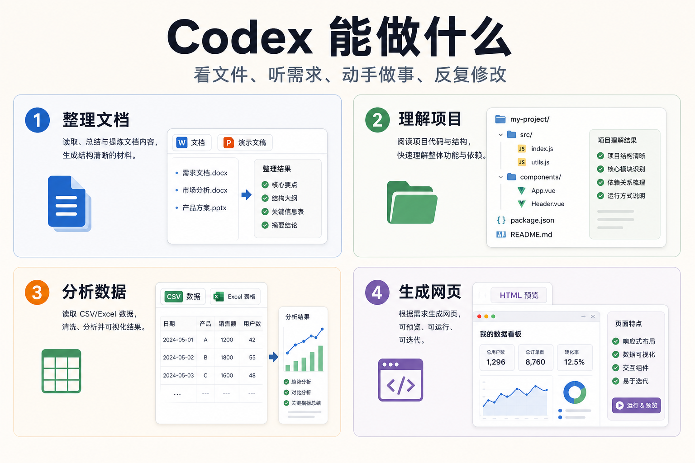
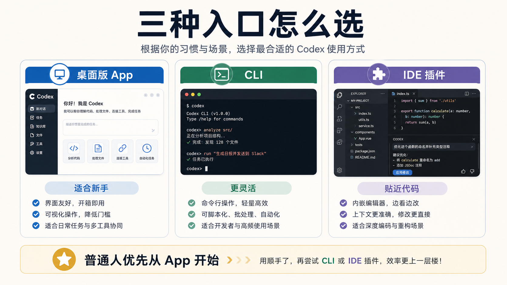
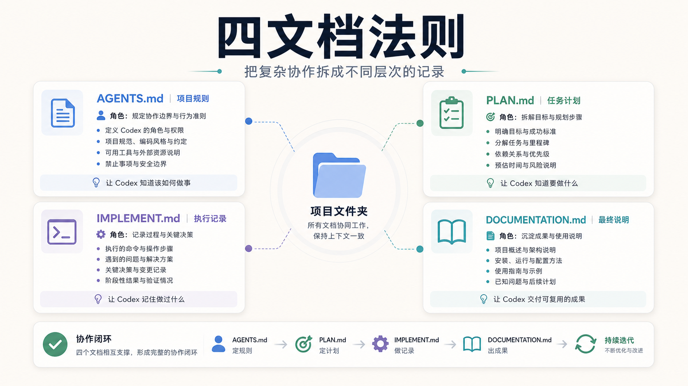
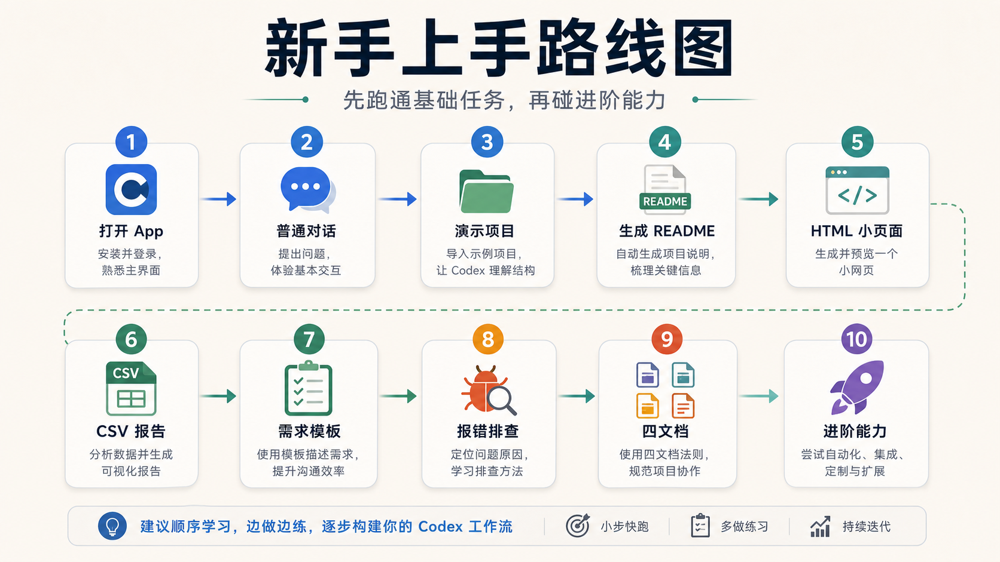

# Codex 从 0 到 1：普通人也能上手的智能体保姆级教程

很多人第一次打开 Codex，第一反应不是兴奋，而是迷茫。

界面里有项目、线程、模型、设置、插件、MCP、Skill、权限、Git、自动化……

看起来好像很强，但也很容易让新手不知道从哪里开始。

其实对普通人来说，理解 Codex 不需要从命令行、配置文件、模型参数开始。

你只要先抓住一句话：

**Codex 不是一个只会回答问题的聊天机器人，而是一个能进入你的项目、读取文件、执行任务，并持续推动工作进展的数字员工。**

它能做的事情，不只是“回答你一个问题”。

它可以：

- 整理文档和资料；
- 理解一个陌生文件夹；
- 分析 CSV / Excel 数据；
- 生成 HTML 页面和小工具；
- 修改代码和内容；
- 运行命令并检查结果；
- 根据你的反馈继续改。

更重要的是，它并不只适合程序员。

哪怕你不会写代码，也可以从很低风险的任务开始，让它先帮你整理资料、生成页面、分析表格，再慢慢进入更复杂的项目协作。

这篇文章就是一份面向普通人的 Codex 从 0 到 1 上手指南。

## 一、先理解 Codex 最重要的几件事

Codex 最核心的变化，是它不只停留在对话框里。

它可以进入你的工作场景。

### 1. 整理文档和资料

你可以把一份 Word 文档、一套 PPT、几篇笔记，或者一堆还没归类的素材交给它。

它可以先帮你看内容，再提炼重点，重新组织结构。

比如：

- 把会议记录整理成纪要；
- 把多份材料合成一份报告；
- 把杂乱笔记整理成清晰提纲；
- 把 PPT 内容改写成演讲稿；
- 把长文变成公众号稿或教程。

这里最重要的不是“让它帮你润色一下”。

而是让它先看懂材料，再按你的用途重新组织。

### 2. 理解项目和文件夹

很多人一看到一个陌生项目就头大。

文件夹一堆，文件名一堆，配置文件也看不懂。

这时你可以先让 Codex 做一件事：

**不要动文件，先帮我看一下这个项目是干什么的。**

它可以扫目录，告诉你：

- 哪些是核心文件；
- 项目入口在哪里；
- 哪些文件暂时不用管；
- 哪些目录是生成产物；
- 如果要改某个功能，大概率该看哪里。

这能帮普通人先抓住主线，而不是一上来被细节淹没。

### 3. 分析数据和生成报告

Codex 很适合处理 CSV、Excel、销售数据、名单、统计表。

一个稳妥流程是：

1. 先让它解释字段；
2. 再检查空值、重复值和异常值；
3. 然后让它给结论；
4. 最后再生成图表和报告；
5. 重要数据必须人工复核。

注意顺序：

**先要结论，再要图表，最后人工复核。**

不要一上来就让它“做个漂亮图表”。

图表只是表达结果，结论才是核心。

### 4. 生成网页、原型和小工具

Codex 也适合把一个想法快速做成可看的东西。

比如：

- 一个介绍页；
- 一个静态 HTML 页面；
- 一个数据展示页面；
- 一个产品原型；
- 一个贪吃蛇小游戏；
- 一个可以打开的本地报告。

正确流程不是期待一次完美。

而是：

提出需求 → 生成代码 → 打开预览 → 发现问题 → 继续反馈 → 反复优化。

**Codex 最好用的方式，不是一次生成，而是反复协作。**

## 二、Codex App、CLI、IDE 插件怎么选

Codex 常见有三种形态：

1. 桌面版 App；
2. 命令行 CLI；
3. IDE 插件。

它们不是谁替代谁，而是适合不同人群。

### 1. 桌面版 App：最适合新手和普通人

如果你刚开始用，建议从 App 开始。

原因很简单：

- 有图形界面；
- 不用一上来记命令；
- 可以看到项目、线程、设置和侧边栏；
- 很多操作能在界面里完成；
- 更适合做文档、网页、数据报告和项目协作。

对普通人来说，App 是最稳的入口。

### 2. CLI：更适合进阶用户

CLI 是命令行版本。

它的优点是灵活、快速、贴近开发环境。

但如果你看到黑窗口就紧张，不建议一开始从 CLI 入手。

你可以等自己熟悉 Codex 的工作方式后，再学 CLI。

### 3. IDE 插件：适合已经写代码的人

IDE 插件是把 Codex 放进 VS Code、JetBrains 这类开发工具里。

如果你每天都写代码，它很方便。

但对新手来说，IDE 插件通常不是第一入口。

因为你可能连开发工具本身都还不熟，再加一个插件，只会更乱。

## 三、下载安装：新手先装 App

最简单的路线是：

1. 访问 Codex 官方入口；
2. 下载对应系统的桌面版 App；
3. 安装后打开；
4. 登录你的 ChatGPT 账号；
5. 先不要急着改设置。

如果你后面要用 CLI，Windows 上通常还会涉及 Node.js、PowerShell、npm 之类的东西。

但新手不需要一开始就碰这些。

先用 App 跑通一个真实小任务，比先折腾环境更重要。

## 四、主界面地图：左边、中间、右边

第一次打开 Codex，记住一个简单地图就够了：

- 左边：项目、线程、历史会话和功能入口；
- 中间：你和 Codex 对话、下任务、看执行过程；
- 右边：展示结果、来源、预览和代码变化。

左边像导航栏。  
中间像工作对话。  
右边像结果面板。

如果你让 Codex 生成一个网页，右边可能会显示预览。  
如果你让它改项目，右边可能会显示文件变化。  
如果你让它做文档，右边可能会展示文档或产物。

对新手来说，右边很重要。

因为它能让你看到 Codex 到底产出了什么，而不是只看一段“我已经完成了”。

## 五、设置页：先看懂，不要乱改

设置页会让新手紧张，因为里面有模型、Git、集成、MCP、通知、权限等入口。

刚开始不要急着全都配置。

先理解几个概念。

### 账号和模型

账号设置用来确认你当前登录的是哪个账号。

模型设置会影响 Codex 使用哪个模型、速度如何、质量如何。

新手阶段不需要频繁切模型。

### 权限

权限越大，Codex 能做的事越多，风险也越大。

涉及这些动作时，一定要看清楚：

- 修改文件；
- 运行命令；
- 访问外部账号；
- 操作浏览器；
- 操作桌面软件；
- 发消息或发布内容。

如果看不懂，可以直接问：

> 这个权限具体会让你做什么？有什么风险？有没有更低风险的方式？

### 个性化

个性化可以写你的偏好。

比如：

- 希望回答更口语；
- 希望用中文；
- 希望先给结论；
- 希望代码改动前先解释；
- 希望文档按固定格式输出。

但不要把 API Key、密码、Cookie、身份证、银行卡、公司机密写进去。

### Git

Git 可以理解成项目的“时间机器”。

它会记录哪些文件被改了，哪些内容新增，哪些内容删除。

新手第一次使用时，Git 设置保持默认即可。

如果 Codex 改了项目，你看不懂，可以问：

> 请按文件逐个解释这次改动，用非程序员能懂的话说。

### MCP 和 Skill

MCP 可以理解成让 Codex 连接外部工具的一条通道。

Skill 可以理解成一套固定工作流说明书。

比如你经常写教程，就可以让 Codex 按固定结构写。  
你经常做会议纪要，就可以让 Codex 按固定模板整理。  
你经常做数据报告，就可以让 Codex 按固定流程分析和输出。

新手不需要一上来配置 MCP。

先用内置能力和官方插件，已经足够完成很多日常任务。

## 六、普通对话和项目对话怎么选

一句话：

**一般问题，用普通对话。涉及本地文件或项目，用项目对话。**

普通对话适合：

- 解释概念；
- 写文案；
- 翻译；
- 总结；
- 梳理思路；
- 生成普通内容。

项目对话适合：

- 读取本地文件；
- 修改项目代码；
- 生成网页文件；
- 分析 CSV / Excel；
- 运行命令；
- 排查报错；
- 管理项目结构。

如果你想让 Codex 真正“做事”，最好进入项目。

因为项目对话里，它才能围绕文件、目录、命令和结果持续推进。

## 七、第一次实战：一句话生成一个页面

新手第一次实战，不要选太复杂的项目。

可以从一个静态页面开始。

比如你可以这样说：

> 请在这个项目里生成一个简单的 HTML 页面，主题是“我的第一个 AI 工具箱”。页面要包含标题、三张功能卡片、一个开始按钮。风格简洁，适合新手演示。生成后告诉我文件在哪里，怎么打开。

这句话里有几个关键点：

- 目标：生成 HTML 页面；
- 主题：我的第一个 AI 工具箱；
- 内容：标题、卡片、按钮；
- 风格：简洁；
- 输出：告诉我文件位置和打开方式。

不要期待第一版完美。

你可以继续说：

> 保留当前结构，但把颜色改得更清爽，按钮更明显，文字更口语化。

这就是 Codex 的正确打开方式：

**先做出来，再基于结果继续改。**

## 八、第二个实战：CSV 数据分析与 HTML 图表报告

第二个更实用的办公场景，是让 Codex 分析 CSV 数据。

可以按四步走：

### 第一步：先认识数据

> 请先读取这个 CSV，解释每一列大概是什么意思，不要急着生成报告。

### 第二步：先要结论

> 请找出 3 个最值得关注的结论，并说明依据。

### 第三步：再生成报告

> 请生成一个 HTML 图表报告，把结论、图表和说明放在同一个页面里。

### 第四步：人工复核

> 请列出你认为需要我人工确认的数据点。

数据任务可以提效，但不能完全托管。

尤其是金额、人数、名单、业务结论，一定要复核。

## 九、怎么和 Codex 说清楚需求

很多时候，Codex 做不好，不是因为它能力不行，而是需求没说清楚。

一个好用模板是：

> 目标：我要做什么。  
> 背景：为什么要做。  
> 输入：你可以看哪些文件或材料。  
> 输出：我要什么格式的结果。  
> 约束：不要做什么，必须注意什么。

比如：

> 目标：帮我做一份 CSV 销售数据报告。  
> 背景：我要给领导看本月销售情况。  
> 输入：当前文件夹里的 sales.csv。  
> 输出：一个 HTML 报告和 5 条结论。  
> 约束：不要删除原始数据，所有异常值单独列出来。

如果任务复杂，可以先让 Codex 复述需求：

> 先不要动手，请用你自己的话复述我的需求，并列出你准备怎么做。

这一步很有用。

它能避免一开始方向就偏。

## 十、让 Codex 修改、补充和重构

很多新手反馈结果时只会说：

“不好，再改改。”

这句话信息量太少。

更好的方式，是区分三类反馈。

### 1. 修改

在原有基础上微调，不动核心结构。

比如：

> 这个按钮太小了，请放大一点，并和标题保持 24px 间距。

### 2. 补充

原来少了东西，现在加进去。

比如：

> 请补充一个适合小白理解的案例，并加上操作步骤。

### 3. 重构

重新组织内容或代码结构。

比如：

> 这个页面和我的需求偏差较大。我的目标是做一个教程首页，而不是产品官网。请按标题区、痛点区、功能区、实战案例区、开始学习按钮重新构建。

最好一次只改一类问题。

不要一条消息里同时要求改结构、改颜色、改文案、加功能、换技术栈。

## 十一、常见报错怎么处理

新手遇到报错，最容易做两件错事：

全部删了重来。  
到处乱改赌运气。

正确做法是保留现场。

不要只说“报错了”。

可以用这个模板：

> 我刚才做了什么：  
> 现在看到的错误是：  
> 我期望的结果是：  
> 请先判断可能原因，不要直接大改。

如果有错误截图、终端输出、日志文本，也一起给它。

Codex 排错时，最需要的是上下文。

## 十二、四文档法则

当任务变复杂，只靠聊天会越来越乱。

这时可以用四个文档来配合 Codex。

### 1. AGENTS.md

项目里的协作说明书。

它写清楚：

- 这个项目是什么；
- Codex 应该遵守什么规则；
- 哪些文件不能动；
- 输出格式有什么要求；
- 测试和验证怎么做。

### 2. PLAN.md

任务计划。

它回答：

- 目标是什么；
- 范围是什么；
- 先做哪一步；
- 验收标准是什么。

### 3. IMPLEMENT.md

执行记录。

它记录：

- 改了哪些文件；
- 为什么这么改；
- 遇到了什么问题；
- 怎么解决。

### 4. DOCUMENTATION.md

最终可复用说明。

比如：

- 使用说明；
- 安装方法；
- 功能介绍；
- 对外教程；
- 项目总结。

四个文档的价值，不在名字本身。

它们的价值是把复杂协作拆成不同层次的记录。

## 十三、插件、Skill、MCP、自动化怎么理解

对新手来说，先记住这句话：

**插件是能力包，连接器是接账号，Skill 是工作流说明书，MCP 是接工具的通道。**

Plugin 插件：给 Codex 装能力，比如表格、浏览器、PPT、GitHub。  
Connector 连接器：连接外部账号，比如 Gmail、Google Drive、Slack。  
Skill 技能：固定工作流说明书，比如会议纪要、教程写作、数据报告。  
MCP：让外部工具接入 Codex 的通道。

刚开始不要一口气装很多。

先用内置能力跑通真实任务。

等你明确知道自己要连接 Gmail、GitHub、浏览器、表格或 PPT，再去装对应能力。

## 十四、常见踩坑和排查

### 1. Codex 一直在跑，不知道是不是卡了

可以问：

> 你现在卡在哪一步？已经完成了什么？下一步准备做什么？

### 2. 它请求权限，不知道能不能点

可以问：

> 这个权限具体会让你做什么？有什么风险？有没有更低风险的方式？

### 3. 它改了项目，我看不懂

可以问：

> 请按文件逐个解释这次改动，用非程序员能懂的话说。

### 4. 生成结果不满意

不要马上重开。

基于结果继续改：

> 保留现在的结构，但把语言改得更口语化，并补充每一步的成功标志。

### 5. 插件太多，不知道装哪个

先别装。

先用官方内置能力。

等你有明确需求再装。

### 6. 自动化跑偏

大概率是任务描述太泛。

要把目标、输入、输出、限制、验收标准写清楚。

## 十五、推荐使用路线

第一次用 Codex，可以按这个顺序来：

1. 打开 App，熟悉左侧导航；
2. 新建普通对话，问一个低风险问题；
3. 打开设置页，只看不改；
4. 新建一个干净演示项目；
5. 让 Codex 生成一个 README.md；
6. 看右侧结果区，确认它产出了什么；
7. 让它解释它做了什么；
8. 尝试做一个 HTML 小页面；
9. 再尝试 CSV 数据分析和 HTML 图表报告；
10. 学会用“目标、背景、输入、输出、约束”写需求；
11. 遇到报错，用四步法排查；
12. 开始了解 AGENTS.md、PLAN.md、四文档法则；
13. 最后再碰 Skill、MCP、Git、自动化和电脑操控。

## 写在最后

普通人真正进入 AI 协作时代，不是从学会代码开始的。

而是从第一次把一个想法，借助 Codex 做成看得见、跑得动、能继续修改的东西开始。

你不需要一开始就懂命令行、Git、MCP、Skill。

你只需要先学会一件事：

**把目标说清楚，然后让 Codex 先做一个最小版本，再基于结果继续改。**

这就是普通人上手智能体最稳的起点。

