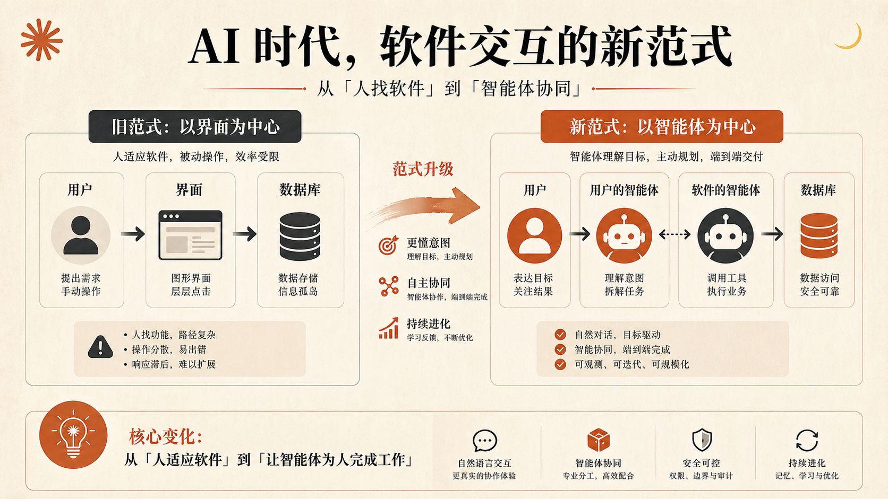
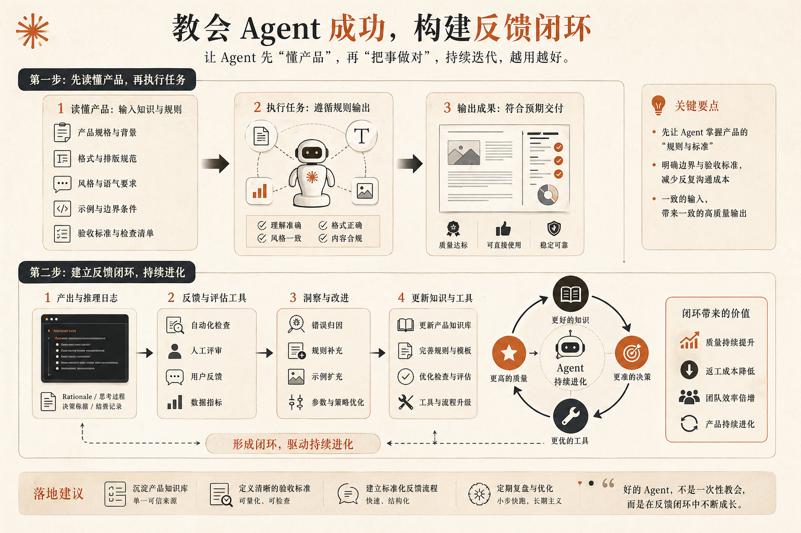
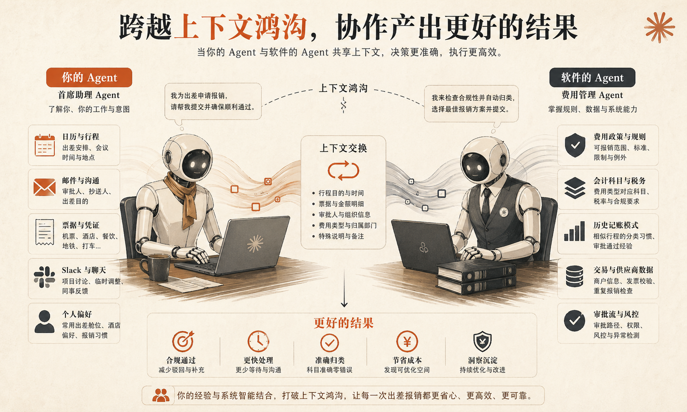

过去二十年，我们默认的软件使用方式一直很稳定：

人打开界面。

点按钮。

填表单。

看结果。

几乎所有产品设计、交互设计、信息架构、权限体系，都是围绕这条链路搭起来的。

但现在，一个非常大的变化已经开始发生了：

**越来越多的软件，不再先被人类点击，而是先被 Agent 调用。**

也就是说，真正和系统发生高频交互的，开始不再是“人”，而是“代表人的智能体”。

这件事的影响，比很多人想象中大得多。

因为它改变的不只是入口，而是产品本身的设计逻辑。

以前，一个产品最重要的问题是：

- 用户能不能看懂
- 能不能点得顺
- 会不会在流程里迷路

而现在，新的问题变成了：

- Agent 能不能调用成功
- 它会不会在关键步骤上理解错
- 它能不能在没有 GUI 的情况下稳定完成任务

很多人说“UI 已死”，我不完全同意。

人类当然还是需要界面，需要确认，需要回看，需要点开检查细节。

但真正值得注意的是另一件事：

**软件的主要交互对象，正在从人类切换成 Agent。**

这会重新定义我们该怎么做产品。

## 新的交互模式，已经不是“人 -> 界面 -> 数据库”了

过去最常见的软件交互结构，可以简化成这样：

**用户 -> 界面 -> 数据库**

界面就是产品。

你通过界面理解产品、操作产品、完成任务。

但当 Agent 开始替用户承担越来越多的工作之后，中间那一层就变了。

现在更常见的情况，是：

**用户 -> 用户自己的 Agent -> 系统**

比如用户不再自己打开报销系统，而是让自己的 Agent 去完成：

- 查找待提交的费用
- 补充缺失字段
- 归类交易
- 提交审批

在这个模型里，用户看到的已经不是“产品页面”，而是 Agent 给出的结果。

但变化还不止于此。

因为随着软件公司也开始构建自己的 Agent，新的结构很快又变成了：

**用户 -> 用户的 Agent -> 软件自己的 Agent -> 数据系统**

这意味着什么？

意味着未来很多软件交互，不再是“一个人类对着一个 UI 做操作”，而是“两边的 Agent 在相互协作，替人类完成结果”。

一边带着用户上下文。

一边带着系统上下文。

真正的产品设计工作，也就从“设计界面”开始转向“设计这两个 Agent 如何协作”。

## 真正厉害的产品，不是开放一个 MCP 就结束了

现在很多团队一提到 AI 时代的软件升级，第一反应是：

“我们也要上 MCP。”

这当然没错。

但如果只是把 API 包一层、把工具暴露出来、勾上一个“支持 Agent 使用”的框，事情其实只做了一半。

因为 Agent 能不能调用，和 Agent 能不能**稳定成功地调用**，是两回事。

差别在于，你有没有认真想过：

**调用你产品的那个 Agent，到底需要什么信息，才能把事情做好？**

这其实是 Agent 时代最关键的问题之一。

很多团队会把规范放在文档里，然后觉得任务完成了。

但对 Agent 来说，文档放在那里，并不等于它会在正确的时间、正确的上下文中用对。

一个真正为 Agent 设计的系统，应该主动把成功所需的信息喂给调用方，而不是让它自己猜。

## 要让 Agent 成功，不是靠“它足够聪明”，而是靠你给够了正确上下文

这件事最典型的例子，就是格式和规则。

为什么有些系统，Agent 一写进去就非常稳定？

不是因为模型突然变聪明了，而是因为产品已经明确告诉它：

- 这里支持什么格式
- 哪些写法会失败
- 该先读取哪份规范
- 哪些默认习惯在这里不适用

一旦规则被明确给到，Agent 的成功率会非常高。

反过来，如果系统把这些东西都藏在网页文档里，或者默认调用方自己应该知道，那结果通常就是：

- 格式不对
- 输出错位
- 额外返工
- 用户体验反而更差

所以，为 Agent 设计的核心不是“开放能力”，而是：

**教会调用你系统的 Agent，怎样才能成功。**

这和过去写开发者文档很像，但比文档更进一步。

因为现在你面对的不再只是人类开发者，而是一个会在运行时即时决策的智能调用方。

## 第二个关键点：必须建立反馈回路

很多团队在接入 Agent 能力时，还有一个典型问题：

能看到调用量。

却看不到调用背后的意图。

比如你知道某个工具被调用了 10 万次，但你并不知道：

- 用户到底想完成什么
- Agent 是如何理解任务的
- 它在哪里卡住了
- 哪类需求一直被反复尝试却没有做好

这时候，单看“调用次数”几乎没有意义。

你真正需要的，是反馈回路。

一套成熟的 Agent 产品，至少应该能逐步回答下面这些问题：

- 这个 Agent 为什么会调用这个工具
- 它本来想完成什么目标
- 它失败时卡在哪一步
- 哪种错误在持续重复出现
- 这些重复错误背后，是否暗示了一个新功能需求

这时候，产品改进就不再只是拍脑袋。

你会发现，Agent 给你的反馈，往往比很多真实用户还更结构化：

- 它会告诉你自己想做什么
- 它会告诉你尝试过什么
- 它会告诉你卡在什么边界条件上

如果把这些信息收集好，你就会开始看到一条非常有意思的产品演进路径：

最初，Agent 只是你的调用方。

后来，Agent 开始反过来告诉你：

**你的产品下一步应该补什么。**

这时候，反馈回路就不只是“排查问题”的工具，而变成了产品增长机制的一部分。

## 第三个关键点：永远要意识到“上下文缺口”

Agent 之间协作时，最重要的一件事，不是彼此谁更强，而是谁知道什么。

因为在任何一个 Agent-to-Agent 的交互里，两边掌握的上下文天然就是不对称的。

用户侧的 Agent，可能知道：

- 用户的日历
- 邮件附件
- Slack 对话
- 照片和票据
- 个人偏好和习惯

软件侧的 Agent，则可能知道：

- 业务规则
- 审批逻辑
- 数据字段
- 分类规则
- 历史处理模式

这就意味着，一个设计得不好的系统，会把本来应该自己处理的复杂度甩回给用户：

- 让用户自己选一堆复杂编码
- 让用户理解一堆内部规则
- 让用户在不熟悉的结构里填细节

而设计得好的系统，会做相反的事情：

它不会把自己拥有的复杂性推给对方，而是只向对方要它真正缺失的那一小块上下文。

比如，系统真正不知道的，不一定是某个内部编码，而是：

- 这笔消费是客户餐饮、团队聚餐，还是私人行程

一旦用户侧 Agent 能根据日历、邮件、聊天记录补出这个上下文，系统侧 Agent 就可以在内部自动完成编码、分类和处理。

这就是 Agent 时代产品设计最值得重视的一点：

**不要把系统内部复杂性抛给调用方，而是设计好双方如何用各自掌握的上下文拼出正确结果。**

## 这会重新定义产品团队的职责

以前做产品，很大一部分工作是在回答：

- 这个页面怎么布局
- 这个按钮放哪儿
- 这个流程怎么少点一步
- 用户在哪个地方最容易出错

以后这些当然还重要。

但你会越来越频繁地面对另一类问题：

- 这个能力怎么暴露给 Agent
- 哪些规则必须被明确注入
- 哪些错误应该被结构化反馈
- 哪些上下文该由谁补齐
- 两个 Agent 之间如何减少误解

换句话说，产品团队正在从“设计给人类点”的岗位，逐步变成“设计给 Agent 协作”的岗位。

而一个产品能不能在这个阶段跑出来，很可能就取决于它有没有认真处理这些细节。

## 最后总结

很多公司接下来都会补一层 MCP、补一组工具、补一套 API，然后宣布自己已经“支持 Agent”。

但真正能在下一轮竞争里拉开差距的，不会是那些只把接口开放出来的产品。

而会是那些认真想清楚了这几个问题的产品：

- 怎么让 Agent 成功
- 怎么让失败变成反馈
- 怎么处理上下文缺口
- 怎么让系统真正适配 Agent 协作

归根结底，Agent 时代的软件设计，问的还是同一个问题：

**调用你系统的那个智能体，到底需要什么，才能把它的工作做好？**

如果你把这件事想透了，你做的就不再只是一个“能被 Agent 使用的产品”。

你做的是一个真正**为 Agent 而设计**的产品。
