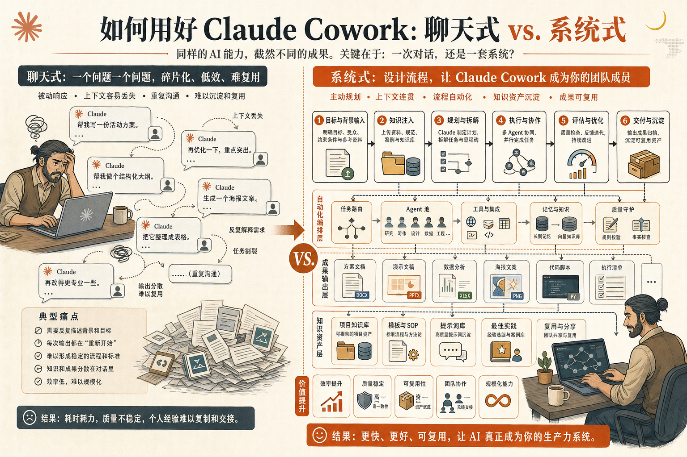
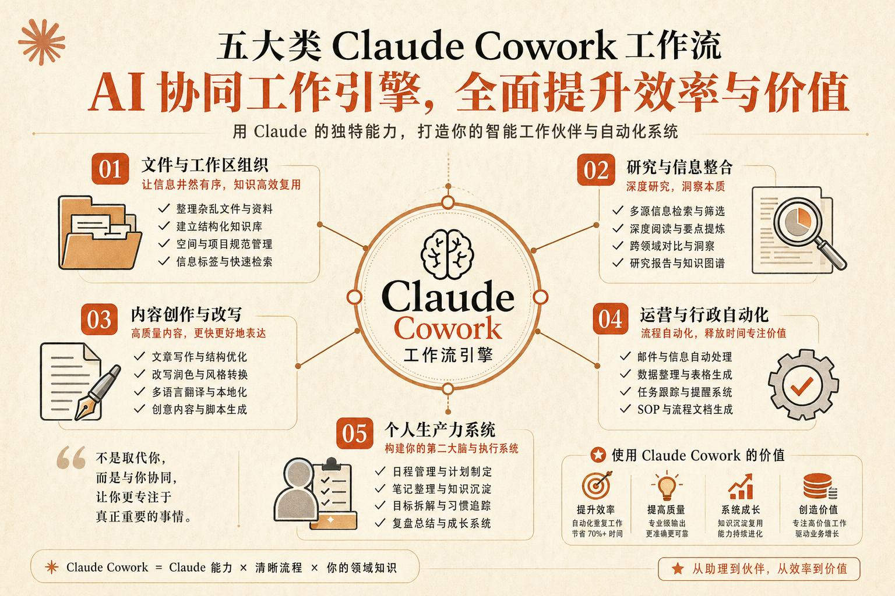
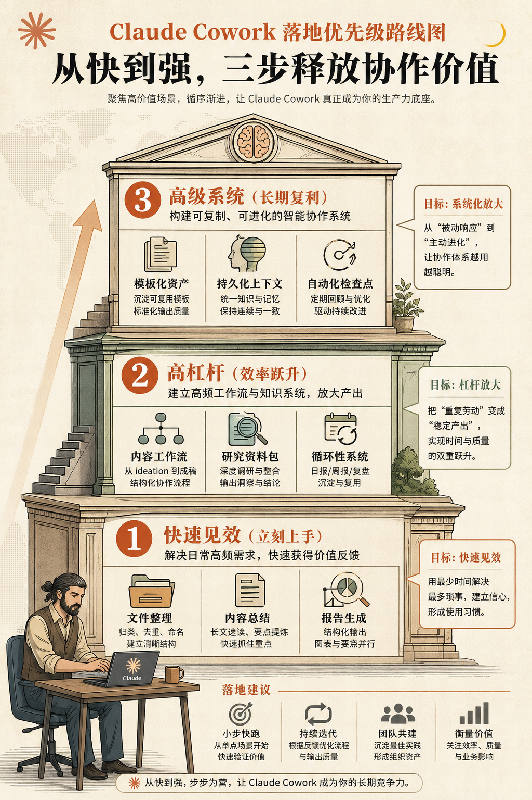

这篇文章，整理自 X 上一篇很火的长文，原标题是：

**40 Claude Cowork Commands, Workflows & Automations Most Users Don’t Know — The Complete List**

它最吸引人的地方，不是“40 个”这个数字，而是它提醒了很多人一件事：

**Claude Cowork 真正的价值，不在于替你完成一个指令，而在于把一串原本需要你来回切换、重复确认、手动收尾的事情，变成一条可复用的工作流。**

如果你现在对 Claude Cowork 的理解还停留在：

- 帮我整理下载文件夹
- 帮我改一下文案
- 帮我搜一下资料

那你其实只用了它最浅的一层能力。

这篇整理版，我不准备把 40 条英文原句直接堆过来，而是做两件更实用的事：

1. 先讲清楚为什么多数人没把 Cowork 用对
2. 再把这 40 个思路拆成中文用户更容易吸收的 5 类工作流

## 为什么大多数人没用出 Cowork 的价值

多数人使用 Cowork 的方式，其实还是“聊天式使用”。

也就是：想到什么，就打一条；做完一步，再补一条；中间出错了，再自己接回来。

这种方式当然能用，但它更像是在用一个更会干活的聊天框。

而真正高手的用法，往往不是“给 Cowork 一个动作”，而是“给 Cowork 一段流程”。

也就是说，他们输入的不是：

- 帮我整理一下这个文件夹

而更像是：

- 先扫描文件夹
- 按类型和日期分类
- 把截图、PDF、表格分别归档
- 重命名明显重复的文件
- 最后生成一份整理报告

这两者的差别，看起来只是“提示词更长一点”，其实本质完全不同。

前者是在让 AI 做动作。

后者是在让 AI 接手流程。

Claude Cowork 真正强的，也恰恰是后者。

## 这篇文章最值得抓住的核心

如果要把原文的精神压缩成一句话，我会这样说：

**Claude Cowork 不是一个“替你做一步”的助手，而是一个“替你跑完一段链路”的协作型执行者。**

所以，真正高价值的命令、工作流和自动化，往往都有这几个特点：

- 不是单轮问答，而是多步推进
- 不是只给答案，而是能交付结果
- 不是做一次就结束，而是能反复复用
- 不是只节省 30 秒，而是减少整段重复劳动

理解了这一点，你就会知道，所谓“40 个命令”，其实更像 40 个可复用的协作模式。

## 把 40 个思路拆成 5 类，你会更容易用起来

为了更适合公众号阅读，我把原文这类思路，重组成 5 个你最可能真正会用到的场景。

这 5 类分别是：

1. 文件与工作台整理
2. 研究与资料汇总
3. 内容生产与改写
4. 运营与行政自动化
5. 个人效率系统

下面我按这 5 类来拆。

## 一、文件与工作台整理：最容易立刻见效的一类

这是大多数人第一次接触 Cowork 时最容易感受到“哇，原来真能替我干活”的地方。

因为文件整理这件事，本来就非常适合 AI 接手：

- 规则明确
- 重复度高
- 人做很烦
- 出成果很直观

这类思路大概可以延展出 8 种典型命令：

1. 扫描下载文件夹并按文件类型分类
2. 把截图、合同、发票、表格分别归档
3. 统一重命名一批会议录音或素材文件
4. 找出明显重复或版本冲突的文件
5. 按日期为项目资料建立目录结构
6. 把一堆零散 PDF 重新整理成项目包
7. 对新建文件夹自动生成说明文档
8. 整理后输出“本次处理报告”

这里最重要的，不是某一个命令写法，而是你要开始把它当成一种模板：

**扫描 -> 分类 -> 重命名 -> 归档 -> 汇报**

一旦你有了这个模板，很多文件类任务都能复用。

## 二、研究与资料汇总：让 Cowork 从“会搜”升级成“会整合”

第二类高价值场景，是研究型工作。

很多人觉得 AI 搜资料并不稀奇，但真正费时间的从来不是“搜到”，而是：

- 把多个来源读完
- 抽出共识和差异
- 整理成能继续推进的材料

这正是 Cowork 特别适合接手的地方。

这一类可以拆成 8 个常见用法：

9. 收集一个主题的多篇文章并做对比摘要
10. 把网页、PDF、文档混合整理成统一笔记
11. 提炼出一组会议前 briefing
12. 从多份资料中抽出可执行结论
13. 找出来源之间的冲突点和一致点
14. 为一个选题生成背景综述
15. 为一个客户生成行业信息包
16. 把研究结果整理成可汇报结构

如果说普通聊天 AI 更像“单点回答器”，那 Cowork 在这类工作里更像“研究助理”。

## 三、内容生产与改写：不是写一篇文，而是跑完整个内容链路

很多内容工作者第一次用 Cowork 时，会先让它“帮我写一篇文章”。

但更有效的方式，其实是把内容工作拆开，让它接手一整段内容链路。

比如：

- 先读资料
- 再整理框架
- 再输出初稿
- 再改成指定语气
- 再做标题和摘要
- 最后给出发不同平台的版本

原文这类思路，如果抽成中文用户最常用的场景，大概有 8 种：

17. 把一堆散笔记整理成文章初稿
18. 把长文改成社媒短帖
19. 把技术说明改成面向客户的版本
20. 把会议纪要改成对外更新稿
21. 生成多个标题方向并排序
22. 按不同平台改写同一内容
23. 为文章补摘要、亮点和行动建议
24. 为内容生成一个后续选题清单

这类任务最值钱的地方，不在于“它替你写”，而在于**它替你完成内容从素材到成稿的中间工序**。

## 四、运营与行政自动化：真正帮你省掉那些高频但低价值的时间

如果你的工作里有很多运营、协调、整理、推进类事务，那 Cowork 的价值会更明显。

因为这些事情的共同特点是：

- 不难
- 但很多
- 一天能切碎你好几次注意力

这部分也很容易延展出 8 个很实用的自动化思路：

25. 根据收件箱内容起草回复
26. 整理一次会议后的待办清单
27. 把多个文件合并成一个交付包
28. 根据要求生成周报或日报
29. 整理客户资料并生成简档
30. 从表格和文档中抽出关键字段
31. 按固定模板生成 SOP 草稿
32. 批量处理重复的文本录入和格式化任务

这类工作最适合被标准化。

而 Cowork 的意义，就是把这些原本靠你“脑中记住流程”的任务，外显成可以重复调用的执行链。

## 五、个人效率系统：从“提醒你”变成“替你推进”

最后一类，是很多人一开始不会想到，但长期回报很高的一类：

把 Cowork 接进你自己的个人效率系统。

不是只让它回答问题，而是让它围绕你的工作节奏、资料结构、习惯模板来持续协作。

这类思路也可以整理成 8 个方向：

33. 每天早上生成当天任务概览
34. 每周自动汇总本周工作与未完成项
35. 根据文件夹变化生成更新摘要
36. 维护你的个人知识库结构
37. 帮你把零散待办整理成优先级列表
38. 把项目资料整理成可回顾档案
39. 自动生成下次继续工作的上下文说明
40. 基于固定模板持续复用你的个人工作流

一旦走到这一层，Cowork 对你就不再只是一个“偶尔用一下的 AI 功能”，而更像一个开始理解你做事方式的协作系统。

## 哪些最值得先上手？

如果你真的打算开始用，不要一上来就追求最复杂的自动化。

最好的路径，通常是从这三层往上走：

### 第一层：Quick Wins

先做那些立刻见效、失败成本也低的任务：

- 文件整理
- 会议纪要整理
- 资料汇总
- 周报初稿

这类任务适合用来建立信任感。

### 第二层：High Leverage

再去做那些能持续省时间的流程：

- 内容改写链路
- 研究与 briefing
- 客户资料包
- 个人工作台整理

这类任务会明显提高你对 Cowork 的依赖度。

### 第三层：Advanced Systems

最后，才是把它接成自己的系统：

- 持续上下文
- 固定模板
- 自动检查点
- 周期性复盘

到这里，Cowork 才真正从“工具”变成“协作接口”。

## 这篇“40 个清单”真正想告诉你的，不是 40 条命令

我觉得原文最值得借鉴的，不是记住某个具体命令，而是换一个视角去看 AI：

不要只问：

- 这一步它能不能替我做？

更要问：

- 这整段流程里，哪些部分本来就该被接管？

一旦这么想，你会发现很多平时烦人的工作，其实都可以被重写成 Cowork 任务。

也就是说，真正的生产力提升，不是让 AI 替你“做一件事”，而是让它替你“接住一个重复链条”。

## 最后总结

如果把这篇整理版压缩成一句话，那就是：

**Claude Cowork 最值得学的，不是 40 个命令本身，而是 40 种把零散工作重组成流程、再把流程交给 AI 去推进的思路。**

所以，对普通用户来说，最好的起点不是追求花哨，而是先做三件事：

1. 找出你每周都会重复出现的任务
2. 把它写成“输入 -> 处理 -> 输出”的链路
3. 再让 Cowork 接手其中最烦、最机械、最耗注意力的部分

当你开始这样用它，Claude Cowork 才会从“一个会聊天的桌面 AI”，变成“一个真正能替你分担工作的数字同事”。

---

说明：
这是一篇基于原始标题、导语预览和 Claude Cowork 公开工作流信息整理的中文导读版，用于公众号阅读，不是原文逐段直译。

原始来源：
[Khairallah AL-Awady on X](https://x.com/eng_khairallah1/status/2047609433489035739?s=20)
