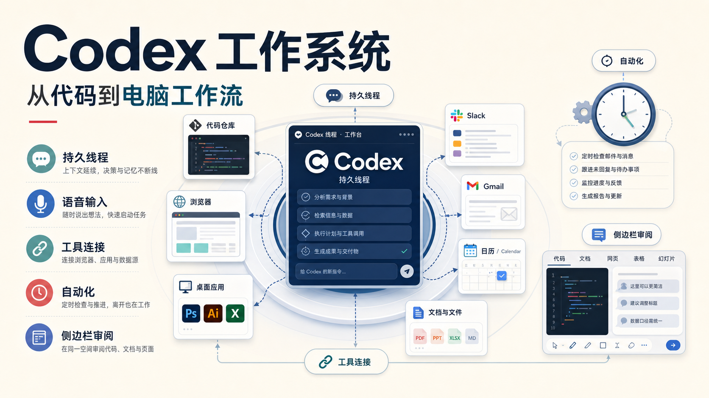
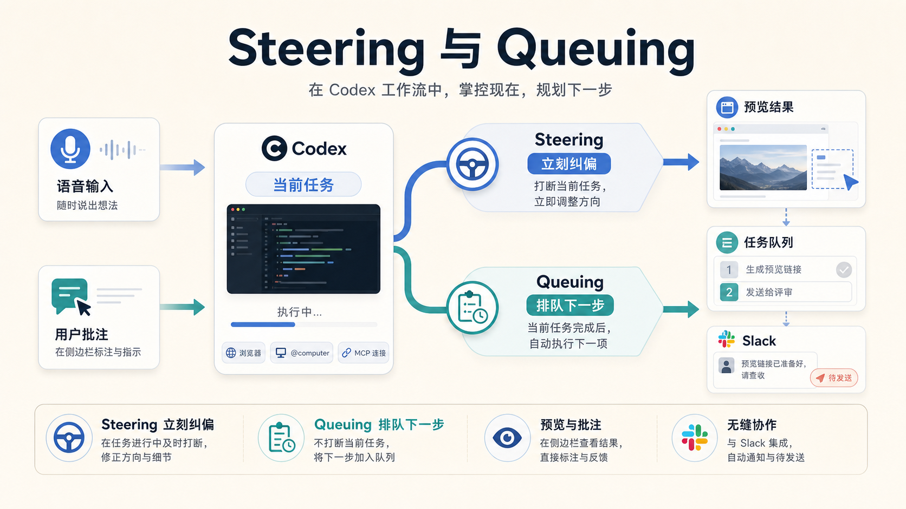
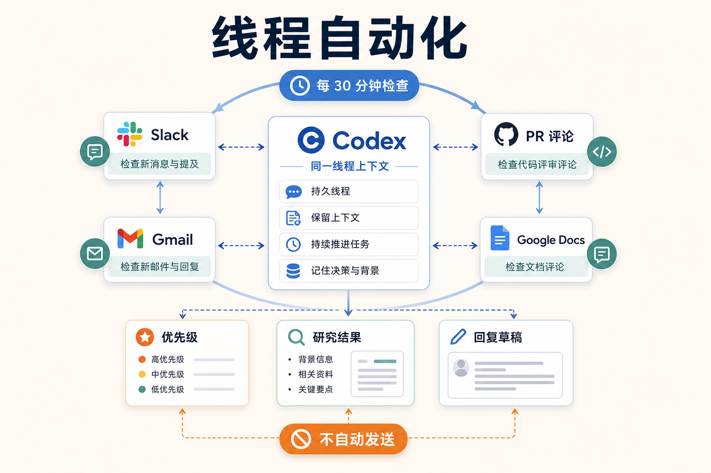
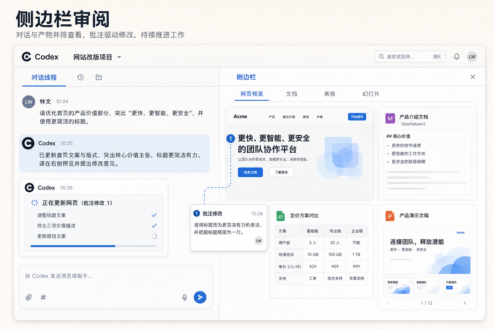

# Codex 不只是写代码：真正值得用起来的是这套“电脑工作系统”

很多人第一次用 Codex，都是从写代码开始的。

让它看一个仓库，改一段代码，跑一遍测试，再开一个 PR。

这当然还是 Codex 最核心的能力。

但如果只把它理解成“更强的编程助手”，其实会低估它。

因为今天电脑上的很多工作，本来就已经被代码、网页、API、文档、消息、自动化和各种工具串起来了。只要这些界面能被 Codex 接触到，它能做的事情就不再局限于仓库里的代码。

它开始更像一个可以帮你把电脑工作推进下去的系统：

- 能保留上下文，不用每次从头解释；
- 能一边执行，一边接受你的纠偏；
- 能打开网页、调用工具、接 Slack/Gmail/Calendar；
- 能定时回来检查进展；
- 能把代码、文档、网页、表格、PPT 都放在侧边栏里继续改。

这篇文章要讲的，不是“Codex 又多了几个功能”。

更准确地说，是：

**怎么把 Codex 从一个写代码工具，用成一套持续推进工作的操作系统。**

## 一、持久线程：别把每次对话都当一次性聊天

以前用 AI 工具最大的问题之一，是每次都像重新认识。

你得重新解释项目背景、目标、偏好、文件结构、上一次做到了哪里。

Codex App 里的线程，价值就在这里。

它不是一次性问答，而是一个可以持续工作的空间。

适合长期保留的线程包括：

- 一个“Chief of Staff”线程，专门处理日常信息和跟进事项；
- 一个发布线程，长期跟进版本、PR、发布清单；
- 一个文档评审线程，持续维护文档质量；
- 一个外部监控线程，盯消息、评论、反馈和异常。

这些线程不是短聊天，而是长期工作台。

你可以把它理解成：  
**项目里的代码仓库保存代码，Codex 的持久线程保存推进这件事所需的上下文。**

当一个线程被固定下来，它就不只是方便打开。

它变成了一个长期入口。

你下次回来时，不用重新铺垫，它已经知道之前讨论过什么、做过什么、哪些地方要注意。

这对复杂工作很重要。

因为真正消耗人的，不只是执行，而是每次重新恢复状态。

## 二、语音输入：先把粗糙想法说出来

很多任务一开始并不清楚。

你脑子里可能只有一句很松散的话：

“好像 Slack 里有个人提到过这件事，我不记得是谁，也不记得细节，你去找一下。”

如果让你打字，你可能会想半天怎么组织。

但用语音说出来就很自然。

Codex 的语音输入适合处理这种“还没成型”的任务。

它的价值不是让你少敲几个字，而是让你在想法还粗糙的时候，就能把它交给系统开始处理。

两三分钟的口述、会议转录、随手记录的计划，往往比一段过度整理的摘要更有用。

因为原始材料里会保留犹豫、重点、未完成的判断和上下文。

对 Agent 来说，这些信息反而更接近真实工作。

## 三、Steering 和 Queuing：一个负责纠偏，一个负责排队

用 Codex 做复杂任务时，最重要的不是一次性下一个完美指令。

更实用的是在执行过程中控制方向。

这里有两个动作：

**Steering，是打断当前任务，立刻纠偏。**

比如你让 Codex 检查网页，它正在改一个页面，你看到侧边栏里某块布局不对，就可以直接说：

- 这个模块再小一点；
- 这两个元素之间的间距不舒服；
- 这段文案不对，换成更直接的说法。

这不是等它全部做完再返工，而是在它执行中把方向拉回来。

**Queuing，是不打断当前任务，把下一件事排到后面。**

比如你可以说：

“等这个预览链接出来之后，把链接发给 Slack 里的评审人。”

Steering 改变的是现在正在做什么。  
Queuing 改变的是接下来还要做什么。

这两个能力很关键。

因为真实工作不是“我发一个需求，你给一个最终答案”。

真实工作更像人和系统一起推进：看结果、改方向、补任务、继续走。

## 四、工具扩展：让 Codex 走出仓库

一旦线程可以持续保留上下文，下一步问题就是：Codex 能碰到哪些工作表面？

它可以一层层往外走。

第一层，是侧边栏里的浏览器。

这适合检查网页、看本地预览、标注界面问题、调试交互。

第二层，是 Chrome 相关工作流。

当任务依赖你已经登录的浏览器状态，比如后台、控制台、账号页面，就需要进入更接近真实浏览器的环境。

第三层，是桌面 GUI。

有些工作不在代码里，也不在网页 API 里，只存在于一个桌面软件的按钮、窗口、上传框和菜单里。这时就需要计算机操作能力。

再往外，就是 MCP 服务器和连接器。

Slack、Gmail、Calendar 这些东西之所以重要，是因为很多任务最初并不是以“代码需求”的形式出现的。

它们可能先出现在：

- 一条 Slack 消息里；
- 一封邮件里；
- 一个会议邀请里；
- 一个文档评论里；
- 一个别人随手提到的反馈里。

如果 Codex 能接触这些入口，它就能从信息出现的地方开始工作，而不是等你手动搬运到对话框里。

这也是 Skills 的价值。

当一个流程被你反复使用，就不应该每次重新解释。

把它固化成 Skill，Codex 下次就能按同一套方法继续跑。

## 五、移动端：人可以离开桌面，任务不用停

Codex 移动端改变的是工作节奏。

你可以在电脑上启动一个任务，因为代码、文件、权限和环境都在本机。

然后人离开电脑，在手机上继续看进展、回答问题、批准下一步、临时纠偏。

这听起来只是“多了一个手机入口”，但实际影响很大。

因为很多长任务并不是一直需要你盯着。

真正需要你出现的，是几个关键节点：

- 它需要你确认方向；
- 它发现权限不够；
- 它遇到两个可选方案；
- 它需要你判断是否继续；
- 它做完一版，等你看结果。

移动端让你不必一直坐在电脑前等这些节点。

本地环境还在，任务还在，线程还在。

你只是从另一个入口参与决策。

## 六、自动化：让线程自己按时回来

固定线程能保留上下文，但它仍然要等你回来。

自动化解决的是另一个问题：

**让 Codex 按时间自己回来检查、继续、汇报。**

这里可以分两类。

一种是定时从工作区启动的新任务。

比如每天生成报告、定期检查仓库、每周跑一次质量扫描。

另一种是线程自动化。

它不是重新开始，而是回到当前这个线程，带着原来的上下文继续工作。

比如一个 Chief of Staff 线程可以每 30 分钟醒来一次：

“检查 Slack 和 Gmail 里有没有需要我处理的未回复消息。帮我判断优先级。如果有人问我问题，先尽可能研究答案并起草回复，但不要直接发送。”

这样你回来时，最耗时的信息收集已经完成。

你仍然做最后决策。

这非常适合反馈循环。

比如一个视频动画工作流：评审人在 Slack 里发意见，线程自动化定时检查评论，有新意见就重新渲染版本，再把更新结果回复到同一个线程里。

这个循环可能跨越 Slack、代码仓库、渲染工具和桌面上传，但它仍然在同一个工作线程里推进。

## 七、Goals：没有验证的目标，只是愿望

Goals 适合那种有明确终点、需要持续推进的任务。

但关键不是“任务看起来很大”，而是终点要能验证。

一个弱目标是：

“按这个 Markdown 里的计划实现一下。”

一个更强的目标是：

“把这个内部工具从 Python 迁移到 Rust。新实现没完成，直到单元测试全部通过。”

两者差别很大。

前者只是描述工作。

后者定义了完成条件。

Codex 真正适合长期推进的目标，最好带一个验证器。

常见的验证器包括：

- 测试套件；
- 基准测试；
- bug 复现脚本；
- 验收矩阵；
- 必须跑通的端到端流程。

没有验证，Agent 很容易“看起来做了很多”。

有验证，它才知道自己是不是更接近完成。

这也是用 Codex 做复杂工作的核心原则：

**野心可以大，但完成信号必须具体。**

## 八、侧边栏：让产物留在对话旁边

Codex 的侧边栏不只是一个预览窗口。

它解决的是上下文切换问题。

过去你让 AI 生成一个文件，接下来要自己打开、检查、截图、反馈、再切回来改。

现在代码、网页、PDF、文档、表格、PPT、数据应用，都可以留在同一个工作界面里。

侧边栏最适合做四件事：

1. 检查产物；
2. 标注问题；
3. 操作网页；
4. 审查修改。

这对网页和文档尤其有用。

比如一个 `index.html` 文件，就可以是一个轻量的交互产物，不需要服务器也能打开。  
一个 Storybook 可以变成 UI 评审现场。  
一个浏览器版幻灯片，可以直接在同一条线程里反复修。  
一个数据应用，可以边生成边校验。

侧边栏让“产物”和“产生它的对话”待在一起。

这会减少大量来回搬运。

## 九、共享记忆：重要上下文不要只活在聊天记录里

长线程有用，但还不够。

真正长期的上下文，最好能写到一个明确、可检查、可迁移的地方。

一种很实用的模式，是用一个 Obsidian vault 或类似的文件夹来承载工作记忆。

结构不必照抄，但可以有这些区域：

- TODO；
- people；
- projects；
- agent；
- notes。

重点不是文件夹名字，而是规则要清楚：

- 哪些内容值得长期保存；
- TODO 放哪里；
- 人物信息放哪里；
- 项目状态放哪里；
- 决策、阻塞、负责人、日期和链接怎么记录；
- 没有实质变化时，不要制造文件噪音。

代码仓库保存代码。

共享记忆保存滚动上下文：

谁参与了、发生了什么、卡在哪里、下一步谁负责、哪些事情要跟进。

这些信息如果只留在聊天记录里，下个线程就很难接上。

写到一个明确位置，Codex 才能在未来继续用。

## 最后：Codex 的边界正在从“代码”扩到“电脑工作”

Codex 当然仍然从代码开始。

但它正在触碰更多代码周围的工作：

- 浏览器里的页面；
- 消息系统里的请求；
- 邮件里的任务；
- 日历里的安排；
- 文档和表格里的评审；
- 自动化里的周期检查；
- 桌面软件里的最后一步操作。

这会改变我们使用 Agent 的方式。

以前我们更多是在问：

“它能不能把这段代码写出来？”

以后更值得问的是：

**“我能不能把这整条工作流交给一个持续线程，让它在我参与关键判断的情况下往前推进？”**

写代码只是入口。

真正的变化，是 Codex 开始从指令到执行，从执行到产物，从产物到审阅，再从审阅继续回到下一轮修改。

它不再只是一个回答问题的窗口。

它正在变成一套能把电脑工作持续推进下去的系统。

