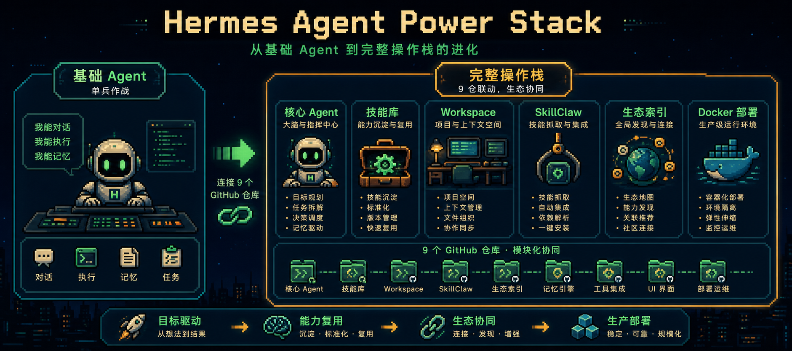
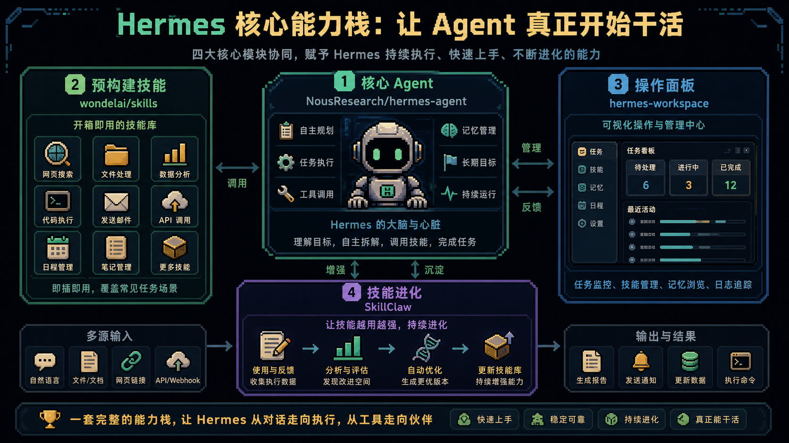
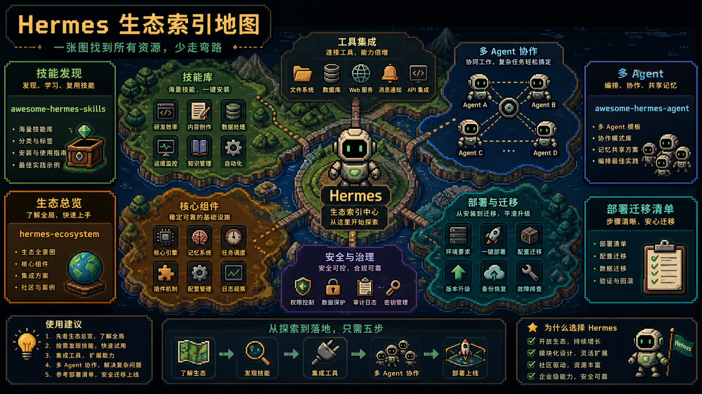
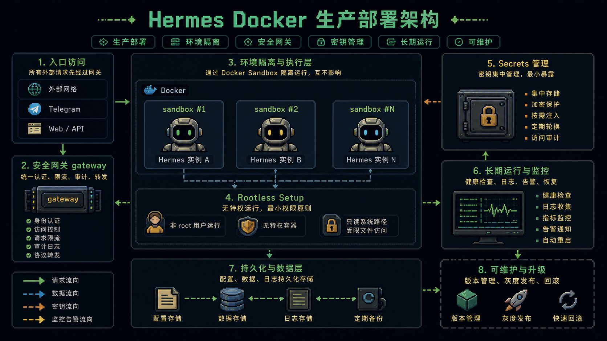

# 让 Hermes Agent 真正变强的 9 个 GitHub 仓库

很多人第一次装 `Hermes Agent`，会觉得它还不够强。这很正常，因为 base agent 只是起点。

真正能跑起来的 Hermes 工作流，需要核心框架、技能库、workspace、技能进化、生态索引和部署模板一起组成操作栈。

## 核心和技能

[`NousResearch/hermes-agent`](https://github.com/NousResearch/hermes-agent) 是整个生态的核心。

[`wondelai/skills`](https://github.com/wondelai/skills) 提供预构建技能，让 Agent 不用从零长能力。

## 工作台和技能进化

[`outsourc-e/hermes-workspace`](https://github.com/outsourc-e/hermes-workspace) 走的是完整操作面板方向，把 chat、memory browser、skill marketplace、MCP manager、kanban 和 multi-agent controls 放到一个工作台里。

[`AMAP-ML/SkillClaw`](https://github.com/AMAP-ML/SkillClaw) 关注技能库自动改进，用真实会话数据反过来整理和进化 skill library。

## 生态索引

[`ZeroPointRepo/awesome-hermes-skills`](https://github.com/ZeroPointRepo/awesome-hermes-skills)、[`SamurAIGPT/awesome-hermes-agent`](https://github.com/SamurAIGPT/awesome-hermes-agent)、[`ksimback/hermes-ecosystem`](https://github.com/ksimback/hermes-ecosystem)、[`0xNyk/awesome-hermes-agent`](https://github.com/0xNyk/awesome-hermes-agent) 都属于生态索引和 curated list。

它们的价值不是让你一次全装，而是让你知道现有生态里已经有什么，少重复造轮子。

## 生产部署

[`hermes-agent/docker`](https://github.com/NousResearch/hermes-agent/tree/main/docker) 是 Hermes 官方仓库里的 Docker 部署目录，面向更稳定的长期运行、隔离和运维。

## 项目链接清单

- [`NousResearch/hermes-agent`](https://github.com/NousResearch/hermes-agent)：Hermes 核心 Agent
- [`wondelai/skills`](https://github.com/wondelai/skills)：预构建技能库
- [`outsourc-e/hermes-workspace`](https://github.com/outsourc-e/hermes-workspace)：操作面板和 workspace
- [`AMAP-ML/SkillClaw`](https://github.com/AMAP-ML/SkillClaw)：技能库自动进化
- [`ZeroPointRepo/awesome-hermes-skills`](https://github.com/ZeroPointRepo/awesome-hermes-skills)：Hermes skills curated list
- [`SamurAIGPT/awesome-hermes-agent`](https://github.com/SamurAIGPT/awesome-hermes-agent)：Hermes 操作者参考
- [`ksimback/hermes-ecosystem`](https://github.com/ksimback/hermes-ecosystem)：Hermes 生态地图
- [`0xNyk/awesome-hermes-agent`](https://github.com/0xNyk/awesome-hermes-agent)：部署和迁移方向 curated list
- [`hermes-agent/docker`](https://github.com/NousResearch/hermes-agent/tree/main/docker)：Hermes Docker 部署模板

原文来源：[@mikenevermiss](https://x.com/mikenevermiss/status/2065083227069349901)
