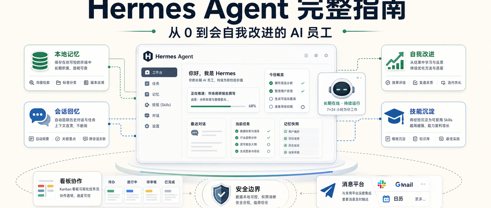
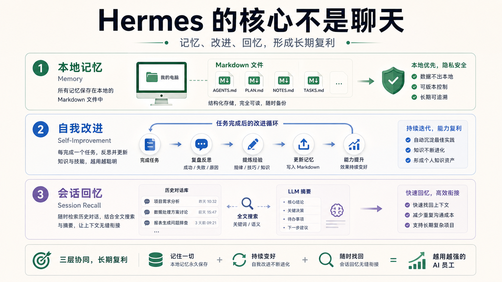
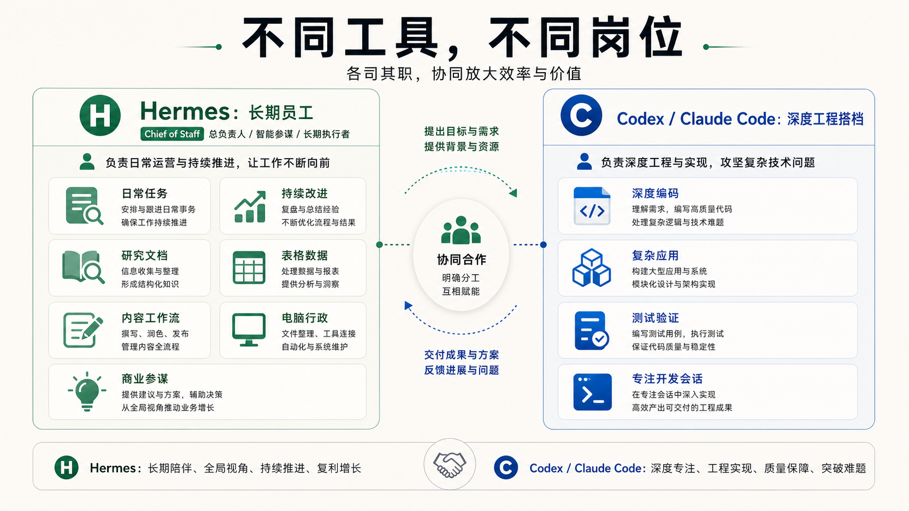
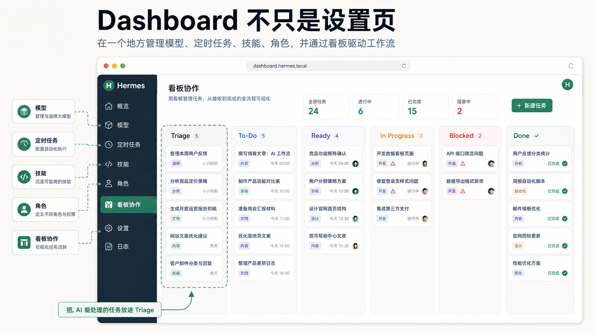
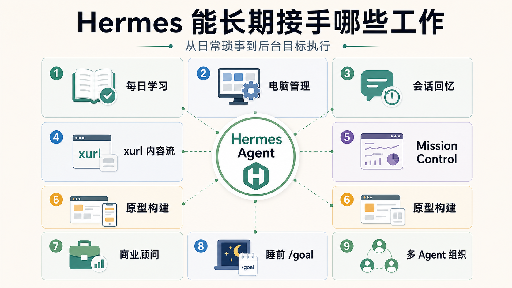
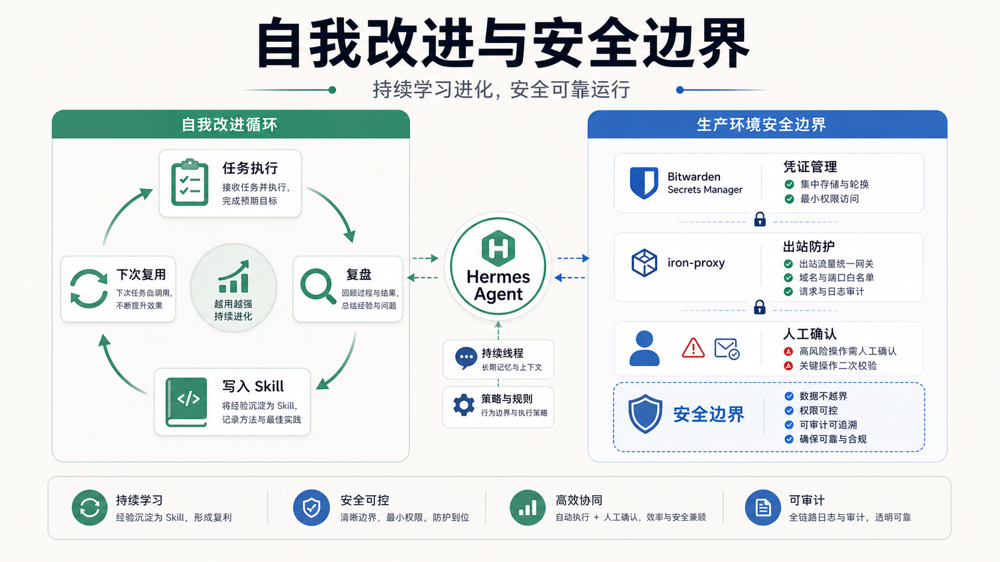

# Hermes Agent 完整指南：从 0 到一个会自我改进的 AI 员工

很多人第一次听到 Hermes Agent，会把它理解成又一个 AI 助手。

但真正用起来之后，你会发现它和普通聊天工具不是一类东西。

普通聊天工具的逻辑是：

你问一句，它答一句。  
你下次回来，它又像第一次见你。

Hermes 想做的是另一件事：

**让一个 Agent 长期运行在你的电脑上，记住你是谁，知道你在做什么，能主动执行任务，并且在每次任务之后改进自己的工作方式。**

所以它更像一个 AI 员工，而不是一个聊天窗口。

这篇文章按照原文脉络，把 Hermes 从定位、安装、模型选择、消息入口、Dashboard、使用场景、自我改进到安全策略，整理成一份中文公众号版完整指南。

## 一、Hermes Agent 到底是什么

Hermes Agent 是 Nous Research 做的一个 24/7 自主 AI Agent。

你可以把它理解成一个长期运行的数字员工：

- 你给它目标；
- 它根据目标拆任务；
- 它在后台继续做；
- 它把结果交付给你；
- 它复盘这次任务；
- 它把经验写进自己的技能里；
- 下次再遇到类似任务，它会做得更好。

Hermes 和普通聊天机器人的关键区别，主要有三点。

### 1. 本地记忆

Hermes 的记忆不是一个你看不到的云端黑盒。

它把很多上下文放在你电脑上的 Markdown 文件里。

这意味着：

- 你可以打开看；
- 你可以编辑；
- 你可以删除；
- 你知道它到底记住了什么。

对长期使用 Agent 来说，这很重要。

因为信任不是来自“它说自己记住了”，而是来自“我能检查它记住了什么”。

### 2. 自我改进

Hermes 的一个核心卖点，是每次完成任务后会复盘。

它会总结：

- 什么做得好；
- 什么没做好；
- 下次应该怎么做；
- 哪条路径更省事；
- 哪些规则应该沉淀成技能。

然后它会把这些经验写到技能里。

这就是所谓的自我改进循环。

你纠正一次，它应该在后续同类任务里少犯同样的错。

### 3. 会话回忆

Hermes 会记录历史会话，并通过全文搜索和摘要能力找回过去内容。

比如你可以问：

“我们三个月前讨论过哪些业务想法？”

它不需要你手动翻聊天记录，而是能从历史里检索和概括。

对个人和团队来说，这类能力很关键。

因为很多工作不是一次性完成的，而是跨越几周、几个月不断推进。

## 二、Hermes、OpenClaw、Claude Code / Codex 怎么分工

原文里把 Hermes 和 OpenClaw、Claude Code、Codex 做了区分。

这里可以先记住一个简单结论：

**Hermes 更像长期员工；Claude Code / Codex 更像深度专注的工程搭档。**

### Hermes vs OpenClaw

原作者认为 OpenClaw 后期变得越来越重，更新也更容易破坏已有配置。

而 Hermes 的优势在于更轻、更快、更稳定。

这对长期运行 Agent 的人很重要。

因为如果一个 Agent 经常因为更新坏掉，你就很难把稳定工作流交给它。

Hermes 还强调几个能力：

- Kanban 多 Agent 协作；
- 内置 Nous Portal 模型入口；
- 大量技能库；
- 20 多种消息平台接入；
- 独立 profile 承载不同角色。

### Hermes vs Claude Code / Codex

这几个工具不是互相替代，而是分工不同。

Hermes 适合：

- 日常任务；
- 研究；
- 文档；
- 表格；
- 电脑管理；
- 内容工作流；
- 商业顾问；
- 原型构建；
- 持续改进型工作。

可以把它理解成 Chief of Staff。

Claude Code / Codex 适合：

- 深度编码；
- 大型复杂应用；
- 端到端测试；
- 长时间专注开发；
- 在一个代码仓库里连续推进行为。

一个很实用的工作方式是：

**Hermes 处理长期琐事和持续工作，Codex 处理代码仓库里的深度执行。**

## 三、安装：先跑起来，再慢慢配置

原文强调 Hermes 安装很简单，Linux、macOS、WSL2、Android Termux 都有一行命令式安装。

Windows 原生 PowerShell 也在早期 beta。

安装后，先做快速设置：

- 选择模型；
- 选择消息平台；
- 配置基础身份；
- 决定是否导入 OpenClaw 记忆。

如果你之前装过 OpenClaw，原作者建议不要急着导入全部记忆。

原因很现实：

两个 Agent 的记忆和技能最好分开。

混在一起，可能会把旧习惯、旧配置、旧问题都带进来。

更稳的做法是：

先让 Hermes 干净启动，跑通最小流程，再按需迁移真正有价值的记忆。

## 四、模型怎么选：不是越贵越好

Hermes 可以接不同模型。

选模型时不要只看价格，也不要只看榜单。

更重要的是看任务类型。

### 1. 高成本模型：适合复杂判断

原文提到 Claude Opus / Sonnet 这类模型适合复杂推理、长目标任务、细腻写作和商业顾问角色。

当 Hermes 需要在任务中不断做判断，比如：

- 研究路线怎么调整；
- 哪些信息可信；
- 方案优先级怎么排；
- 内容应该怎么表达；
- 复杂问题怎么拆；

这类模型更有优势。

但成本也更高。

重度使用时，API 费用需要单独考虑。

### 2. 中等成本模型：适合日常主力

原文把 GPT-5.5 放在更适合日常主力的位置。

适合：

- 编码任务；
- 原型；
- 日常工作流；
- 更注意预算的长期运行。

如果你刚开始用 Hermes，不一定要一上来用最贵模型。

更稳的策略是：

先用一个日常模型跑通流程，知道哪些任务真的需要更强模型，再升级。

### 3. 低成本或固定成本入口：适合长时间运行

原文还提到 Qwen、Grok、Nous Portal 这类选择。

它们适合不同场景：

- Qwen：长时间自主任务；
- Grok：X 相关研究和内容任务；
- Nous Portal：更简单的一账单模型入口。

真正成熟的用法，不是全局只选一个模型。

而是不同 profile、不同任务用不同模型。

## 五、消息平台：先用 Telegram 跑通

Hermes 支持很多消息平台：

Telegram、Discord、Slack、WhatsApp、Signal、Matrix、Teams、Email、SMS、飞书、钉钉等。

但原文建议新手先用 Telegram。

原因很简单：

- 免费；
- 配置快；
- BotFather 拿 token；
- Hermes 安装过程会引导；
- 适合手机随时下任务；
- 很适合 Agent 通知和反馈。

对普通用户来说，先不要把所有平台都接上。

先用一个入口跑通：

发任务 → Hermes 执行 → 收结果 → 继续反馈。

流程稳定后，再扩展到其他平台。

## 六、新装 Hermes 后，第一天应该做什么

把 Hermes 当成新员工来看。

新员工第一天最重要的不是立刻干大活，而是知道你是谁、你在做什么、什么对你重要。

### 第一步：告诉 Hermes 你的背景和目标

你应该告诉它：

- 你是谁；
- 你在做什么项目；
- 你每天最重要的工作是什么；
- 你长期目标是什么；
- 你偏好的沟通方式；
- 哪些事情不能自动做；
- 哪些内容必须先问你。

这些内容会进入记忆，影响后续主动任务。

如果跳过这一步，Hermes 就是在盲干。

### 第二步：设置第一个 cron 任务

cron 任务就是定时任务。

你可以让 Hermes 每天早上做一件小事：

- 整理新闻；
- 生成学习提醒；
- 检查某个文件夹；
- 总结昨天未完成事项；
- 给你一份 morning brief。

先从低风险任务开始。

不要第一天就让它自动发帖、自动改生产系统、自动处理敏感账号。

### 第三步：学习 /goal

`/goal` 是 Hermes 很重要的命令。

它可以把 Agent 从“你问我答”变成“后台执行一个目标”。

你给目标，它拆任务、执行、继续推进，直到完成或需要你决策。

比如：

“做一份竞品研究报告，覆盖价格、功能、内容策略、近 30 天热门帖子，输出成 Markdown 文件。”

这类任务不是一句回答能解决的，就适合 `/goal`。

## 七、Dashboard：不要只把它当设置页

Hermes Dashboard 通常在浏览器里打开。

原文说，很多人用错 Dashboard。

他们只把它当成设置页。

但真正重要的是几个核心区域。

### Models：切换模型

不用重装，不用改代码，可以切换模型。

不同 profile 可以用不同模型。

### Cron：管理定时任务

比在消息里临时写命令更可控。

你可以看到有哪些任务、什么时候跑、执行什么。

### Skills：真正的价值区

Skills 里可以看到 Hermes 学会了什么。

一个用得好的 Agent，会逐渐拥有大量与你工作相关的技能。

这些技能不是黑盒，而是 Markdown 文件。

你可以看，也可以改。

建议优先启用的能力包括：

- browser automation；
- computer use；
- image generation；
- video generation。

### Profiles：多 Agent 的入口

一个 profile 可以理解成一个独立 Hermes 角色。

比如：

- Chief of Staff；
- Head of Research；
- Head of Content；
- DevOps Engineer；
- Business Advisor。

每个 profile 有自己的记忆、技能和模型。

这就是多 Agent 组织的基础。

### Kanban：最容易被低估的屏幕

原文特别强调 Kanban。

它的用法是：

每天早上把待办事项写进 Triage。

能交给 AI 的任务放进去。

Hermes 会拆任务、分配、推进、标记状态。

状态大致是：

Triage → To-Do → Ready → In Progress → Blocked → Done

这比“随手发一句命令”更像真正的工作管理。

## 八、几个最实用的使用场景

Hermes 真正适合的，不是一次性问答，而是可以持续运行的场景。

### 1. Daily Tutor：每日学习教练

你看到一个有价值的 YouTube 视频，可以让 Hermes 读取 transcript，提炼关键概念。

然后每天早上给你一个小课程和一个测验。

这样你不是看完就忘，而是把视频变成长期学习计划。

### 2. Computer Administrator：电脑管理员

如果你有多台设备，可以配合 Tailscale 之类工具，让 Hermes 在设备之间帮你找文件、移动文件、检查本地服务。

比如：

“把我 Mac Studio 上的 agent.md 找出来，放到 MacBook Pro 上。”

这类任务对人来说很琐碎，对 Agent 很适合。

### 3. Session Recall：会话回忆

你可以让 Hermes 找回过去讨论过的想法、链接、计划和项目。

这对长期工作很有用。

因为很多有价值的信息不是正式写进文档的，而是在对话中出现过。

### 4. xurl 内容工作流

`xurl` 能让 Hermes 直接操作 X：

- 搜索帖子；
- 读取讨论；
- 发布内容。

但单独用 `xurl` 只是执行工具。

它最好和 `/goal`、research、memory 组合起来，形成内容系统：

Data Collection → Style Check → Repetition Check → Draft → Quality Score → Publish Decision

刚开始不要自动发布。

先人工审核 5 到 7 次，确认质量稳定后再逐步自动化。

### 5. Mission Control：定制工作台

你可以让 Hermes 给你做一个 mission control：

- 内容 pipeline；
- memory wiki；
- 文档资产页；
- 工具入口；
- 任务看板。

这个工作台会慢慢变成你自己的操作界面。

### 6. Prototype Builder：原型构建器

你在外面想到一个产品点子，可以在 Telegram 里告诉 Hermes：

“做一个 landing page，一页，包含 hero、3 个功能、价格、CTA，部署到 localhost，发我链接。”

如果环境和偏好已经在记忆里，它就不需要每次问你用什么技术栈。

### 7. Business Advisor：商业顾问

Hermes 的优势在于它知道你的业务背景。

所以当你问：

“这个决策有哪些支持和反对理由？你会怎么选？”

它不是只给通用框架，而是可以结合你的目标、约束和历史上下文。

### 8. Overnight /goal：睡前交付大任务

睡前给 Hermes 一个复杂研究任务。

比如竞品研究、SEO 审计、内容日历、数据库迁移计划。

第二天醒来拿结果。

注意：复杂任务可以提高 `max_turns`，但不要无脑调很高。

每一轮都要消耗 token。

### 9. Multi-Agent Org Chart：多 Agent 组织图

你可以创建多个 profile：

- Chief of Staff：统筹；
- Head of Research：做研究；
- Head of Content：做内容；
- DevOps Engineer：处理运维；
- Analyst：做报告。

它们各自有记忆和技能。

最后由一个主 Agent 汇总。

## 九、自我改进：Hermes 真正的边

原文认为，自我改进循环是 Hermes 最重要的优势。

它的循环是：

1. 你给任务；
2. Hermes 执行；
3. 完成后复盘；
4. 总结什么有效、什么无效；
5. 把经验写成 skill；
6. 下次类似任务直接复用。

这会带来复利。

第一天，它不了解你。

一个月后，它知道你怎么工作、喜欢什么格式、哪些工具好用。

半年后，它可能比很多临时助理更懂你的习惯。

关键是这些技能透明。

它们不是隐藏在云端，而是放在你电脑上的 Markdown 文件里。

你可以检查，也可以改。

这解决了长期使用 Agent 的一个核心问题：

**如果它会学习，我必须能知道它学了什么。**

## 十、安全：个人使用和生产使用要分开看

原文对个人使用的安全观点比较直接：

普通个人任务里，最大的风险不是 Hermes 自己突然乱来，而是你让它做了危险的事。

所以基本原则是：

- 不要让它自动转钱；
- 不要让它自动处理敏感账号；
- 不要让它批量删除文件；
- 对破坏性操作先确认；
- 在记忆里写清楚危险边界。

例如可以在 `soul.md` 里写：

“没有明确确认，永远不要向任何人转账。”

对于生产环境，要求就完全不同。

原文提到两层安全栈：

### 1. Bitwarden Secrets Manager

凭证不要散落在各个 `.env` 里。

把真实密钥放在 Bitwarden。

Hermes 启动时读取需要的密钥。

这样旋转和撤销会更集中。

### 2. iron-proxy 出站防火墙

不要把真实密钥直接给 sandbox。

用代理 token 替代真实凭证。

网络边界处再由代理替换成真实凭证并转发。

这样即便 sandbox 出问题，攻击者拿到的也不是完整真实密钥。

个人使用可以靠常识和确认机制。

生产系统必须靠正式的凭证管理和网络边界。

## 最后：Hermes 的真正价值是复利

ChatGPT、Claude、Codex 都很强。

但大多数对话式工具的问题是：每次会话都容易从零开始。

Hermes 试图解决的是另一个问题：

**让 Agent 的记忆、技能、历史和信任关系持续复利。**

Day 1，它什么都不知道。  
Month 1，它开始知道你怎么工作。  
Month 6，它知道你的项目、习惯、常用工具、常见任务和偏好路径。

模型能力当然重要。

但长期 Agent 真正的瓶颈，往往不是模型本身，而是：

- 记忆；
- 改进循环；
- 可检查的信任。

Hermes 的价值就在这里。

如果你只是想临时问一个问题，普通聊天工具够用。

如果你想要一个长期在后台工作、持续积累经验、越来越懂你工作方式的 AI 员工，Hermes 才值得认真搭起来。

