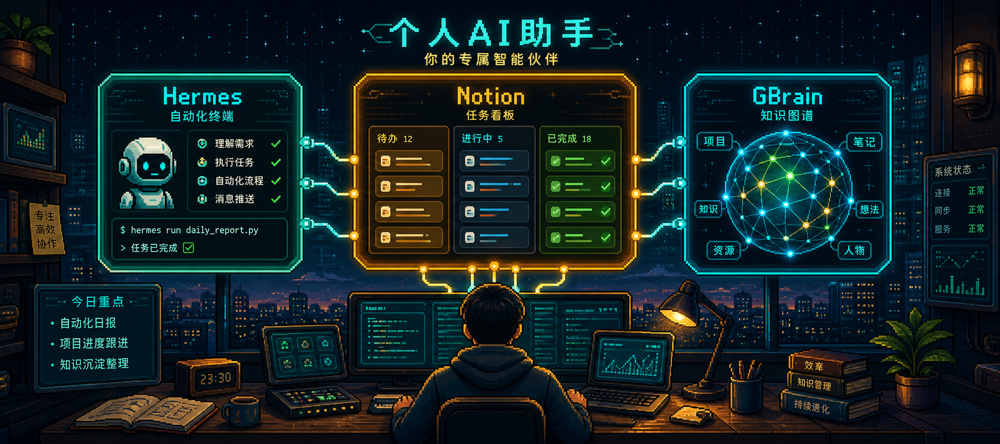
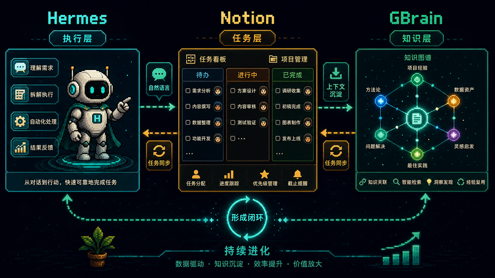
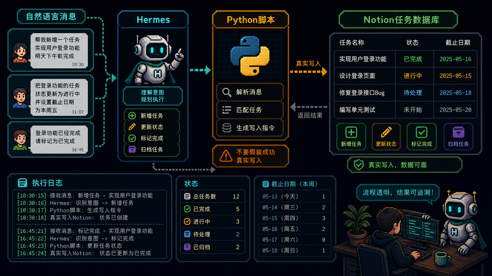
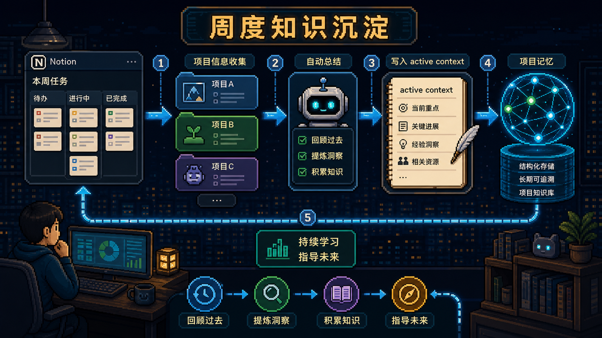

# Hermes + Notion + GBrain：把任务系统接入你的个人 AI 助手

很多人做个人 AI 助手，最先想到的是聊天能力、自动化能力，或者接入一堆模型。

但真正用久了以后，你会发现卡住你的往往不是“模型够不够强”。

而是上下文不连通。

你的任务在 Notion。

你的自动化在 Hermes。

你的知识沉淀和关联推理在 GBrain。

如果这三套系统彼此割裂，那么 AI 再聪明，也只能在各自的小盒子里工作。

这篇 Hermes + Notion + GBrain 的集成思路，真正解决的是一件更关键的事：

**让你的 AI 助手既能执行任务，又能理解你正在推进的项目，并把日常工作自动沉淀成长期知识。**

---

## 为什么要把 Hermes、Notion 和 GBrain 连起来

单看这三样东西，各自其实都不难理解。

`Hermes` 负责执行和自动化。

`Notion` 负责承载项目、任务和日常管理。

`GBrain` 负责把分散的信息抽取、综合、做知识图谱和上下文联想。

问题在于，大多数人的系统是断开的。

Notion 里有任务，但 AI 不知道。

Hermes 能执行命令，但不知道你到底在推进哪个项目。

GBrain 能学东西，但缺少你日常真实工作的上下文。

一旦把三者连起来，整个系统就会发生质变：

- 你用自然语言添加、修改、完成任务
- Hermes 把这些意图翻译成对 Notion 的真实操作
- GBrain 再把最近一周的任务变化沉淀成项目上下文
- 于是你的 AI 助手不只是“做事”，还开始“理解你为什么在做这些事”

这就是个人 AI 助手从工具，走向工作系统的关键一步。

---

## 第一部分：先把 Hermes 接到 Notion

这一部分的核心目标很简单：

让 Hermes 不再维护一套“假的内部任务列表”，而是把所有任务相关动作都真实写进 Notion。

这个原则很重要。

因为很多 AI 助手看起来会记任务，实际上只是把任务留在会话里，一旦上下文丢失，任务也就丢了。

正确做法是：

- 创建 Notion Integration
- 让这个 Integration 拥有正确的数据库和父页面权限
- 找到正确的 database ID 与 project page ID
- 用脚本直接调用 Notion REST API
- 在 Hermes 的系统提示里强制所有任务操作都通过脚本执行

这里有两个细节非常关键。

第一，权限不只是给数据库本身。

原作者踩过的坑是：数据库上层的父页面如果没有共享给 Integration，也会报错。

第二，不要过度依赖 SDK。

帖子里明确提到 `notion-client` 新版本去掉了一些旧方法，所以直接走 REST API 反而更稳。

这也是一个很实用的工程判断：

当一个 SDK 的抽象层开始妨碍你时，直接打官方 API 往往更可控。

---

## 核心不是脚本，而是约束 Hermes 的行为

很多人看完这类教程，会把注意力放在 `notion_tasks.py` 这个脚本本身。

脚本当然重要。

它负责创建任务、列任务、更新状态、标记完成、归档删除。

但真正决定系统是否可靠的，不只是脚本能不能跑，而是 Hermes 是否被**强约束**成必须调用这个脚本。

这篇教程里最有价值的一条规则其实是：

**凡是和任务、待办、提醒、跟进有关的消息，Hermes 都必须调用脚本，不能自己假装记住，也不能模拟成功。**

这意味着：

- 没有脚本输出，就不算任务已创建
- 没有脚本返回，就不能口头确认成功
- Hermes 不允许偷偷在会话里维护一份虚假的任务系统

这个设计非常对。

因为个人 AI 助手最危险的，不是“不会做”，而是“假装做了”。

一旦你把这一层约束写进 `system_prompt` 和 `channel_prompts.default`，整个系统的可靠性才会真正上来。

---

## 第二部分：让 GBrain 自动吸收任务上下文

如果第一部分解决的是“AI 能执行任务”，那第二部分解决的就是“AI 会不会越用越懂你”。

作者的做法很清晰：

每周拉取 Notion 最近 7 天发生变化的任务。

按项目分组。

再调用 OpenAI 做简洁总结。

最后把这份总结写回 GBrain，变成每个项目的 active context 页面。

这一步的价值非常大。

因为日常工作里最难保留的，不是任务本身，而是任务背后的模式。

比如：

- 哪些项目一直在推进
- 哪些任务经常延期
- 哪些主题最近高频出现
- 哪些关键人物反复参与
- 哪些信息散落在不同渠道却属于同一件事

这些东西如果只存在单条任务里，很难形成长期认知。

但一旦每周自动汇总，GBrain 就能逐步把项目运行状态、主题趋势和关键关系沉淀成可检索的知识。

于是 Hermes 在后续执行时，就不再只是“处理一条命令”，而是能带着更完整的项目背景来理解你的意图。

---

## 一个成熟的个人 AI 系统应该怎么分工

看完这套方案以后，可以把三者的角色理解得更清楚一些：

`Notion` 不是智能层，它是任务与项目的事实数据库。

`Hermes` 不是知识库，它是执行层和交互层。

`GBrain` 不是任务管理器，它是长期上下文和知识联结层。

这三个角色不要混。

一旦混了，系统就会开始混乱：

- 用聊天记录代替任务系统，任务会失真
- 用任务系统代替知识系统，洞察会变浅
- 用知识系统代替执行系统，自动化会变弱

把三者拆清楚，反而更稳。

这也是为什么这篇文章虽然看起来是在讲“怎么接 Notion”，本质上讲的却是：

**如何给个人 AI 助手做一层清晰的系统架构。**

---

## 真正值得抄的，不是代码，而是工程原则

这篇教程真正值得拿走的，不只是脚本模板，而是里面几个很硬的工程原则：

第一，所有关键动作都必须落真实系统，不要让 AI 在会话里“脑补成功”。

第二，权限、ID、列名这些基础信息一定要先验证，不要靠猜。

第三，能直接打 REST API，就不要被脆弱的 SDK 版本问题拖住。

第四，任务系统和知识系统要打通，但不要混成一个东西。

第五，定期做自动总结，才能让个人 AI 助手具备长期积累能力。

从这个角度看，Hermes + Notion + GBrain 这套做法并不只是一个“集成教程”。

它更像是一份个人 AI 工作流设计样本。

你完全可以把这套思路继续扩展到邮件、Slack、日历、CRM、读书笔记、市场监控、客户跟进，甚至自己的内容生产系统里。

---

## 如果你也想自己搭

最好的起点，不是一下子做完整套系统。

而是先完成两个最小闭环：

第一步，让 Hermes 真正能对 Notion 增删改查任务。

第二步，让最近一周任务变化能自动汇总进 GBrain。

只要这两个闭环跑通，你的个人 AI 助手就已经不再只是“会聊天的自动化工具”。

它开始拥有了：

- 真实任务执行能力
- 项目上下文感知能力
- 长期知识沉淀能力

这三样能力叠在一起，才更接近大家真正想要的个人 AI 助手。

---

原文来源：[@smantena](https://x.com/smantena/status/2052483819270521238)
