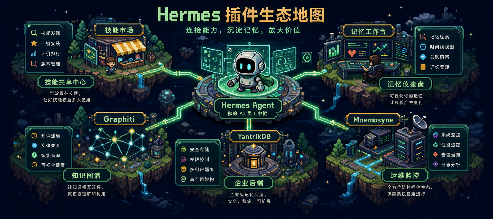
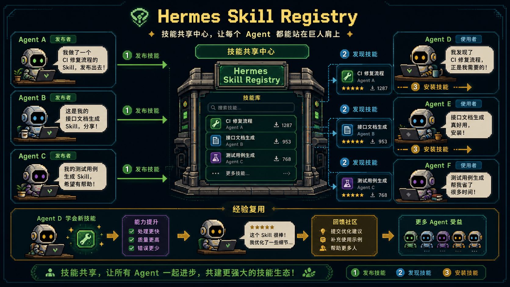
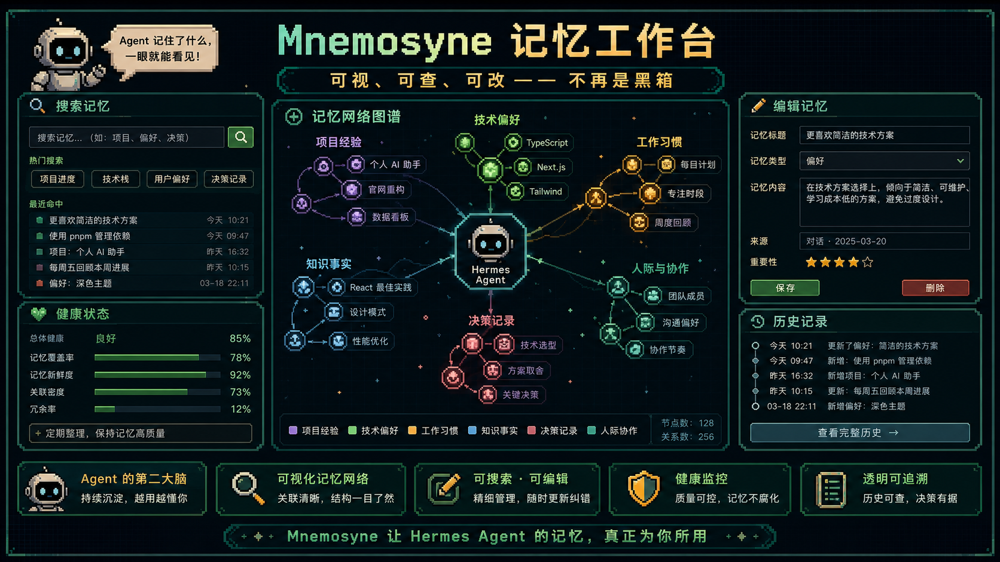
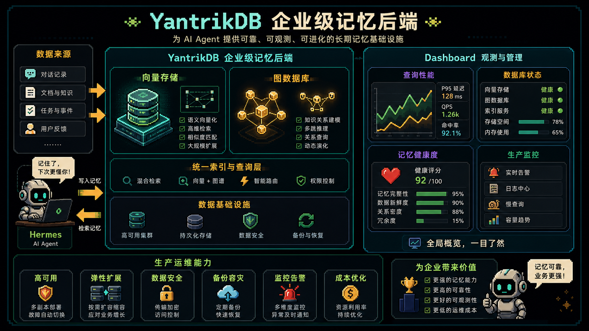

# Hermes 灵魂插件：它正在长出技能市场、知识图谱和企业级记忆后端

很多人看 `Hermes Agent`，还停留在“能不能替我跑任务”的阶段。但社区最近冒出来的一批插件，真正值得看的不是单点功能，而是 Hermes 正在从单体 Agent 长成一个生态系统。

## Skill Registry：Agent 之间开始共享技能

`hermes-skill-registry` 解决的是技能发布、发现和安装问题。一个 Agent 学到的技能，其他 Agent 能不能复用，这是 Agent 生态能不能真正协作的基础。

## Graphiti 插件：记忆不该只是线性日志

[`hermes-graphiti-plugin`](https://github.com/p1s4/hermes-graphiti-plugin) 把 `Graphiti` 接进 Hermes，让记忆从线性记录变成关系图谱。

复杂任务需要的不只是“存过什么”，而是项目、任务、人物、资源、约束之间的关系。

## Mnemosyne Dashboard：记忆不能一直是黑箱

[`mnemosyne-dashboard`](https://github.com/wysie/mnemosyne-dashboard) 的价值，是让 Agent 记忆变成可以监控、搜索、编辑和维护的工作台。

长期记忆如果不能观察、修正和清理，就很难真正放心使用。

## YantrikDB：个人记忆走向企业级后端

[`yantrikdb-hermes-plugin`](https://github.com/yantrikos/yantrikdb-hermes-plugin) 代表的是更重的一层：企业级向量和图数据库后端。

当记忆量变大、多 Agent 共享、权限和持久化需求出现时，本地轻量记忆就不一定够用了。

## Dashboard：企业后端必须有运维面板

[`yantrikdb-hermes-dashboard`](https://github.com/wysie/yantrikdb-hermes-dashboard) 解决的是状态、性能、健康度和可观测问题。

插件解决能不能接入，Dashboard 解决接入后能不能长期维护。

## 项目链接清单

- [`Debarpan08/hermes-skill-registry`](https://github.com/Debarpan08/hermes-skill-registry)：Hermes 技能共享中心
- [`p1s4/hermes-graphiti-plugin`](https://github.com/p1s4/hermes-graphiti-plugin)：Graphiti 知识图谱插件
- [`wysie/mnemosyne-dashboard`](https://github.com/wysie/mnemosyne-dashboard)：Mnemosyne 记忆仪表盘
- [`yantrikos/yantrikdb-hermes-plugin`](https://github.com/yantrikos/yantrikdb-hermes-plugin)：YantrikDB 企业级记忆后端
- [`wysie/yantrikdb-hermes-dashboard`](https://github.com/wysie/yantrikdb-hermes-dashboard)：YantrikDB 运维仪表盘

## 最后

这五类项目放在一起看，趋势很清楚：Hermes 社区正在补 Agent 长期运行所需要的底层能力。

技能共享解决能力复用，知识图谱解决关系理解，Dashboard 解决可见可管，企业后端解决大规模记忆，运维面板解决生产维护。

现阶段更适合当作技术生态观察和实验入口。真正值得兴奋的，不是某个插件“装了直接飞”，而是 Hermes 正在长出一个更完整的 Agent 操作系统生态。

原文来源：[@GitTrend0x](https://x.com/GitTrend0x/status/2064350001137065990)
