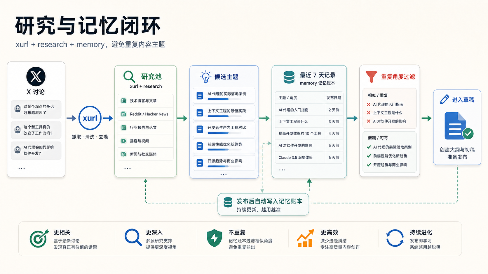
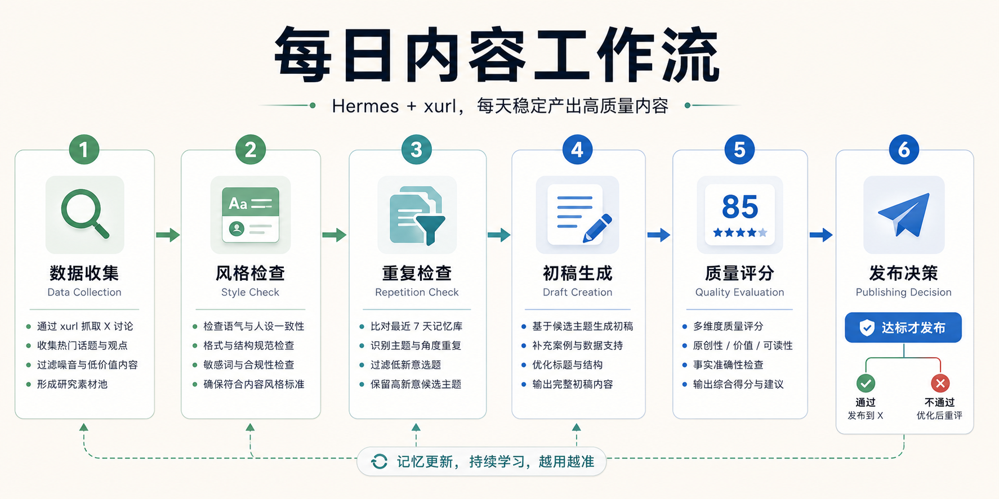
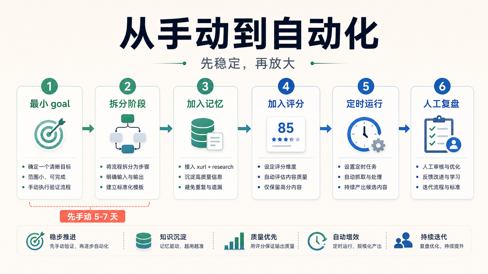

# Hermes + xurl 不只是发推工具：真正好用的是把它做成一套内容工作流


很多人第一次看到 `xurl`，会把它理解成一个很直接的能力：

让 Hermes 去 X 上搜索内容、读取讨论、发布帖子。

这当然有用。

但如果只这样用，`xurl` 其实还只是一个“执行工具”。

它能做动作，但不一定能形成稳定流程。

真正有价值的用法，是把 `xurl` 和 Hermes 里的其他能力组合起来，尤其是：

- `/goal`
- research
- multi-step reasoning
- memory
- planning

这些能力加在一起，才会让 `xurl` 从“能发一条内容”，变成“能长期运行一套内容生产系统”。

这篇文章讲的就是这个问题：

**怎么把 Hermes + xurl 用成一个可重复、可评估、可持续改进的内容工作流。**

## 一、为什么单独用 xurl 很容易不稳定

单独使用 `xurl` 时，最常见的问题不是“它不能发内容”。

恰恰相反，它能执行。

问题在于执行背后没有结构。

你让它去 X 上找内容、写帖子、发布，它可能每次都能给你一个结果。

但结果会有几个明显风险：

- 每次流程不一致；
- 不知道之前已经做过什么；
- 没有质量检查；
- 容易重复话题；
- 内容容易浅；
- 发布判断太随意。

这就导致 `xurl` 停留在“一个有用功能”的层面。

它能帮你完成一件事，但还不能让你放心地把一套长期内容流程交给它。

如果你想要的是稳定产出，而不是偶尔试一下，就必须给它补上流程、记忆和评估。

## 二、最重要的组合：xurl + /goal

`xurl` 最强的组合，是和 `/goal` 放在一起。

原因很简单：

`xurl` 负责执行。  
`/goal` 负责结构。

如果没有 `/goal`，你很容易写出这种一次性命令：

“去 X 上找 AI Agent 的热门讨论，写一条 thread 发出去。”

这能跑，但不够稳。

因为它没有规定：

- 先研究什么；
- 怎么筛选信息；
- 怎么提炼观点；
- 怎么起草；
- 怎么评分；
- 什么情况下才能发布；
- 发布后怎么记录。

而 `/goal` 的价值，就是把这些步骤变成一个明确流程。

一个更可靠的结构应该是：

1. research：收集过去一段时间的相关讨论；
2. analysis：提炼共识、分歧和新角度；
3. drafting：写出候选 thread；
4. evaluation：按标准打分；
5. publishing：达到阈值才用 xurl 发布；
6. memory：记录已经发过的话题和角度。

这时 `xurl` 不需要负责“想清楚整个流程”。

它只需要在正确的阶段做正确的执行动作。


## 三、xurl + research：先收集，再表达

很多内容质量差，不是因为模型不会写，而是因为前面没有足够的信息输入。

如果 `xurl` 直接从一个模糊指令开始写，很容易变成泛泛而谈。

所以更稳的做法是：

先让 research 技能参与进来。

比如在写一个 AI Agent 主题 thread 之前，不要直接让它开写，而是先让它完成这些动作：

- 搜索过去 12 小时相关讨论；
- 找出高互动帖子；
- 读取评论区争议点；
- 归纳重复出现的问题；
- 找到一个不那么常见的切入角度。

然后再进入写作。

这样生成出来的内容，会更像“基于观察的观点”，而不是“模型凭空写的一段总结”。

`xurl` 在这里的作用，是接触 X 这个信息源。

research 的作用，是把信息变成可用材料。

## 四、xurl + multi-step reasoning：不要第一稿就发布

很多人做自动发帖，最大的问题是太急。

Agent 刚写出第一版，就直接发布。

这会带来两个问题：

- 第一版往往 hook 不够强；
- 内容可能只是正确，但没有传播力。

更好的方式，是让 Agent 至少经过几轮内部改进。

比如：

第一轮：写出原始 thread。  
第二轮：检查开头是否足够抓人。  
第三轮：检查有没有真正的洞察。  
第四轮：检查是否和账号风格一致。  
第五轮：决定是否发布。

这个过程不是为了让内容变复杂，而是为了避免“看起来完成了，但质量不够”。

Agent 最容易犯的错误，就是把“生成了内容”当成“内容值得发布”。

这两者不是一回事。

## 五、xurl + memory：避免重复，是长期内容系统的底线

如果你只是偶尔发一条内容，记忆没那么重要。

但如果你要让 Hermes 每天跑、每周跑、长期跑，memory 就非常关键。

没有记忆，Agent 很容易反复写同一个话题。

比如它今天写“AI Agent 需要记忆”，明天又写“Agent 的长期记忆很重要”，后天再写“为什么 Agent 要有 memory”。

看起来标题不一样，本质上是在重复同一个角度。

所以 recurring workflow 里必须有一个步骤：

**发布前检查过去 7 天已经发过什么。**

不仅要看主题，还要看角度。

比如记录这些信息：

- 发布时间；
- 主题；
- 核心观点；
- 目标受众；
- 使用的数据或案例；
- 是否发布成功；
- 互动反馈。

这样下一次生成内容时，Agent 才知道什么应该避开，什么可以延伸。



## 六、一个可复用的每日内容工作流

如果要把 Hermes + xurl 用成系统，最实用的场景是每日或每日两次的内容工作流。

不要一开始就让它完全自动发。

先做成一个可审阅流程。

可以按下面 6 步来设计：

### 1. Data Collection：收集讨论

用 `xurl` 收集最近的 X 讨论。

范围可以先定窄一点，比如：

- AI Agent；
- Hermes；
- Codex；
- MCP；
- 自动化工作流；
- 开发者工具。

只收集近期内容，不要无限扩散。

### 2. Style Check：检查账号风格

在写之前，先读取你的风格要求。

比如：

- 开头要直接；
- 不写空洞鸡汤；
- 少用大词；
- 多写具体流程；
- 保持技术人员能接受的密度。

风格不是最后润色才看，而是写作前就要介入。

### 3. Repetition Check：检查重复

读取最近 7 天或 30 天已发布内容。

确认这次主题和角度没有重复。

如果重复，就要求 Agent 换角度，而不是硬写。

### 4. Draft Creation：生成初稿

基于研究材料写 thread。

这里可以先生成 2 到 3 个候选方向：

- 一个偏教程；
- 一个偏观点；
- 一个偏案例。

然后再选择最强的一版继续打磨。

### 5. Quality Evaluation：质量打分

不要让 Agent 自己“感觉还不错”。

要给明确评分项。

比如每项 1 到 10 分：

- hook strength：开头是否抓人；
- insight depth：是否有真观点；
- relevance：是否贴近当前讨论；
- style alignment：是否符合账号风格；
- engagement potential：是否值得互动。

只有平均分达到阈值，才进入发布环节。

### 6. Publishing Decision：决定是否发布

最后一步才是 `xurl` 发布。

而且一开始建议保留人工确认。

比如：

“如果平均分低于 8，不发布，只输出改进建议。”  
“如果平均分达到 8，但存在重复风险，先请求人工确认。”  
“连续 5 到 7 天表现稳定后，再考虑自动发布。”

这样 `xurl` 才不是一个盲目发布器，而是整个系统里的最后执行环节。



## 七、常见错误：不要一上来就全自动

很多人搭 Agent 工作流时，会犯几个相同错误。

第一个错误，是把所有事塞进一个巨大 goal。

目标太大，Agent 很容易丢上下文。

更好的做法，是把流程拆成清晰阶段，每个阶段有明确产物。

第二个错误，是评估标准太松。

如果你让 Agent 自己判断“是否足够好”，它往往会过于宽容。

所以评分规则要具体，发布阈值要严格。

第三个错误，是没有记忆追踪。

没有记录，重复几乎一定会发生。

第四个错误，是太早自动化。

自动化不是第一步。

手动跑 5 到 7 天，观察输出是否稳定，再做定时任务。

如果一开始就让它自动发，最后你调试的不是系统，而是事故。

## 八、推荐的启动路径

如果你想真的把这套东西落地，可以按这个顺序来。

### 第一步：先做一个最小 goal

不要一开始就追求完美。

先让 Hermes 能稳定完成最小闭环：

```bash
hermes goal "Research the latest AI agent discussions from the last 12 hours and publish a short thread using xurl"
```

先手动跑几次。

确认它能正常搜索、读取、生成和发布。

### 第二步：把流程拆成阶段

把目标扩展成：

research → analysis → drafting → evaluation → publishing

每一步都要有清晰输出。

### 第三步：加入记忆和重复控制

给它加一条规则：

“生成新 thread 前，检查最近 7 天已经发布过的话题和角度，避免重复。”

### 第四步：加入质量评分

发布前必须打分。

低于阈值不发布，只给修改建议。

### 第五步：再做定时运行

等手动模式稳定之后，再设置早晚各跑一次。

### 第六步：前 7 到 10 次人工复盘

看几个指标：

- 内容是否有价值；
- 风格是否稳定；
- 是否重复；
- 评分是否过松；
- 发布判断是否合理。

根据复盘结果继续改 goal。



## 最后：xurl 的价值不在“能发”，而在“能接入系统”

`xurl` 本身很有用。

它让 Hermes 能直接接触 X：搜索、阅读、发布。

但它真正变强，是在和 `/goal`、research、reasoning、memory 组合之后。

这时你得到的不是一个命令工具，而是一套内容系统：

- 有输入；
- 有分析；
- 有草稿；
- 有评估；
- 有发布判断；
- 有历史记忆；
- 有迭代空间。

如果只是偶尔发一条内容，用 `xurl` 就够了。

但如果你想让 Hermes 变成一个长期可用的内容助手，就不要只问它：

“能不能帮我发？”

更应该问：

**“能不能把研究、写作、评估、发布和记忆，组成一个可以持续运行的系统？”**

这才是 Hermes + xurl 真正值得搭起来的地方。

