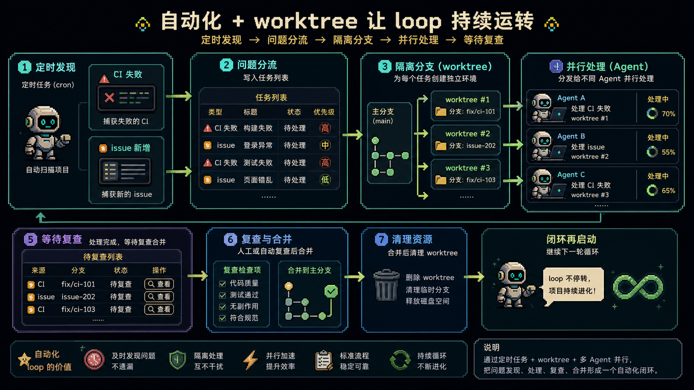
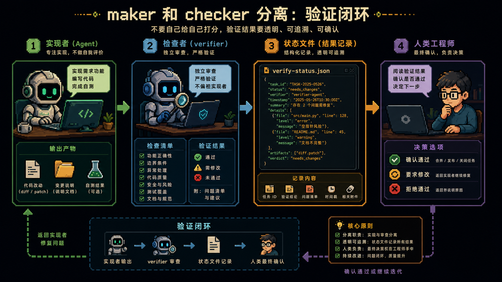

# Loop Engineering：别再亲自提示 Agent 了，开始设计会自己提示 Agent 的系统

过去两年，我们和 coding agent 协作的方式，基本还是“人类一轮一轮提示”。

你写一个 prompt。

它回一个结果。

你读完，再补上下文。

它继续改。

你再检查、再追问、再让它继续。

这套方式当然有效。

但 Addy Osmani 最近写的 [Loop Engineering](https://x.com/addyosmani/status/2064127981161959567)，讲的是另一种更值得关注的变化：

**你不再把自己放在每一轮 prompt 的位置上，而是设计一个会自动提示 agent、分发任务、检查结果、记录状态、继续下一轮的系统。**

换句话说，你从“亲自操作 agent 的人”，变成“设计 agent 工作循环的人”。

这就是 Loop Engineering。

---

## 1. Loop Engineering 到底是什么

原文里有一句话很关键：

**Loop engineering is replacing yourself as the person who prompts the agent. You design the system that does it instead.**

翻成更直白的话就是：

以前是你不断提示 agent。

现在是你设计一个循环，让这个循环去提示 agent。

这个循环不是一个神秘概念。

你可以把它理解成一个递归目标：

你定义一个目的。

系统自己发现工作。

自己分发给 agent。

自己检查进度。

自己写下已经完成什么、下一步是什么。

然后继续跑下一轮。

这听起来有点像自动化。

但它比普通自动化更进一步。

普通自动化通常是固定步骤。

Loop 更像一个带状态、带判断、带验证、带下一步决策的小系统。

它不是只执行一次。

它会按节奏持续回来。

这也是为什么 Peter Steinberger 说：

> You shouldn't be prompting coding agents anymore. You should be designing loops that prompt your agents.

而 Claude Code 负责人 Boris Cherny 也表达过类似观点：

> I don't prompt Claude anymore. I have loops running that prompt Claude and figuring out what to do. My job is to write loops.

这两句话背后的意思是同一个：

提示词本身不是终点。

真正的杠杆点，正在从“写 prompt”转向“设计 loop”。

---

## 2. 一个 loop 需要哪几块积木

Addy 把这个结构拆成五块，再加一个外部记忆层。

这五块分别是：

- 自动化
- worktree
- skill
- 插件和连接器
- sub-agent

第六块是记忆。

可以是 Markdown 文件。

可以是 Linear 看板。

也可以是任何能活在单次对话之外、记录“做了什么”和“下一步是什么”的外部状态。

这一点看起来朴素，但极其重要。

因为模型会忘。

上下文会断。

单次对话会结束。

但 repo、文件、看板、状态记录不会。

所以长期运行的 agent 系统，真正的记忆不能只放在模型上下文里。

它必须落在外部。

这也是 Addy 在 [long-running agents](https://addyosmani.com/blog/long-running-agents/) 里反复强调的那条线：

agent 会忘，repo 不会。

---

## 3. 自动化是 loop 的心跳

如果没有自动化，loop 就只是你手动跑过的一次任务。

自动化让它变成一个真正会按时醒来的系统。

在 Codex app 里，你可以用 Automations 设置：

- 哪个项目
- 跑什么 prompt
- 多久跑一次
- 在本地 checkout 还是后台 worktree 运行
- 有发现时进 triage inbox
- 没发现时自动归档

这很适合做那些无聊但稳定的工程工作。

比如：

- 每天扫 issue
- 汇总 CI 失败
- 写 commit briefing
- 找出上周引入的 bug
- 定时生成项目状态摘要

在 Claude Code 里，思路也类似，只是入口不同。

你可以用 `/loop`、cron、hooks，或者把任务放到 GitHub Actions 里跑。

Codex 和 Claude Code 的名字不完全一样，但能力结构已经非常接近。

这也是原文里一个很重要的观察：

**现在已经不是“哪个工具有没有这块能力”的阶段，而是两个主流工具都开始长出同样的 loop 组件。**

区别不再只是工具。

而是你会不会设计循环。

---

## 4. worktree 让并行不变成混乱

一旦你让多个 agent 同时工作，最先炸的往往不是模型能力，而是文件冲突。

两个 agent 改同一个文件。

两个分支互相覆盖。

一个任务还没收尾，另一个任务已经把现场弄乱。

这和两个工程师没沟通就改同一块代码，本质上是同一个问题。

`git worktree` 的价值就在这里。

它让每个 agent 拥有自己的工作目录和分支。

一个 agent 的改动，不会直接碰到另一个 agent 的 checkout。

Codex 已经把 worktree 支持做进产品里。

Claude Code 也可以通过 `git worktree`、`--worktree` 或 subagent 的 isolation 设置做到类似隔离。

但这里有一个很现实的提醒：

worktree 只能解决机械冲突。

不能解决人的 review 带宽。

你能同时开几个 agent，不取决于工具能开几个。

而取决于你能认真审几个结果。

Addy 在 [the orchestration tax](https://addyosmani.com/blog/orchestration-tax/) 里讲过这个问题：编排能力变强以后，人类 review 才是新的瓶颈。

---

## 5. Skill 让 loop 不用每轮从零理解项目

如果没有 skill，loop 每跑一轮都要重新推断项目规则。

怎么 build。

怎么 test。

哪些写法不能用。

历史上踩过什么坑。

团队的代码风格是什么。

这些东西如果每次都靠 agent 从 repo 里临时猜，成本很高，也很容易猜错。

Skill 的价值就是把这些稳定知识写到外部。

一个 `SKILL.md`，加上可选的脚本、参考资料、资产，就能把一类任务的做法固化下来。

Codex 可以通过 `$skill-name` 或任务匹配自动调用。

Claude Code 也使用类似格式。

Addy 在 [agent skills](https://addyosmani.com/blog/agent-skills/) 里也讲过这个模式。

从 loop 的角度看，skill 解决的是一件非常关键的事：

**不要让 agent 每一轮都重新支付一次意图成本。**

Addy 在 [intent debt](https://addyosmani.com/blog/intent-debt/) 里把这个问题说得很清楚：

agent 每个 session 都是冷启动。

你没有写清楚的意图，它就会用自信的猜测补上。

Skill 就是把这些意图债写到系统外部，让 loop 每次启动时都能读到稳定规则。

---

## 6. 插件和连接器，让 loop 真正碰到你的工作环境

一个只能看文件系统的 loop，能力非常有限。

真正有用的 loop，必须能碰到你的真实工具：

- issue tracker
- 数据库
- staging API
- Slack
- CI
- GitHub
- Linear

这就是插件和连接器的价值。

连接器通常基于 MCP，让 agent 能读取和操作外部系统。

插件则可以把 skill 和 connector 打包在一起，让别人一次安装整套能力。

有了连接器以后，loop 就不只是说：

“这是我建议的修复。”

它可以直接：

开 PR。

关联 Linear ticket。

等 CI 绿了以后通知频道。

把状态写回看板。

这才是 loop 从“本地助手”走向“真实工作流”的关键一步。

---

## 7. sub-agent：让写的人和检查的人分开

loop 里最重要的结构之一，是把 maker 和 checker 分开。

写代码的 agent，不应该自己给自己打分。

因为模型对自己的产出通常太宽容。

一个不同指令、不同角色，甚至不同模型的 verifier，往往能抓到第一个 agent 说服自己接受的问题。

Codex 可以按需 spawn subagents。

Claude Code 也有 subagents 和 agent teams。

常见分工是：

- 一个 agent 探索
- 一个 agent 实现
- 一个 agent 按 spec 验证

Addy 之前在 [code agent orchestra](https://addyosmani.com/blog/code-agent-orchestra/) 和 [adversarial code review](https://addyosmani.com/blog/adversarial-code-review/) 里都讲过这个方向。

放在 loop 里，它更关键。

因为 loop 是在你不盯着的时候运行。

如果没有一个可信的验证者，它说“完成了”并不等于真的完成。

这也是 `/goal` 这类机制的关键点：

停止条件最好由另一个模型或独立检查器判断，而不是由刚刚完成任务的那个 agent 自己判断。

---

## 8. 一个真实 loop 大概长什么样

把这些积木拼起来，一个 loop 可以是这样：

每天早上，automation 在 repo 上运行。

它调用 triage skill，读取昨天的 CI 失败、open issues、recent commits。

它把发现写入 Markdown 文件或 Linear board。

对于值得处理的问题，它开一个隔离 worktree。

一个 sub-agent 草拟修复。

另一个 sub-agent 按项目 skill 和现有测试审查修复。

connector 负责开 PR、更新 ticket、通知频道。

无法自动处理的部分，进入 triage inbox 等你处理。

状态文件记录：

- 已经尝试过什么
- 哪些通过了
- 哪些还没做
- 明天应该从哪里继续

到这里，你已经不是在一轮一轮提示 agent。

你是在设计一个每天会自己跑起来的小控制系统。

这就是 Loop Engineering 的实际形状。

---

## 9. loop 不会把你从工程里删除

这篇文章最重要的地方，不是鼓吹“人类不用管了”。

恰恰相反。

Addy 最后提醒得很清楚：

loop 改变了工作，但不会把工程师删除掉。

甚至 loop 越强，有几个问题越尖锐。

第一，验证仍然是你的责任。

自动跑的 loop，也可能自动制造错误。

sub-agent verifier 只是让“完成”这件事更可信，但它不是证明。

你仍然要确认自己要 ship 的东西真的能工作。

第二，理解会腐烂。

loop 生成代码越快，你越容易不理解系统里到底发生了什么。

这就是 Addy 在 [comprehension debt](https://addyosmani.com/blog/comprehension-debt/) 里讲的理解债。

第三，最舒服的姿势往往最危险。

当 loop 能自己跑，你很容易停止形成判断，只接受它吐回来的结果。

这就是 [cognitive surrender](https://addyosmani.com/blog/cognitive-surrender/) 的风险。

所以真正成熟的态度不是：

“让 loop 替我思考。”

而是：

“我设计 loop 放大我的判断，但我仍然承担工程责任。”

---

## 最后：Build the loop, stay the engineer

Loop Engineering 很可能会成为我们和 coding agent 协作的新阶段。

但它不是更懒的 prompt engineering。

它更像一层新的系统设计工作。

你要决定：

- 什么任务适合自动发现
- 什么任务适合自动执行
- 哪些地方必须人工 review
- 哪些状态必须写到外部记忆
- 哪个 agent 负责实现
- 哪个 agent 负责验证
- 成本和质量怎么平衡

两个人可以设计同一个 loop，却得到完全相反的结果。

一个人用它加速自己已经理解很深的工作。

另一个人用它逃避理解。

loop 本身分不清这两者。

你能。

所以真正值得带走的不是“以后不要 prompt 了”。

而是：

**Build the loop. But build it like someone who intends to stay the engineer, not just the person who presses go.**

---

原文来源：[@addyosmani](https://x.com/addyosmani/status/2064127981161959567)
