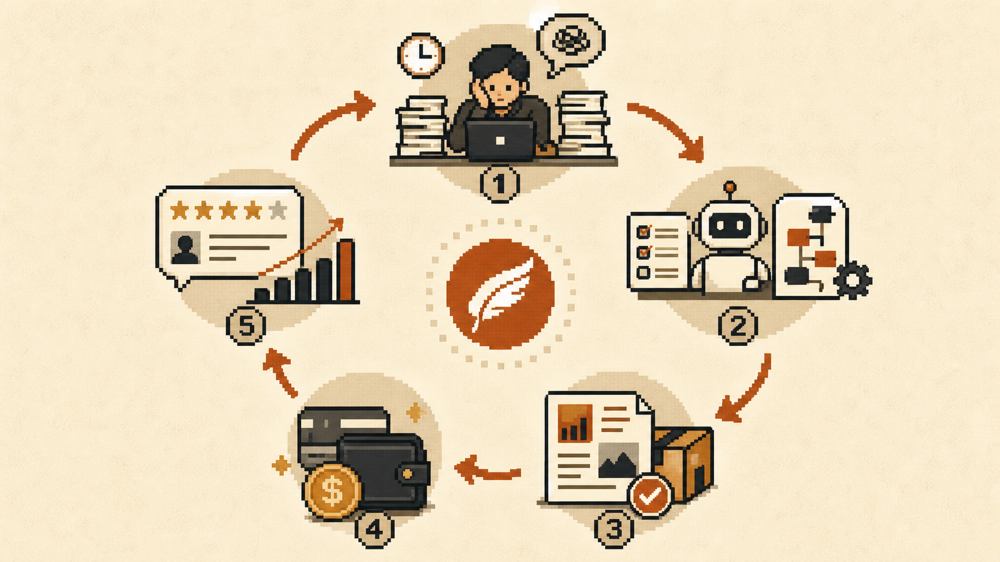
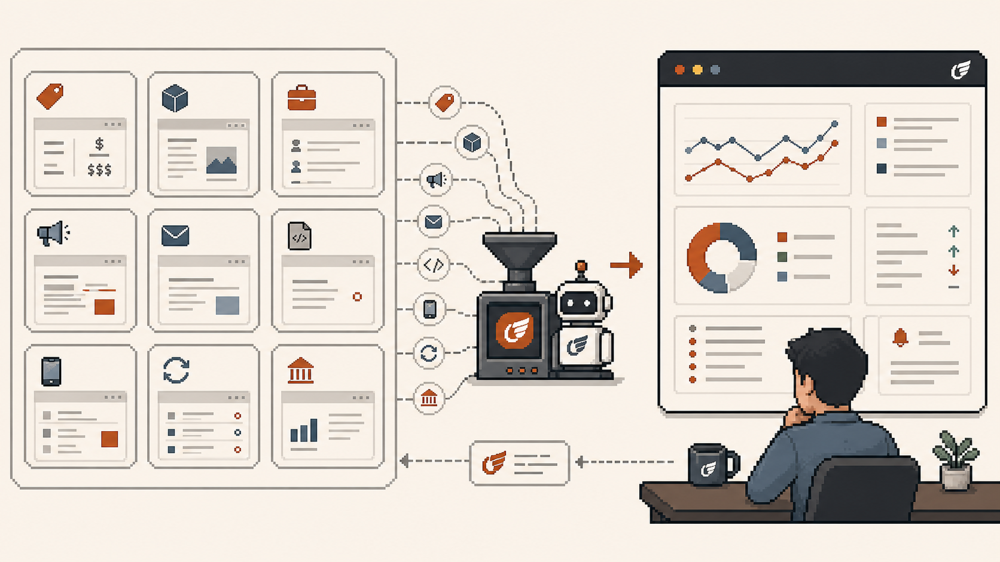
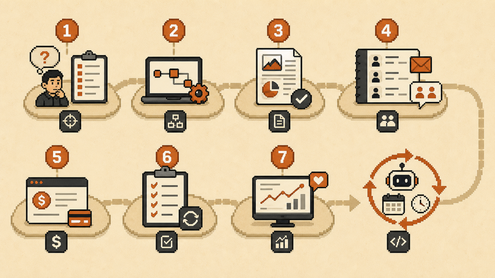

很多人装好 Hermes Agent 以后，第一反应是：

“它能自动化什么？”

这个问题很自然。

但如果目标是让 Agent 真正产生收入，这个问题其实问早了。

更应该先问的是：

**它每周能稳定产出什么结果，而且有人愿意为这个结果付钱？**

这是完全不同的出发点。

因为企业和个人客户不会为“一个 AI Agent”本身付钱。

他们愿意付钱的，通常是这些东西：

- 更精准的潜在客户
- 更好的行业研究
- 更快的跟进
- 更干净的报告
- 更少错过的机会
- 更及时的市场提醒
- 更值得发布的内容选题

所以，如果你想用 Hermes Agent 赚到第一笔钱，不要一开始就卖“Agent”。

**卖输出。**

## 不要从自动化开始，要从结果开始

很多人会把 Agent 变现想复杂。

一上来就想做全自动获客系统、全自动内容工厂、全自动交易机器人、全自动调研平台。

但真正能快速卖出去的，往往不是这些听起来很大的系统。

而是一个非常具体、非常稳定、非常好理解的结果。

比如：

**“我每周给你一份竞品变化简报。”**

或者：

**“我每周给你 50 个研究过的潜在客户，并附上个性化触达角度。”**

这比“我做了一个 AI 销售 Agent”更容易被理解，也更容易被购买。

客户不关心你背后是不是 Agent。

客户关心的是它能不能省时间、少错过机会、帮助判断，并且比自己找人做更便宜、更稳定。

所以第一原则是：

**不要卖工具，卖瓶颈被解决后的结果。**

## 5 个适合用 Hermes Agent 起步的赚钱方向

如果你现在不知道从哪里开始，可以先从下面这 5 类 offer 里选一个。

它们有一个共同点：

不需要你一开始就做成完整产品。

你只需要先用 Hermes 帮你稳定交付一个结果。

## 1. 每周垂直领域情报简报

选一个变化很快、又有人必须持续关注的细分领域。

比如 AI 工具、加密市场、本地房地产、招聘趋势、融资动态、YouTube 细分赛道、竞品发布、监管更新。

Hermes Agent 可以监控信息源、阅读文章、摘要变化、过滤噪音，并整理成一份每周简报。

你卖的不是“研究”。

你卖的是：

**“这周你最应该知道的 10 件事，它们为什么重要，以及你接下来该做什么。”**

这个东西对创始人、投资人、内容创作者、代理商、招聘负责人、交易员都有价值。

最简单的启动方式是：先选一个 niche，找 5 个真正关心这个领域的人，免费发一份样稿，第二份开始收费。

## 2. 线索研究和销售触达准备

很多销售团队的问题，不是缺软件。

他们缺的是高质量准备。

Hermes Agent 可以帮你找目标账户、研究公司背景、识别购买信号、总结机会点、起草个性化触达话术，并整理到表格或 CRM。

注意，这里不需要一开始就做“全自动销售”。

人仍然要审核消息。

这恰恰是卖点。

一个非常具体的 offer 可以是：

**“我每周交付 50 个研究过的潜在客户，并附上定制触达角度。”**

这比“我做了一个 AI 销售 Agent”更好卖。

## 3. 竞品监控

每家公司都说自己重视竞品。

但真正持续、系统地跟踪竞品的团队并不多。

原因也很简单：

这事不难，但烦。

Hermes Agent 可以监控定价页、产品页、招聘信息、社交媒体、广告、newsletter、changelog、融资新闻和 App 更新。

然后每周交付一份报告：

- 发生了什么变化
- 为什么重要
- 你应该怎么应对

这听起来不酷。

但正因为它无聊，所以它很适合被 Agent 接手。

很多真正能赚钱的 Agent 业务，不会长得很未来。

它们可能只是：

**“我确保你不会再错过任何重要竞品动作。”**

## 4. 创始人内容研究系统

很多创始人都知道自己应该发内容。

但他们真正卡住的不是“不会写”。

而是不知道该说什么，不知道哪些角度值得说，不知道最近什么趋势和自己有关。

Hermes Agent 可以帮你搭一个每周内容研究系统：

- 跟踪行业趋势
- 研究爆款帖子
- 收集案例
- 总结新闻
- 把原始想法变成草稿

这里的重点不是“AI 替你写帖”。

这件事太便宜，也太容易变成垃圾内容。

更好的 offer 是：

**“我每周帮你跑一遍内容研究系统，让你不再从空白页开始。”**

客户买的不是“AI 写作”。

客户买的是稳定的内容输入和选题判断。

## 5. 市场提醒 Agent

这是很多人最容易兴奋的方向。

交易 Agent、加密 Agent、市场 Agent、钱包监控、新闻提醒、价格波动、链上信号。

但这里有一条非常重要的边界：

**不要一开始就让 Agent 接触真钱。**

先从提醒开始。

Hermes Agent 可以监控市场、API、钱包、新闻、filing、ticker 或特定事件，然后告诉你发生了什么、为什么重要、哪些条件触发了提醒、行动前还应该检查什么。

顺序应该是：

先提醒，再模拟，再 paper trading，再严格限额。

执行放在后面。

一个好的市场 Agent，必须先证明自己能找到信号，再去碰资金。

真正的机会不是一开始就造“自动印钞机”。

而是先做一个有用的决策辅助系统。

这本身就可以变成付费产品。

## 为什么 Hermes 不只是聊天框

聊天框的工作方式是：

你问，它答。

Hermes 更适合做的是：

它持续工作。

它可以用工具、搜索网页、读文件、跑脚本、调 API、记住偏好、创建 skill、定时执行任务、把结果发到 Telegram，并且随着流程反复运行不断改进。

这很关键。

因为能赚钱的工作流，通常不是一个 prompt。

而是一个循环：

**监控 -> 过滤 -> 分析 -> 包装 -> 交付 -> 重复。**

## 你的第一个 Hermes 业务，不要做 startup，要做付费循环

如果你想开始，不要先想着做一家完整公司。

先做一个 paid loop。

也就是一个每周可以重复运行、有人愿意为结果付费的小循环。

## 7 天启动计划

**第 1 天：选一个痛点结果。**

比如找线索、看竞品变化、每周总结 niche、监控市场、给内容选题。

**第 2 天：手动跑一遍 Hermes 工作流。**

不要急着全自动化。

先让 Agent 帮你产出一次结果。

**第 3 天：把流程变成可重复 checklist。**

包括信息源、规则、输出格式、交付方式、质量标准。

**第 4 天：做一份样稿。**

标准是：好到别人愿意转发。

**第 5 天：发给 10 个真的有这个问题的人。**

不要推销 Agent。

推销结果。

**第 6 天：第二版开始收费。**

哪怕 50 美元也算。

目标不是一周发财。

目标是证明有人在乎这个输出。

**第 7 天：把重复部分变成 Hermes skill、cron job、脚本和交付流程。**

到这一步，你就不只是在用 Agent。

你是在搭一个很小的业务引擎。

## 最后的关键

Agent 本身不是生意。

Agent 是生意背后的杠杆。

真正要你判断的是：

- 选哪个瓶颈
- 怎么包装输出
- 谁会为它付钱
- 质量标准怎么守住

Hermes 的价值，是让这个循环每跑一次，都有更多部分可以被它接手。

先从小结果开始。

让它真的有用。

让它先赚回自己的成本。

然后再放大已经被验证的东西。
