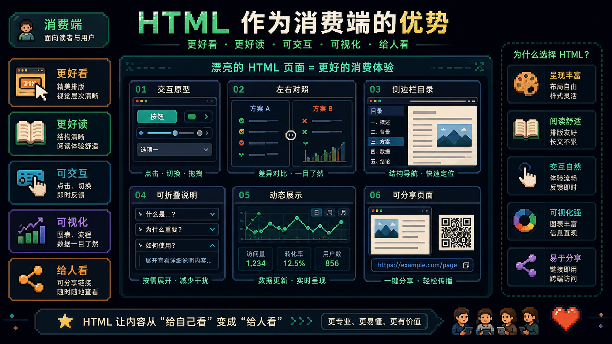
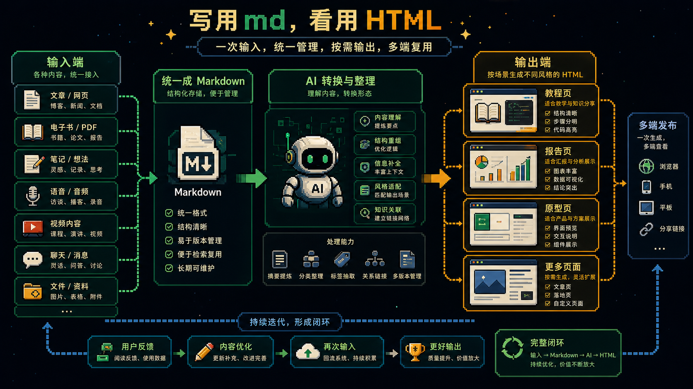

# Markdown还是HTML？这根本不是一个值得吵的问题

最近关于 `Markdown` 和 `HTML` 的争论又火了一轮。

起因是 Claude Code 团队的 Thariq 发了一篇很火的文章，说自己现在几乎不再写 Markdown 文件了，而是更愿意让 Claude 直接生成 HTML。

于是很快，大家就分成了两派。

一派觉得 Markdown 才是 AI 时代真正的源代码。

另一派觉得 HTML 才是更高级的表达介质，能承载更强的视觉、交互和结构化体验。

但如果你认真把两边的论据都看一遍，就会发现一个很直接的问题：

**他们其实根本没有在回答同一个问题。**

Markdown 党回答的是：

我们应该用什么来写、来改、来协作、来给 AI 吃上下文。

HTML 党回答的是：

我们应该用什么来展示、来阅读、来演示、来分享给人看。

这两个问题根本不是替代关系。

一个偏生产端。

一个偏消费端。

所以，这场争论本身就很大程度上是个伪命题。

---

## 为什么 Markdown 党会觉得自己是对的

如果你站在生产端看，Markdown 的优势非常硬。

它轻。

它快。

它天然适合 diff。

它几乎没有视觉噪音。

它的 token 成本也低得多。

所以像 `CLAUDE.md`、`AGENTS.md`、技能说明、知识库 schema、原始资料索引，这些东西几乎天然就适合用 Markdown。

因为这些内容的核心不是“好不好看”。

而是：

- 好不好写
- 好不好改
- 好不好被 AI 读懂
- 能不能在有限上下文里塞更多信息

从这个角度看，Markdown 被称作“AI 时代的源代码”，完全说得通。

你写书、写技能、写说明、写知识结构、写规则文件，面对的核心诉求都不是展示，而是表达效率和协作效率。

这时候，Markdown 就是最自然的生产格式。

---

## 为什么 HTML 党也完全没错

但如果你站在消费端看，HTML 的优势同样非常硬。

很多信息天然带空间维度。

比如 diff。

比如流程图。

比如调用关系。

比如产品原型。

比如解释型页面。

这些东西如果被压成一行行线性文字，理解效率确实会明显下降。

而 HTML 的价值恰恰在于，它不是单纯“更好看”。

它是能把信息重新组织成更适合人类消费的界面。

你可以有：

- 左右对照
- 折叠区块
- 侧边栏目录
- tab 代码块
- 交互式控件
- 动画和实时反馈

当你在做原型、做可视化、做演示、做教程页面、做分享页面的时候，HTML 的表达能力就是比 Markdown 强。

所以如果 HTML 党的命题是：

**“给人看的最终产物，HTML 往往更好。”**

那这个命题也完全成立。

---

## 真正的问题不是二选一，而是分工

这件事真正值得说清楚的地方在于：

Markdown 和 HTML 不是替代关系，而是分工关系。

以前两者之所以常常被拿来对立，是因为当时默认的前提是：

写的人和看的人，往往是同一类人。

你写文档。

你同事看文档。

你写博客。

读者看博客。

在这种情况下，格式必须折中，既要考虑生产成本，也要考虑消费体验。

Markdown 当年胜出，就是因为它在“好写”和“够看”之间找到了一个很舒服的中间点。

但 AI 出来以后，情况变了。

生产成本里最重的那一部分，可以被 AI 吸收。

你不再需要亲手把最终产物一点点雕成 HTML。

于是原来必须折中的问题，被拆成了两个极端最优：

- 生产端追求轻、快、可 diff、token-efficient，那就是 Markdown
- 消费端追求丰富、可视化、可交互、可分享，那就是 HTML

一旦两端被解耦，中间那个折中位置就不再重要了。

这才是这轮争论里最关键的结论。

---

## 真正成熟的工作流，应该是 md 生产，HTML 消费

如果把这个分工落成一句非常实用的话，就是：

**写，用 Markdown。看，用 HTML。**

这不是立场问题。

这是工作流问题。

你在和 AI 一起写技能、写书、写规则、写知识结构时，Markdown 是更好的源格式。

你在给朋友展示、给团队演示、给读者分发、给用户体验时，HTML 是更好的消费格式。

于是一个成熟的链路就很清楚了：

输入端尽量统一成 Markdown。

输出端根据场景渲染成合适的 HTML 主题、界面或交互页面。

这时候你不再需要站队。

你只需要判断自己当前在做的，是“写”，还是“看”。

如果是写，就让格式服务表达效率。

如果是看，就让格式服务理解效率。

这个判断一旦成立，很多无意义争论就自动消失了。

---

## 这也是为什么“转换工具”比“格式立场”更重要

如果真正的问题是工作流，而不是信仰，那最重要的东西就不是站队，而是转换能力。

你需要的是：

- 任意内容能尽量干净地转成 Markdown
- Markdown 能方便地转成适合不同场景的 HTML
- HTML 在必要时还能回流成 Markdown

这样才形成完整闭环。

格式本身不该成为障碍。

它应该是流动的。

该轻的时候轻。

该丰富的时候丰富。

该给 AI 吃原始结构时，用 Markdown。

该给人看最终表达时，用 HTML。

从这个角度看，真正成熟的人不会问“哪个会赢”。

他只会问：

我现在面对的是生产，还是消费？

如果是生产，就用最适合生产的格式。

如果是消费，就用最适合消费的格式。

就这么简单。

---

## 别再把工作流问题，吵成立场问题

回到开头。

Thariq 没错。

Markdown 党也没错。

错的是把这件事理解成一个非此即彼的二元对立。

Markdown 不会消失。

HTML 也不会被替代。

它们会在不同的端，各自变得更重要。

Markdown 更像源代码。

HTML 更像产物界面。

一个负责生成。

一个负责呈现。

两者互相增强，而不是互相取代。

所以，下次再有人问你“Markdown 和 HTML 到底谁更重要”，你其实只需要先反问一句：

**你现在是在写，还是在看？**

写，用 Markdown。

看，用 HTML。

剩下的，让工具去处理切换。

---

原文来源：[@AlchainHust](https://x.com/AlchainHust/status/2053138568818684101)
