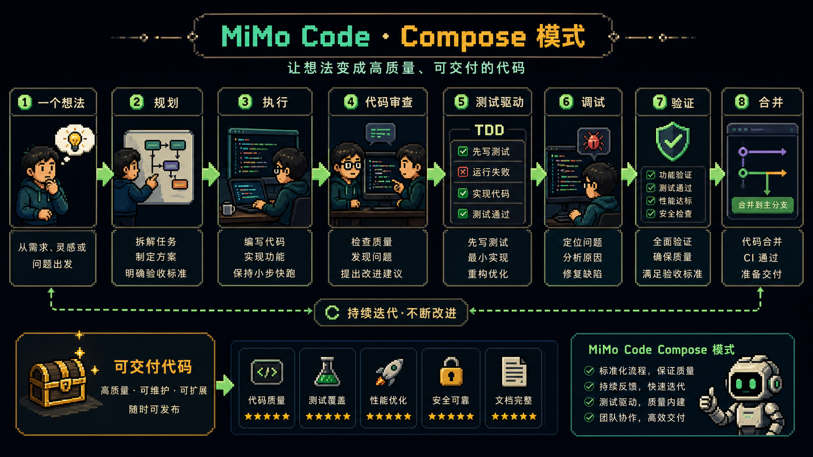
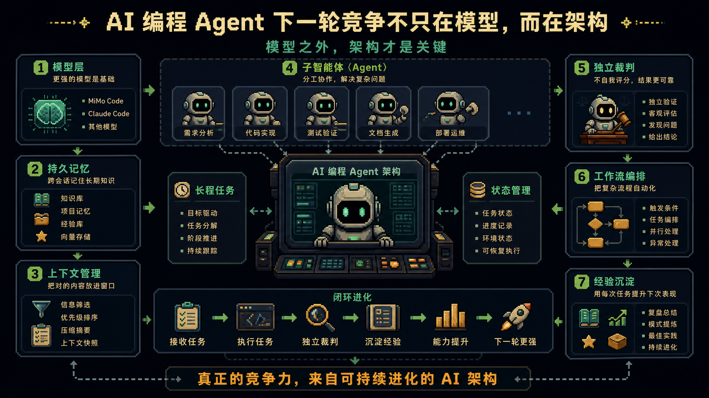

# 小米 MiMo Code 开源了：真正值得看的不是跑分，而是长程 Agent 架构

小米最近把 `MiMo Code` 推上了 GitHub。

这个项目热得很快。

官方仓库 [`XiaomiMiMo/MiMo-Code`](https://github.com/XiaomiMiMo/MiMo-Code) 当前已经是数千 stars，MIT 协议，README 里写得也很直接：它是一个基于 `OpenCode` 的 AI 编程助手，目标是解决长程软件开发任务里的上下文、记忆和执行问题。

所以这件事当然容易被写成一个很炸的标题：

小米开源。

Benchmark 很强。

Claude Code 被挑战。

国产 AI 编程 Agent 追上来了。

但如果只看这些热词，反而容易错过真正值得研究的地方。

我更关心的是：

**MiMo Code 打的不是“会不会写代码”这一层，而是长程 Agent 最容易崩的那几层：记忆、状态、子智能体、编排和自我沉淀。**

这才是它值得拆的地方。


---

## 1. MiMo Code 到底是什么

一句话说，`MiMo Code` 是小米 MiMo 团队做的终端原生 AI 编程 Agent。

项目地址：

[`https://github.com/XiaomiMiMo/MiMo-Code`](https://github.com/XiaomiMiMo/MiMo-Code)

安装以后，你可以在终端里使用 `mimo` 命令，让它读代码、写代码、跑命令、处理 Git、持续推进任务。

这听起来和 `Claude Code`、`Codex`、`OpenCode` 都有相似之处。

但它真正突出的地方，不是“我也能写代码”。

而是它明显把重点放在了一个更硬的问题上：

**Agent 干了几十轮、上百轮之后，怎么不越用越乱、越用越蠢。**

很多编程 Agent 短任务表现很好。

一旦任务变长，就开始出现几个老问题：

- 上下文越来越满
- 前面做过的决定被忘掉
- 中途状态丢失
- 任务到底完成没有说不清
- 子任务之间互相干扰
- 每次开新会话都要重新理解项目

MiMo Code 的设计，正是冲着这些问题来的。

---

## 2. 第一层关键能力：持久记忆

MiMo Code 最值得看的第一点，是它把记忆做成了项目级能力，而不是只靠当前上下文硬撑。

它的记忆不是一句“我会记住你”的产品话术，而是具体落到几类文件和机制里：

- `MEMORY.md`：记录项目背景、架构决策、验证过的事实
- `checkpoint.md`：结构化状态快照，由 writer subagent 自动维护
- `notes.md`：临时草稿区
- `tasks/progress.md`：逐任务进度日志

这件事很重要。

因为长程任务真正需要的不是“上下文越长越好”。

而是该留下来的状态被稳定留下来，该丢掉的噪音能及时丢掉。

MiMo Code 的思路更接近：

上下文快满了，就把当前工作状态写成 checkpoint。

再用一份干净的简报继续下一轮。

这比简单压缩对话更可靠。

因为它不是把所有东西揉成一团，而是在明确区分：

什么是项目事实。

什么是当前状态。

什么是临时草稿。

什么是任务进度。

这正是长程 Agent 最需要的记忆分层。


---

## 3. 第二层关键能力：子智能体和独立裁判

很多 Agent 到后期会犯一个很危险的错误：

它自己觉得任务完成了。

但实际上没完成。

这不是小问题。

因为长程任务里，Agent 如果既当选手又当裁判，就很容易提前收工。

MiMo Code 的设计里，子智能体系统和 judge model 就是为了解决这个问题。

主 Agent 不需要把所有脏活都揽在自己身上。

状态维护、上下文整理、后台执行、任务判断，可以交给更专门的子 Agent 或独立模型。

这里最关键的是：

**判断“这事到底做完没有”的，不应该是刚刚干活的那个 Agent。**

这和最近很多 coding agent 方向的共识是一致的。

maker 和 checker 要分开。

实现者和验证者要分开。

否则长程自动化越强，错误越容易在无人盯着的时候悄悄累积。

---

## 4. 第三层关键能力：Compose 模式

MiMo Code 里另一个值得关注的点是 `Compose`。

按照项目说明，它不是让 Agent 一路 YOLO 写到底，而是把一个想法放进更结构化的工作流里：

- 规划
- 执行
- 代码审查
- TDD
- 调试
- 验证
- 合并

这套流程的重点不是“步骤多”。

而是它承认软件开发不是一次生成。

真正的工程交付本来就是反复计划、执行、测试、审查、修复、合并。

如果一个 Agent 想从“能写代码”走向“能交付工程”，就必须把这些步骤显式编排起来。

这也是我觉得 MiMo Code 值得看的地方。

它不是只在模型输出上卷。

它在卷 Agent harness 和开发流程。



---

## 5. 第四层关键能力：dream 和 distill

`/dream` 和 `/distill` 是这套设计里最像“长期进化”的部分。

按照项目描述：

`/dream` 会扫描历史会话和记忆文件，做合并、去重、验证和压缩，把零散记忆收敛成当前状态。

`/distill` 则会发现你最近重复做的手动工作流，把它打包成可复用的 skill、subagent 或 command。

这件事如果跑得好，会带来一个很关键的变化：

Agent 不只是“完成当前任务”。

它还能从重复任务里提炼出下一次可以复用的流程。

这就是从任务执行到经验沉淀。

也是一个 Agent 能不能越用越顺手的分水岭。

过去很多 AI 工具的问题是：

你每次都在重新教它。

MiMo Code 想做的是：

你重复做过的事，它能慢慢沉淀成自己的技能和命令。

这才是“越用越懂项目”的真正含义。

---

## 6. 为什么它能快速吸引开发者

MiMo Code 这次能快速被关注，不只是因为小米这个名字。

它打中的都是开发者很具体的痛点：

- MIT 协议，改造和商用空间更大
- 一行安装，Mac / Linux 可直接 `curl`，Windows 可用 npm
- 支持 MiMo Auto、OAuth、自定义 OpenAI 兼容 Provider
- 可以从 Claude Code 导入已有认证
- 支持 DeepSeek、Kimi、GLM 等模型接入
- 终端原生，中文场景友好
- 记忆、checkpoint、subagent、compose 这些能力都围绕长程任务展开

它不是只讲“我模型强”。

而是从安装、迁移、模型接入、使用门槛、长程任务体验几个层面一起打。

这对开发者很有吸引力。

因为大家真正痛的从来不是“我缺一个能写代码的模型”。

而是：

能不能装得上。

能不能接现有模型。

能不能迁移旧习惯。

能不能长任务不崩。

能不能真的跑进日常工作流。

---

## 7. 真比 Claude Code 强吗

这个问题要谨慎回答。

原文里提到官方 benchmark 显示 `MiMo Code + MiMo-V2.5-Pro` 在部分测试上优于 `Claude Code + Claude Sonnet 4.6`。

这类结果值得关注，但不应该直接等同于“全面更强”。

原因很简单：

Benchmark 衡量的是特定任务、特定环境、特定设置下的能力。

真实工程体验，还要看：

- 复杂项目里是否稳定
- 长会话是否真能保持质量
- 记忆机制是否可靠
- 子智能体调度是否可控
- 代码质量是否经得住 review
- 成本和速度是否能接受

所以更稳的判断是：

MiMo Code 不是已经“终结 Claude Code”。

而是它把一个非常关键的问题摆到台面上：

**AI 编程 Agent 的下一轮竞争，不只在模型本身，而在长程任务架构。**

谁能更好地管理记忆、状态、验证、编排和经验沉淀，谁就更有机会在真实工程场景里赢。



---

## 项目链接和安装方式

项目地址：

[`XiaomiMiMo/MiMo-Code`](https://github.com/XiaomiMiMo/MiMo-Code)

Mac / Linux：

```bash
curl -fsSL https://mimo.xiaomi.com/install | bash
```

Windows：

```bash
npm install -g @mimo-ai/cli
```

启动：

```bash
mimo
```

首次启动后，可以选择 MiMo Auto、小米 MiMo 平台登录、从 Claude Code 导入，或自定义 OpenAI 兼容 Provider。

---

## 最后

MiMo Code 值得关注，不是因为它能写一个很炸的标题。

而是因为它把 coding agent 真正难的部分都摆出来了：

持久记忆。

checkpoint。

子智能体。

独立裁判。

Compose 编排。

dream / distill 自我沉淀。

这些不是皮肤功能。

它们是长程 Agent 能不能稳定工作的底层结构。

所以我更愿意把 MiMo Code 看成一个信号：

国产开源 AI 编程 Agent，已经开始从“能不能写代码”，打到“能不能管理长程任务”这一层。

这才是值得 Claude Code、Codex 和整个 Agent 生态认真看的地方。

---

原文来源：本地粘贴文本整理；项目链接：[`XiaomiMiMo/MiMo-Code`](https://github.com/XiaomiMiMo/MiMo-Code)
