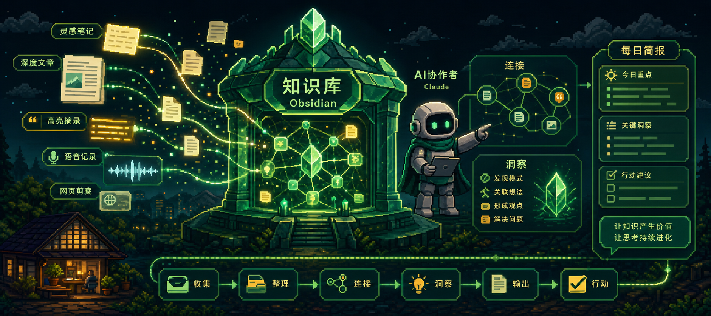
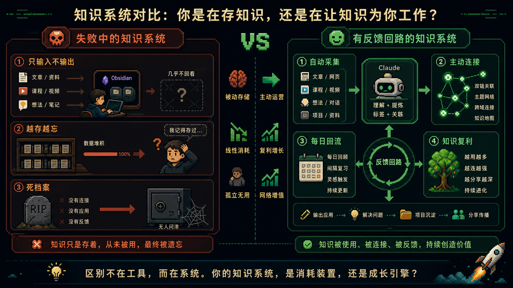
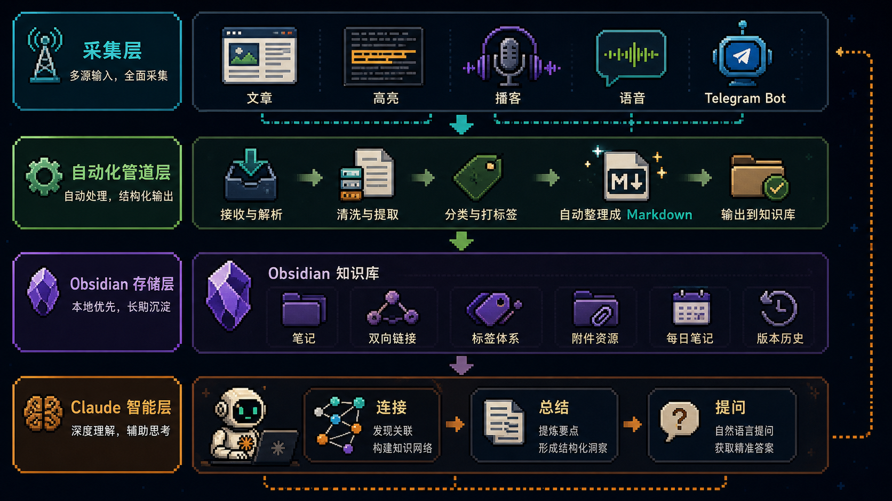
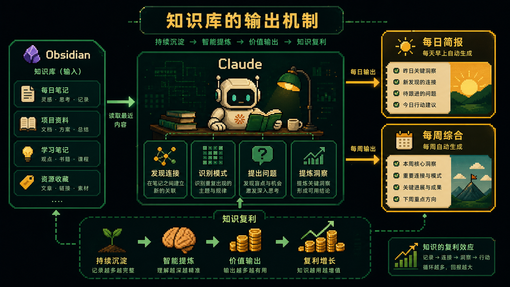

# 让 Obsidian 知识库每天自己变聪明，而不是越存越死

很多人把 Obsidian 用成了一个很漂亮的文件柜。

文章存进去。

推文存进去。

语音笔记存进去。

剪藏越来越多，结构越来越整齐，看起来很有“第二大脑”的味道。

但半年后再回头看，问题也很明显：

你确实保存了很多信息。

可这些信息没有反过来参与过你的思考。

它们只是被你存起来了。

这就是大多数知识系统最后会死掉的原因。

不是输入不够多。

而是没有反馈回路。

真正有用的知识库，不应该只是一个你不断往里塞东西的仓库。

它应该像一个每天都会把洞察推回给你的思考伙伴。

---

## 为什么大多数知识系统最后会失败

很多“第二大脑”方案，一开始都很迷人。

你会认真设计文件夹。

会设置标签。

会写模板。

会把捕获流程做得非常完整。

但最后真正崩掉的地方，通常都一样。

第一，是采集摩擦太大。

如果你每保存一条内容，都要手动复制、粘贴、命名、分类、打标签、写摘要，那这个系统很快就会在真实工作压力下失效。

第二，是没有连接层。

很多人的知识库只是孤立笔记的集合。

三月保存的一篇文章，和今天正在做的项目完全没有被系统自动联系起来。

没有谁来告诉你：你今天卡住的问题，其实和你两个月前读过的那段内容直接相关。

第三，是没有回流机制。

知识只会进入，不会回来。

你只能在有明确搜索目标时才会打开知识库。

这就意味着它不是思考伙伴，只是一个稍微高级一点的书签系统。

所以问题不在于“存了多少”。

而在于系统有没有能力：

- 自动接收输入
- 自动建立连接
- 自动把洞察推回给你

如果这三件事做不到，知识库再大，也只是一个整理得很好的遗忘仓库。

---

## 一套真正能长期运转的架构，只有四层

这篇方案最有价值的地方，是把整个系统拆成了非常清晰的四层。

第一层是采集层。

负责把你读到的、听到的、想到的内容尽量无摩擦地抓进系统。

第二层是自动化管道。

负责把不同来源的内容自动转成结构化 Markdown，落进你的 Obsidian 知识库。

第三层是 Obsidian 本身。

它不是智能层，而是长期存储层，是所有知识的事实底座。

第四层才是 Claude。

它不是帮你“保存信息”的，而是帮你阅读整个知识库、发现连接、识别模式、生成简报、提出问题的。

这四层一旦分清楚，系统就很稳。

采集层只负责进。

自动化层只负责流转。

Obsidian 只负责存。

Claude 只负责理解和输出。

很多系统做不起来，就是因为这几层混在一起了。

---

## 先解决输入：让采集变成零摩擦

知识系统的第一原则，不是分类漂亮，而是输入不能费劲。

只要采集动作复杂，习惯就一定会断。

所以这里的思路非常直接：

文章和高亮交给 Readwise。

播客片段交给 Airr。

语音和长音频交给 Whisper。

手机端的临时想法、问题、摘录交给 Telegram Bot。

所有这些东西都不要在采集当下要求你分类、总结、打标签。

你只负责抓。

系统负责收。

这是个非常重要的判断。

因为大多数人高估了自己在“记录当下”还能顺便做整理的能力。

现实里，人一忙，就只会保留最短路径。

所以采集层最好的设计，不是“最完整”，而是“最不打扰你”。

---

## 文件夹不要复杂，五个就够

这套方案里还有一个判断也很对：

Obsidian 的文件夹结构不要过度设计。

五个就够：

- `Inbox`
- `Notes`
- `Ideas`
- `Projects`
- 根目录下的 `CLAUDE.md`

`Inbox` 用来接一切新进入系统、还没进一步处理的内容。

`Notes` 放处理后的文章、高亮、播客片段。

`Ideas` 放你自己的想法、观察、语音转写。

`Projects` 放你正在推进的项目。

`CLAUDE.md` 则不是普通笔记，而是整个知识库的指令层。

为什么要这么简单？

因为复杂结构的代价很高。

当你开始反复犹豫“这条内容到底该放哪个文件夹”时，采集摩擦就已经上来了。

结构越花哨，系统越容易在后期崩掉。

所以这里真正值得抄的不是某个具体命名，而是那个原则：

**先让系统能跑，再让结构慢慢从真实使用中长出来。**

---

## CLAUDE.md 才是让知识库活起来的关键文件

如果说整个系统里只能挑一个最关键的文件，那一定是 `CLAUDE.md`。

因为它决定 Claude 进入知识库时，是不是带着你的真实上下文来理解一切。

没有这个文件，Claude 每次都像第一次见你。

有了这个文件，它更像一个已经跟着你工作了几个月的协作者。

这个文件里至少要写清楚几件事：

- 你是谁
- 你现在具体在做什么
- 你今年最重要的目标是什么
- 当前在推进哪些项目
- 卡在哪里
- 下一步里程碑是什么
- 你希望 Claude 怎么帮助你

这里最重要的不是写得多，而是写得真。

泛泛地写“我想变得更高效”，对 Claude 没有什么帮助。

但如果你写清楚“我正在做一个 AI 内容工作流系统，当前卡在自动发布和长期记忆层”，Claude 给你的反馈就会完全不一样。

所以 `CLAUDE.md` 本质上不是配置文件。

它是你和知识库之间的对齐文件。

---

## 真正让知识开始复利的，是每日简报和每周综合

大多数知识库失败，还有一个根本原因：

它们只设计了输入，没有设计输出。

而这套系统最重要的突破，就是把输出做成自动回流。

第一层输出是每日简报。

每天早上，在你打开任何应用之前，系统已经读完最近 24 小时的输入和最近 7 天的笔记，然后给你三样东西：

- 最近最值得注意的连接
- 这一周你思考里正在形成的模式
- 今天最值得坐下来想一想的那个问题

这不是任务清单。

这是思考提示。

第二层输出是每周综合。

它不是简单总结，而是要逼你面对更深的东西：

- 你正在形成什么还没说出口的核心观点
- 最近保存的内容里，哪些在打脸你过去的信念
- 你现在的输入里，缺了什么视角
- 这周唯一最值得投入的动作是什么

这一步，才是知识开始真正复利的地方。

因为连接不是终点。

形成观点、修正判断、发现盲区、指导行动，才是知识库存在的意义。

---

## 这套系统真正强的，不是存得多，而是越来越懂你

这类系统一开始看起来只是更方便。

一个月后，你会觉得它像一个好用工具。

三个月后，它开始能把你早期保存的内容和最近遇到的问题联系起来。

六个月后，它会变成另一种东西。

它不只是记得你存过什么。

它开始记得你的问题是怎么变的，观点是怎么改的，哪些主题在反复出现，哪些看似无关的输入正在慢慢汇成同一个方向。

这就是知识复利真正发生的方式。

不是你存得越来越多。

而是系统对你的思考轨迹越来越熟。

从这个角度看，所谓“第二大脑”的核心并不是存储。

而是反馈。

只有当信息进入以后，还能被重新组织、重新解释、重新推回给你，它才真正变成思考系统。

---

## 怎么开始最现实

最现实的起步方式，不是今天就把整套系统全部搭完。

而是先做一个最小闭环。

先放 5 条笔记进 Obsidian。

可以是 5 篇你一直在想的文章，5 个反复出现的问题，或者 5 条最近产生的想法。

然后让 Claude 去找它们之间的连接。

只要它找到一次你没看到的关联，这个系统就不再是一个概念了。

它会开始对你有真实价值。

之后你再去加自动采集、Telegram Bot、每日简报、每周综合，一切都会顺很多。

因为你已经先看到了回报。

---

原文来源：[@cyrilXBT](https://x.com/cyrilXBT/status/2052235121416188114)
