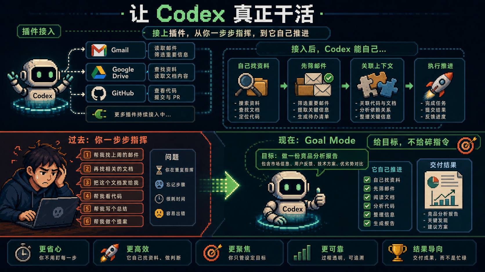
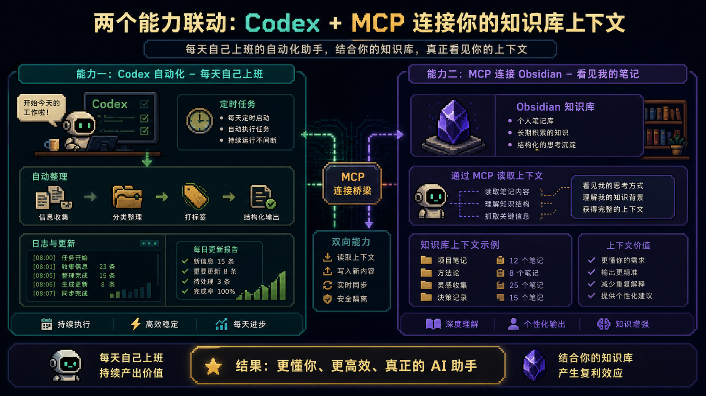
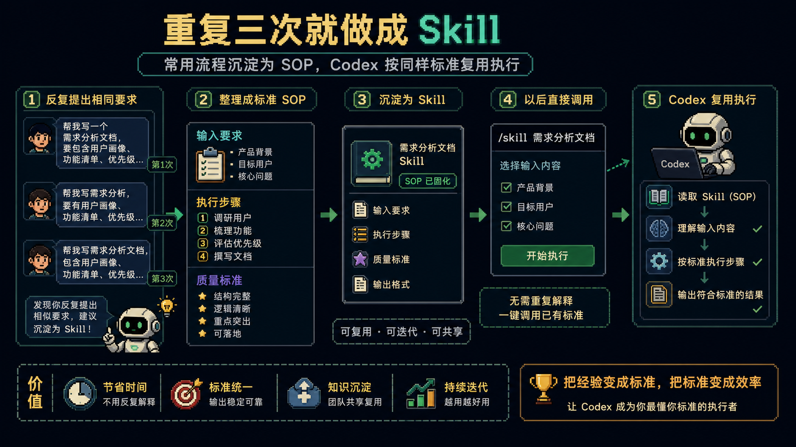

# 别再伺候 AI 了：5 个方法把 Codex 真正用成助手

很多人开始用 `Codex` 以后，表面上是在用 AI 提效，实际体验却很像另一回事。

资料还是自己复制。

背景还是自己补充。

需求还是自己一遍遍解释。

任务做着做着，最后的感觉不是“AI 在替我省时间”，而是“我在陪 AI 加班”。

这很正常。

因为大多数人刚开始用 Codex 的时候，本质上还是把它当成一个更聪明的聊天框。

你说一句，它走一步。

你盯着它，它才能继续。

这种模式当然也有用。

但它远远不是 Codex 最有效的用法。

真正让 Codex 开始像助手，而不是像一个需要被照顾的实习生，关键不在于你写了多神的 prompt。

而在于你有没有把那些**重复解释、重复搬运、重复检查、重复触发**的环节，慢慢交给它自己跑。

这篇文章就把这个思路拆成 5 个最实用的入口。

你不需要一次全配完。

先跑通一个，就能明显感觉到区别。

---

## 1. 插件：先让 Codex 不只是“会说”，而是“能动手”

没有插件的 Codex，更多像一个会回答你的 AI。

接上插件以后，它才开始像一个能进系统里帮你干活的助手。

这一步非常关键。

因为很多人的低效，根本不是因为不会问问题，而是因为每次都在做重复搬运。

邮件内容自己贴。

Drive 文件自己找。

GitHub 链接自己翻。

资料整理好，再一股脑喂给 AI。

这种方式表面上用了 Codex，实际上还是你自己在做信息中转站。

插件真正解决的，是“手脚”问题。

比如 Gmail。

以前你处理邮件，要自己扫标题、点进去看、判断轻重缓急、决定要不要回复、再想怎么回。

接上 Gmail 插件以后，Codex 可以先做第一轮脏活：

- 哪些邮件紧急
- 哪些只是通知
- 哪些需要你回复
- 哪些可以先起草答复

你最后只需要审一眼，而不是从零开始处理。

所以这一步的本质不是“多装一个插件”。

而是让 Codex 开始真正接触你工作的真实环境。

Gmail、Google Drive、GitHub、Slack、Figma、Notion，这些一旦接起来，Codex 才不再只是一个会说话的 AI，而是一个能进工具里替你动手的助手。

---

## 2. Goal Mode：不要一句一句牵着它走

很多人用 Codex 时最累的地方，不是任务难，而是自己一直处在微操状态。

“先看这个文件。”

“这里改一下。”

“不对，再来一次。”

“继续。”

这套流程的问题不在于它没用，而在于它会把你自己锁死在过程里。

你每一步都得盯着。

只要一分神，整个协作节奏就断了。

Goal Mode 更像是另一种协作关系。

你不是给它一串零碎动作。

你是直接给它终点、范围和成功标准。

比如不是说：

“帮我看看这篇格式哪里不对。”

而是说：

“把这篇论文改到目标期刊格式，成功标准是标题、摘要、引用、图表编号和参考文献全部符合要求，最后给我修改总结。”

这两种说法看起来差别不大，实际差很多。

前者是你牵着它走。

后者是你把目标交给它，让它自己找路径。

如果你想让 Codex 真正替你承担任务，而不是只承担动作，就必须学会从“发指令”切到“定目标”。

---

## 3. 自动化：真正省时间的，是你不叫它，它也会来

很多人对效率的理解还停留在：

“我叫它，它很快。”

但更值钱的效率其实是：

**“我不叫它，它也会按时出现。”**

这就是 Automations 的意义。

别一上来就想让它“自动帮我赚钱”或者“自动运营全部账号”。

这种任务太虚，很难稳定。

真正适合自动化的，是那些具体、重复、可验证的小流程。

比如：

- 每天早上整理新增错误日志
- 每天汇总 AI / MCP / Codex 相关更新
- 每周拉一次项目状态摘要
- 定时整理某个文件夹里的新资料

这类任务的共同点是：

- 重复
- 稳定
- 可复查
- 你亲自做并不难，但很烦

也正因为如此，它们最适合被 Codex 接手。

自动化真正带来的，不只是省下几分钟，而是把一些本来会占用你注意力的动作，从“我要记得去做”，变成“系统自然会做”。

这一步一旦跑通，你会开始明显感觉到：

Codex 不再只是一个被召唤的工具，而像一个会定时上班的助手。

---

## 4. MCP + Obsidian：互联网给它外部信息，知识库给它你的上下文

很多人抱怨 AI 不懂自己。

但如果你把自己的素材、复盘、笔记、项目背景全放在 Obsidian 里，又没有让 Codex 看到，那它当然只能泛泛而谈。

互联网给 Codex 的是公共信息。

Obsidian 给 Codex 的，才是你的私人上下文。

这两者完全不是一回事。

MCP 的价值，就在于把这层个人上下文正式接进来。

一旦 Codex 可以通过 MCP 读你的知识库，它就不再只是根据“当前这一次聊天”来回答问题。

它开始能带着你的长期积累来理解任务。

比如：

- 你过去写过什么
- 哪些主题你在长期关注
- 某个项目的前因后果是什么
- 你自己的表达风格和判断标准是什么

这一步打通的不是一个新工具。

而是你过去所有沉淀过的内容，终于能被 Codex 正式看见。

这会直接改变它输出的质量。

因为它不再只会“泛化地回答一个问题”，而是开始“结合你的上下文帮你推进一个问题”。

---

## 5. Skills：把重复说过三遍的话，沉淀下来

如果一个流程你已经重复说了三次，就该把它变成 Skill。

这几乎是所有 AI 工作流成熟以后都会走到的一步。

插件解决的是“去哪里拿资料”。

Goal Mode 解决的是“给它什么终点”。

自动化解决的是“什么时候自动执行”。

MCP 解决的是“它能看到哪些上下文”。

而 Skills 解决的是：

**“它以后要按什么方式做这件事。”**

比如你经常让 Codex 写一种固定风格的长文。

那就没必要每次都重新说：

- 开头先讲痛点
- 语言不要有 AI 味
- 每个方法都要举例
- 结尾要有行动建议

这些都应该沉淀成 Skill。

一旦变成 Skill，Codex 以后不是“记得你这次说了什么”。

而是“拥有了一套能复用的做事方法”。

这一步非常重要。

因为真正拉开效率差距的，从来不是某一次 prompt。

而是你有没有把一次次成功的方法，留下来，复用起来。

---

## 最后：别追求一次配齐，先让一个环节不再重复

如果你现在用 Codex 还觉得累，这不说明你不会用 AI。

更多时候，只是你还停留在“每次都重新解释一遍”的阶段。

而人最容易被消耗掉的，恰恰就是这些重复解释、重复搬运、重复触发的小动作。

所以最现实的做法，不是今天就把插件、Goal Mode、自动化、MCP、Skills 全部配齐。

而是先挑一个最痛的重复动作，把它打穿。

比如：

- 先装一个 Gmail 插件，让它帮你做邮件初筛
- 先做一个每天自动整理信息的自动化
- 先把你最常写的一类任务做成 Skill

只要你先跑通一个最小闭环，就会明显感觉到：

Codex 不再只是“回答你”，而是开始真的替你分担一小段流程。

当这些小段流程慢慢连起来，它才会越来越像一个熟悉你工作方式的助手。

这时候，你省下来的不只是时间。

更是那些本来会被重复沟通一点点蚕食掉的注意力。

---

原文来源：[@369Serena](https://x.com/369Serena/status/2060330862223515816)
