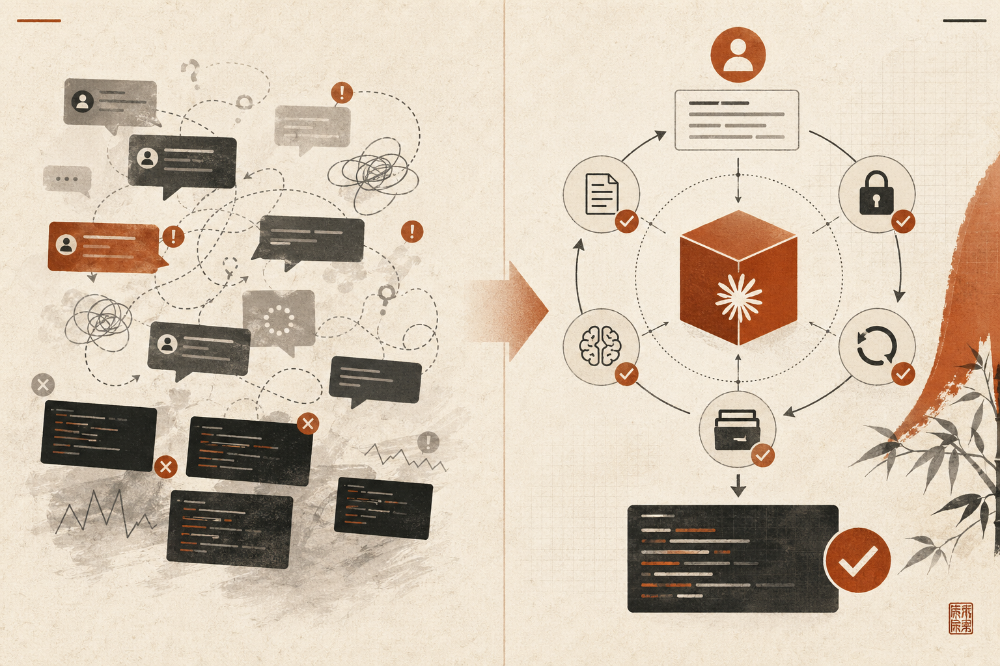
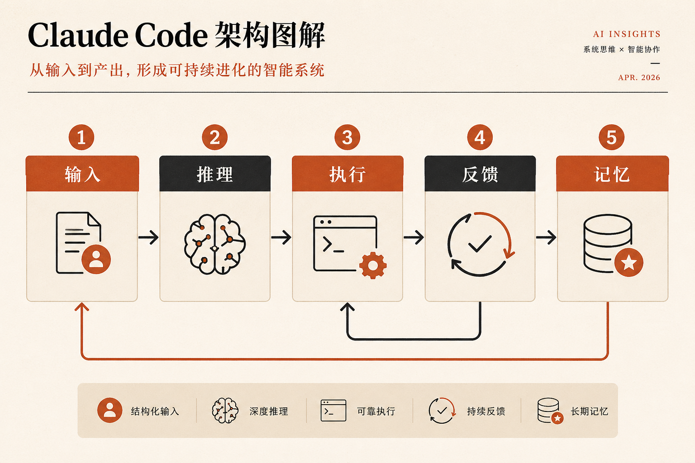
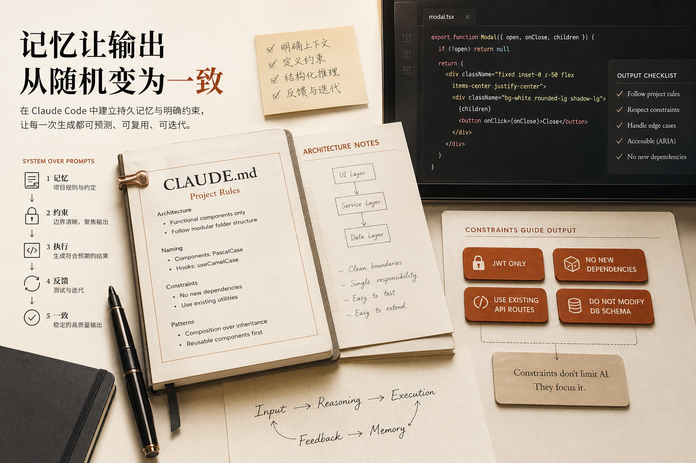

很多人以为，自己已经在认真使用 Claude Code 了。

每天都在提需求，每天都在改 Prompt，每天都在重试。

结果忽好忽坏，于是又开始研究：是不是提示词不够完整？是不是措辞不够精准？是不是顺序写错了？

但问题往往不在 Prompt 本身。

真正的问题是：**你可能一直在把 Claude Code 当成一个聊天框，而不是一个可以被编排进工作流的系统。**

这两种用法，看起来都像"在让 AI 干活"，但结果完全不是一个量级。

前一种，靠运气。后一种，靠系统。

而真正能把 Claude Code 用出稳定产出的人，几乎都会走到第二种。

## Prompt 本身，不会给你稳定结果

**单条 Prompt 再精彩，也只是在争取一次更好的输出。**

它能帮你提高命中率，但不能天然带来稳定性。

这就是为什么很多人会有一种熟悉的体验：今天很惊艳，明天又翻车。明明是类似任务，表现却像两个人。

因为你每次面对的，都是一轮新的"现场发挥"。它当然可能写得很好，但也完全可能漏掉边界、走偏方向、误解约束，或者在你没注意到的地方埋下隐患。

这不是模型"突然不行"，而是你还在用一种临场试运气的方式做工程。

## 真正该升级的，不是 Prompt，而是工作方式

很多人觉得，想把 Claude Code 用得更好，下一步应该是学更多 Prompt 模板、研究更复杂的句式、找到更"万能"的说法。

但更关键的一步，其实不是继续优化语言，而是开始设计系统。

也就是说，你要从"我这次该怎么问"，切换成"我该怎么让这类任务稳定发生"。

这两者之间的差别非常大。前者还是在优化一次输出，后者是在搭建一个能持续复用的环境。

真正有效的思路，不是让 Claude 每次都临场理解一切，而是提前为它准备好：

- 任务上下文
- 项目规则
- 明确约束
- 思考步骤
- 测试反馈
- 长期记忆

当这些东西都被组织起来之后，Claude 才开始真正像一个系统里的执行节点，而不是一个"你每次都要重新教一遍"的助手。

## 真正有用的 Claude Code 工作流，至少有 5 层

如果把这件事讲得更具体一点，一套成熟的 Claude Code 工作流，至少应该包含下面这 5 层：

**输入、推理、执行、反馈、记忆。**

这 5 层缺一不可。因为只要少一层，你的结果就会重新滑回随机。

下面按这 5 层来讲。

## 1. 输入层：不要再给"裸任务"

很多人给 Claude 的输入，其实就是一句话：写一个登录系统、帮我做一个弹窗组件、重构这段代码。

这种输入并不是不能用，但问题是：**你把最关键的信息，全都留给它猜了。**

比如它不知道当前项目是什么栈、目录结构长什么样、你允许它做多大改动、有没有不能碰的依赖、输出该按什么格式给你。

于是 Claude 只能边猜边做。而当 AI 在猜你真实想法时，输出自然就会变得不稳定。

更成熟的做法，是把输入变成结构化信息。至少要把下面几件事说清楚：

- 任务是什么
- 当前环境是什么
- 约束是什么
- 希望它按什么步骤思考
- 最终按什么格式输出

一旦你开始这样组织输入，你其实已经不再是在"写 Prompt"，而是在"设计任务入口"。

## 2. 推理层：不要让它一上来就写代码

Claude Code 很擅长写代码，这点没问题。但问题是，很多人太急着让它动手了。一上来就要实现，往往会产生两个后果：它还没想清楚就开始写，你后面只能通过 debug 来替它补思考。

真正更稳的方式，是先强制它把推理过程走完。比如让它先做这些事：

1. 先拆问题
2. 再列边界情况
3. 再比较几种可能方案
4. 最后才进入实现

这看起来只是多了几步，但对结果影响非常大。

因为工程问题最贵的，从来不是"少写了一行代码"，而是"在错误方向上写了一堆代码"。如果你不提前约束思考顺序，最后就只能在产物上补课。

## 3. 执行层：Claude 可以生成，但不能裸信任

很多人用 Claude Code 时，默认把它产出的东西当"接近完成品"。这是最危险的一步。

Claude 确实可以生成代码、重构逻辑、补测试，甚至把一整段功能写得很完整。但工程上真正稳健的做法，不是"它会写，所以我就信"，而是：

**它负责生成，但必须运行在你设计好的执行层里。**

什么意思？就是它的输出不能直接等于最终结果，而应该被放进一个可控环境里：有统一的调用方式、有明确的输出格式、有后续检查与回流机制。

只有这样，Claude 才不是在"随机吐内容"，而是在一个你可控的执行链条中工作。

## 4. 反馈层：让失败自动回流，而不是人肉返工

这是最容易把 Claude Code 从"看起来很厉害"变成"真的很有用"的关键一步。

很多人现在的工作方式还是：Claude 写完，自己跑一下，发现不对，自己修，或者再粘回去问一次。

这个流程的问题在于，人始终在当中间齿轮。

而系统化的做法，是让失败自动进入回流。比如：跑测试、抓错误日志、把错误反馈给 Claude、让它只修必要部分、再重新验证。

当这个闭环开始跑起来时，你得到的就不再是"一次回答"，而是一种持续收敛的能力。

这也是为什么很多人第一次把测试循环接进 Claude Code 后，会明显感觉它突然"靠谱"了很多。因为从那一刻开始，它不再只是会写，而是开始会在失败中继续推进。

## 5. 记忆层：不重复交代，才可能有一致性

如果你每次都要重新告诉 Claude：项目架构怎么走、命名规范是什么、哪些依赖不能碰、哪些模式优先用……

那你其实还在做一件很低效的事情：**把同一套规则，一轮一轮重新灌进去。**

这不只是麻烦，更会直接拉低输出一致性。因为你说得再完整，也很难保证每次都一样。

真正成熟的方式，是把长期规则沉淀成项目记忆。比如放在 `CLAUDE.md` 这类项目级文档里，让它作为长期上下文的一部分存在。

这样做最大的价值，不是"让 AI 记住更多东西"，而是：**让它少随机一点。**

很多人以为记忆的作用是"让 AI 更聪明"，但工程里更重要的往往不是更聪明，而是更一致。

一致，才有办法复用。复用，才有办法放大。

## 约束层：不是限制它，而是让它聚焦

很多人一提到约束，就担心会不会"限制 AI 发挥"。

但工程里恰恰相反。约束不清，结果才会发散。

比如你让它做一个认证系统，如果没有边界，它可能会：推荐新的依赖、改数据库结构、重写现有路由、引入你根本不想要的方案。

这些并不是它故意乱来，而是因为你没有把"可行动空间"定义清楚。

一旦你明确说：只能用 JWT、不许新增依赖、不改数据库结构、只能复用现有 API……它的输出空间就会立刻变窄，但结果反而更精准。

所以约束真正的作用，不是压缩能力，而是提高命中率。

## 真正厉害的人，不是在优化措辞，而是在搭系统

普通人还在做的，通常是：写 Prompt、改 wording、追求一次更好的回答。

而真正把 Claude Code 用成杠杆的人，做的是另一件事：设计任务输入、固定思考结构、建测试闭环、沉淀项目记忆、用约束稳定结果。

也就是说，他们不再把 Claude 当成"更强的问答工具"，而是开始把它当成一个可编排的智能系统组件。

这两种人表面都在用同一个工具，但长期结果完全不一样。前者会觉得 Claude 有时神、有时玄，后者会越来越稳定地把它接进自己的工作流。

## 最后总结

如果你今天只记住一句话，我希望是这句：

**Prompt 只能帮你争取一次好结果，系统才能让好结果变成默认结果。**

所以，真正应该升级的，不是你的提示词修辞，而是下面这些能力：

- 会不会组织上下文
- 会不会定义约束
- 会不会固定推理顺序
- 会不会把测试接成反馈循环
- 会不会用项目记忆减少随机性

当你开始这么用 Claude Code，你就不再是在"请求 AI 帮忙写点东西"，而是在设计一套环境，让高质量代码、稳定输出和持续迭代，变得越来越必然。

这时候，Claude Code 才真正开始从"工具"变成"杠杆"。
