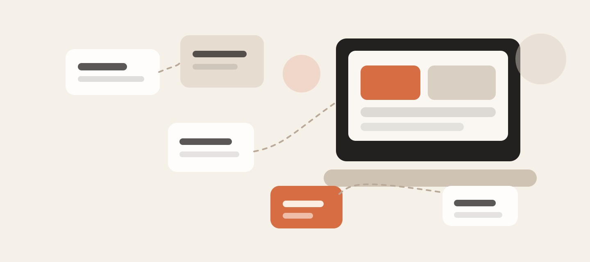
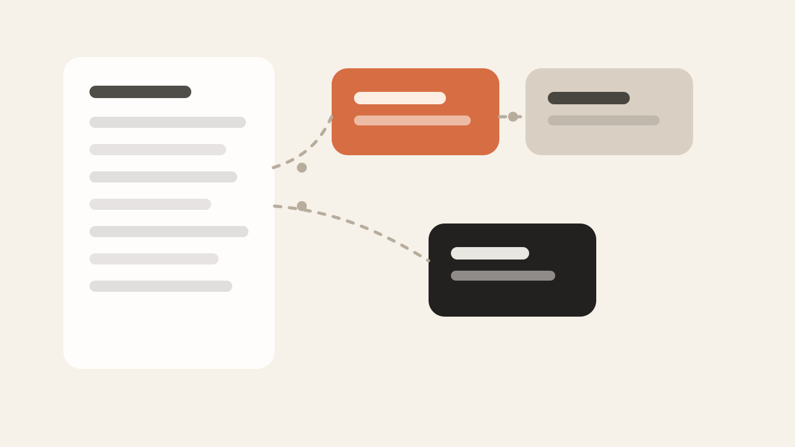
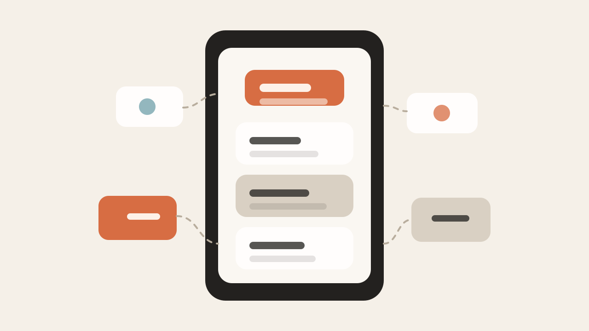
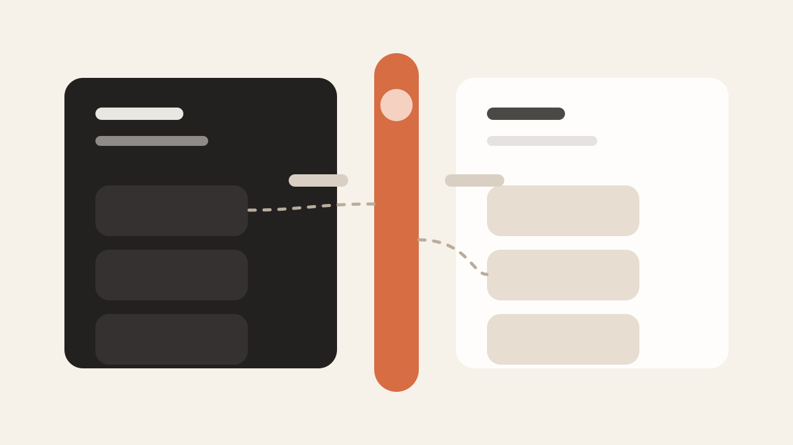

很多人第一次装上一个 AI Agent，都会经历同一个阶段：

兴奋地打开。
看一圈界面。
脑子里冒出一句话：

**“所以……我到底该拿它做什么？”**

我对 `Hermes Agent` 的感觉，最开始也是这样。

那段时间，时间线上全是多智能体、`Mac Mini`、各种本地部署和新工具的讨论。看得人很热闹，但真轮到自己上手时，反而容易卡住：

- 不是不会装
- 不是不会配
- 而是不知道“它到底该替我做哪类事”

这个问题如果想不清楚，Agent 很容易沦为一个看起来很强、实际上很少打开的工具。

所以这篇文章，我不想讨论哪家模型最强，也不想讨论要不要先买硬件。

我更想讲另一件更关键的事：

**普通人到底该怎么找到，属于自己的 Agent 用法。**

## 真正的起点，不是技术，而是你每天在重复什么

很多人一上来就会先问：

- 我要跑哪个模型
- 用本地还是 API
- 要不要上多 Agent
- 要不要配 `Telegram`、`TUI`、自动化链路

这些问题当然都重要。

但如果你还没想清楚“它应该帮你做什么”，那这些都只是更复杂的前置准备。

对我来说，真正开始把 Hermes 用起来，是从一个很简单的方法开始的：

**把自己一天做的事写下来。**

不是写理想中的工作流。
而是写真实发生的事。

比如：

- 哪些事情很耗时间
- 哪些事情你必须做，但并不产生太高价值
- 哪些事情你已经做过很多次，流程很熟
- 哪些事情你总在重复确认、重复整理、重复推进

写完一天还不够。

最好持续记几天，甚至一周。

因为很多真正值得交给 Agent 的事情，不一定是“最难的事”，而往往是：

**那些不难，但反复出现，还会不断打断你的事。**

## 另一个更容易被忽略的入口：生活里的摩擦点

还有一类很适合 Agent 的事，很多技术用户反而最容易忽略。

不是工作。
不是写代码。
而是生活里的那些“软问题”。

比如：

- 总忘记喝水
- 总忘记起身活动
- 坐久了姿势越来越差
- 每天都要为一些重复的小决定消耗精力
- 明明不是难事，但总会拖着不做

这些问题不酷。
也不适合发炫技截图。

但它们很真实。

而且它们往往比“Agent 帮我完成一个复杂任务”更容易立刻带来改变。

所以如果你不知道该从哪里开始，不妨先问自己两个问题：

1. 我每天最重复的动作是什么？
2. 我生活里最稳定出现的摩擦点是什么？

很多适合 Agent 的场景，就藏在这两个问题里。

## 我现在怎么用 Hermes Agent：4 个最常用的方向

真正把思路打开之后，Agent 的用途其实会慢慢清晰起来。

我现在给自己配了一组不同角色的 Agent。重点不在“数量”，而在于它们各自解决的是不同类型的问题。

## 1. 技术研究 Agent：帮我先把信息跑一遍

这一类 Agent，我最常拿来做研究型任务。

比如：

- 一个技术方向的 research brief
- 带引用的资料整理
- 某个概念的学习路径
- 某个问题相关的论文、原始材料和背景梳理

这里我最看重的一点是：

**一定要有引用。**

因为我不是想让 Agent 替我形成结论。
而是让它先帮我完成资料收集、方向定位和初步整理。

比如学模型量化这类事，我不需要它替我做完整个过程，但我很愿意让它先把相关论文、资料和主流方法帮我串起来，再自己去验证和动手。

也就是说，这类 Agent 更像：

**研究助理，而不是替身。**

## 2. 技术执行 Agent：把“知道怎么做”变成“有人先帮你做掉一部分”

如果说研究 Agent 负责帮我看方向，那执行 Agent 就负责真正推进任务。

我会用它做这些事：

- 写或改 Hermes 的 skill
- 调整 `TUI`
- 做一些具体的工程性任务
- 帮我把一个已经知道目标的任务先跑起来

这类 Agent 的价值，不在于它比你更懂。

而在于它可以先把很多体力活、整理活、搭骨架的活干掉，让你直接进入判断和修正阶段。

我现在基本把技术类 Agent 分成两种：

- 一个偏研究
- 一个偏执行

这样分开之后，反而比“所有事都丢给同一个 Agent”更清楚。

## 3. 生活提醒 Agent：最不性感，但最立刻见效

这个可能最容易被人吐槽。

我有一个 Agent，会定时提醒我喝水。

是的，听起来很荒谬。

但坦白说，非常有用。

而且很可能还会继续扩展，比如提醒我：

- 检查坐姿
- 起来活动
- 别连续坐太久
- 做一些最基础但总会忘的身体管理

这类 Agent 的有趣之处在于：

它不需要很聪明。
也不需要很强的推理。
它只要稳定、低成本、够顺手，就已经很有价值。

这也是很多人一开始低估 Agent 的地方：

**不是所有高价值场景都需要“最强模型”。**

有些场景，便宜、稳定、够用，反而就是最优解。

## 4. 生活 / 研究混合 Agent：处理长期问题，比处理单次任务更有价值

还有一类我自己很重视的 Agent，是围绕长期生活问题展开的。

比如健康相关的研究、饮食相关的信息整理，或者每天做饭时的低负荷辅助。

有些日常问题并不复杂，但会长期反复出现：

- 今天吃什么
- 手头这些食材能做什么
- 某类健康议题最近有没有新研究
- 某个长期问题有哪些值得跟进的信息

这类 Agent 的价值，不在于“惊艳”。

而在于它真的能融进日常。

很多时候，你不需要它替你做重大决策。
你只需要它让日常决策少一点摩擦。

而这恰恰是 Agent 最容易被做出真实价值的地方。

## 一个很重要的原则：只自动化你本来就懂的事

我自己有一个很明确的使用原则：

**AI 是助理，不是替代思考的人。**

我不会把判断直接交给它。
我更愿意把它当成：

- 帮我先探路
- 帮我先整理
- 帮我先跑体力活
- 帮我把重复劳动压缩掉

然后我自己再验证，再推进。

对于自动化任务，我尤其倾向于只让 AI 自动执行那些：

**我本来就知道怎么做、也知道怎么检查结果的事。**

这条边界非常重要。

因为一旦超出这个边界，Agent 就容易从“省力工具”变成“风险放大器”。

## 模型和成本怎么选？先别追求完美，先追求可持续

很多人一想到 Agent，就会直接联想到高额 API 账单。

这也是我自己一直很警惕的事。

我非常不想把个人 Agent 系统做成一个“每天几十上百美元”才能跑起来的玩具。

所以我一直在做一件事：

**尽量便宜地把它跑起来。**

这里面的关键，不是找到一个万能模型。
而是学会把不同任务分配给不同成本结构的模型。

一个很现实的思路是：

- 低风险、提醒类任务，用便宜甚至免费的模型
- 研究类任务，优先选择引用能力和稳定性更好的模型
- 执行类任务，用你最信得过、最省心的那一个
- 能本地跑的，尽量尝试本地跑

这背后的思路其实很简单：

**不是所有任务都配得上最高成本。**

很多人用不好 Agent，不是因为不会配，而是因为默认“所有任务都该交给最强模型”。

这往往既贵，也没必要。

## 如果你刚开始，不要先从“完美配置”开始

如果你现在也正处在“我装了 Agent，但不知道拿它干嘛”的阶段，我反而建议你别先研究这些：

- 最佳模型组合
- 最复杂的多 Agent 编排
- 最极致的本地推理性能
- 最炫的自动化链路

你先做三件事就够了：

1. 记下你这几天实际在重复做什么
2. 找出你生活和工作里的高频摩擦点
3. 从一个最具体、最小的场景开始试

比如：

- 帮我整理研究资料
- 帮我生成一个技术学习 brief
- 每天下午提醒我喝水和起来活动
- 帮我从一组食材里给出几种简单晚餐方案
- 帮我把一个重复性的执行流程整理成 skill

先把一个场景跑通。

你一旦跑通一次，后面的很多用法会自己长出来。

## 最后想说的

我现在越来越觉得，很多人使用 Agent 最大的误区，不是技术不够强，而是起点放错了。

他们从硬件开始。
从模型榜单开始。
从别人怎么配开始。

但真正让 Agent 变得有用的，通常不是这些。

而是你愿不愿意回头看一眼自己的真实生活和真实工作：

- 你每天到底在重复什么
- 你真正卡住的是哪类摩擦
- 哪些事不值得你亲自反复做
- 哪些流程其实已经熟到可以放心交给一个助理先跑一遍

Agent 真正有价值的时刻，不是它看起来多像未来。

而是它第一次让你觉得：

**“这件事以后终于不用每次都自己从头来一遍了。”**

这才是它开始真正有用的时候。
