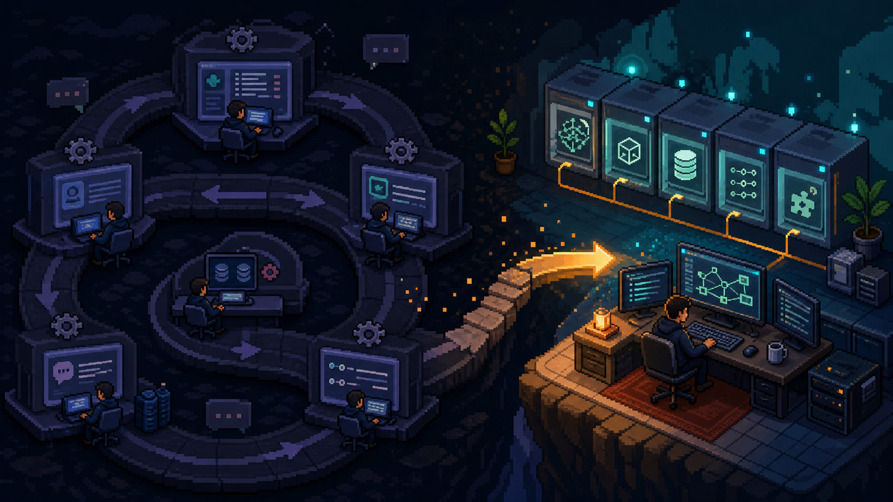
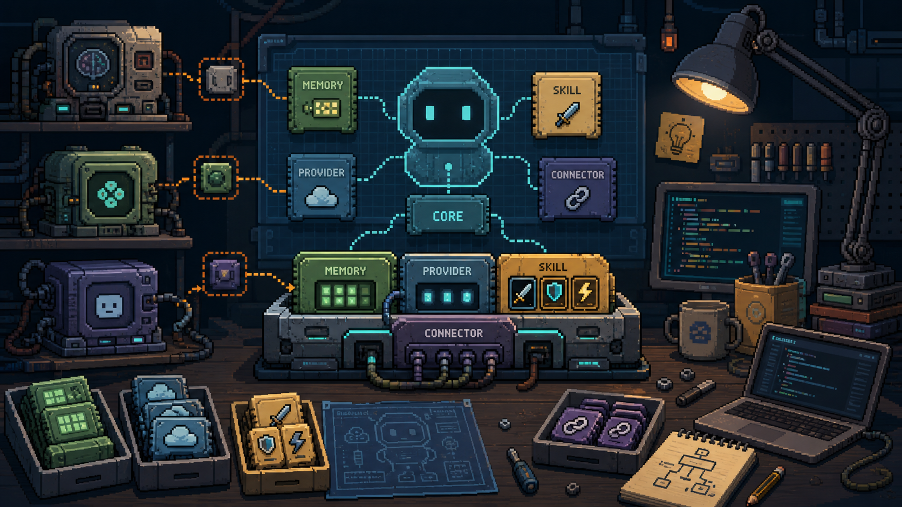

# 为什么我还是建议你自己搭一个 Agent

`OpenClaw`、`Hermes Agent` 已经很好了。  
这句话我认。

但我还是越来越想劝一句：

**如果你准备长期用个人 Agent，最好还是往“自己搭”这条路上走。**

不是因为现成的不好。  
而是因为真正有价值的，不是“装上一个很强的 Agent”，而是拥有一个 **越来越像你自己的系统**。

---

## 1. 现成框架给你的是起点，不是终点

我完全建议新手先从现成框架开始。

因为它们的价值很大：

- 上手快
- 有社区
- 有现成能力
- 能让你迅速感受到“24 小时在线 AI 助手”是什么体验

但问题也恰恰在这里。

很多人装上之后，就停在“会用”这一步了。

而真正拉开差距的，往往不是谁装得快，而是谁开始改。

改一行 prompt。  
加一个记忆文件。  
补一个自己的 Skill。  
做一个只服务自己工作流的小自动化。

**从那一刻开始，它才不再只是“别人做的工具”，而开始变成“你的系统”。**

---

## 2. 用别人的框架，很容易一直卡在配置层

这半年个人 Agent 生态有个特别明显的现象：

今天这个火，明天那个更强。  
然后你开始：

- 配环境
- 调 prompt
- 修记忆
- 改工作流

刚顺手一点，又有人说有个新的更猛。

然后重来一遍。

久而久之，你会发现自己一直在：

**迁移、配置、再迁移、再配置。**

看起来一直在升级，实际上很多人根本没真正跑到应用层。

所以我现在越来越在意的不是：

“哪个框架现在最强？”

而是：

**我能不能只换我想换的那一层。**

底层换了，记忆不动。  
模型换了，工具接口不动。  
框架换了，数据格式还在。

这个自由度，才是真正省时间的东西。

---

## 3. 自己搭过一次，你再看别人的项目，眼睛会完全不一样

没自己搭过的时候，看开源 Agent 容易是这种视角：

- 这个项目厉不厉害
- 这个框架强不强
- 这个功能我想不想要

但一旦你自己真的搭过，你的视角会变。

你开始自动拆层：

- 它的记忆层是不是比我干净？
- 它的多 provider 抽象是不是更好？
- 它的技能系统有没有我能直接借的设计？
- 它的依赖预检是不是值得抄？

也就是说，你不再是“选边站”，而是在“拆零件”。

这个能力很值钱。

因为从那以后，别人的项目不再只是“要不要迁移过去”，而是变成：

**我能不能把其中一层偷回来，装进我自己的系统里。**

---

## 4. 2026 年自己搭 Agent，门槛已经低得多了

很多人不自己搭，核心原因就一个：

觉得太难。

但现在有个变化非常现实：

你已经不需要什么都自己写了。

你完全可以这样开始：

- 觉得它话太多，改一句 prompt
- 觉得它不懂你的工作语境，加一个说明文件
- 想让它早上自动提醒你，让 `Claude Code` 或 `Codex` 帮你写脚本

你负责想效果。  
AI 负责写实现。  
你再继续改细节。

这件事的重要性在于：

**“自己搭”不再等于“从零硬写整套框架”。**

它更像是：

你不断把一个通用 Agent 改成更像你自己的样子。

改着改着，它就真成你的了。

---

## 5. 最核心的一点：进化主动权要留在自己手里

我现在越来越认同一句话：

**框架可以借，能力可以偷，但进化主动权最好留在自己手里。**

因为 Agent 和别的工具不一样。

它会越来越懂你：

- 你的日程
- 你的偏好
- 你的工作节奏
- 你的常用术语
- 你的长期记忆

这些东西越积越多，最后最重要的问题就不再是“它好不好用”，而是：

- 数据存哪儿
- 记忆格式谁定义
- 以后迁移靠不靠谱
- 哪天想换底层，会不会把自己几年积累全折腾没了

这就是为什么我会觉得：

**自己搭 Agent，本质上不是折腾技术，而是在拿回主权。**

---

## 我的建议很简单

如果你完全没接触过个人 Agent：

先用 `OpenClaw` 或 `Hermes Agent`，别犹豫。

但请你不要只停在“会用”。

认真用两周，然后把这些记下来：

- 哪一次你觉得它真懂你
- 哪一次你觉得它很烦
- 哪个需求你反复尝试都搞不定

接着，从一个最小改动开始：

- 改一句 prompt
- 加一层记忆
- 加一个自己的功能

你不需要一步到位。

你只需要让它 **一点点变成你自己的**。

---

## 最后一句

现成 Agent 解决的是“今天就能用”。  
自己搭 Agent 解决的是“半年后它还是你的”。

我不是劝你别用现成框架。  
我是劝你，别永远只停在用现成框架。

因为真正好用的 Agent，从来不是社区里最火的那个。  
而是那个越来越理解你、越来越贴合你、并且一直掌握在你自己手里的系统。
