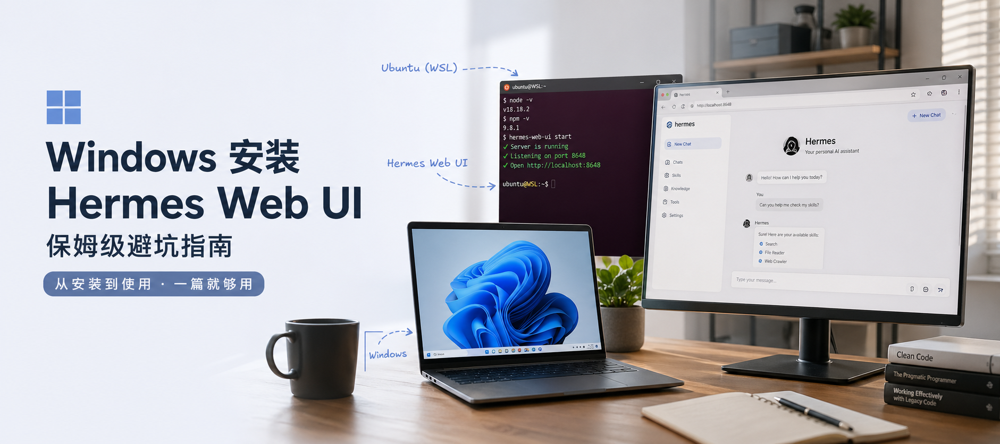
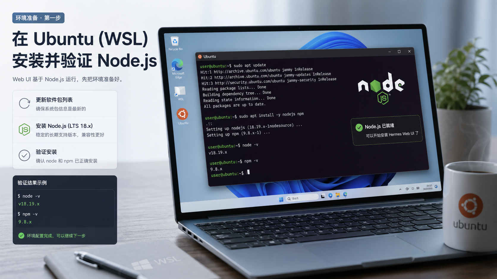
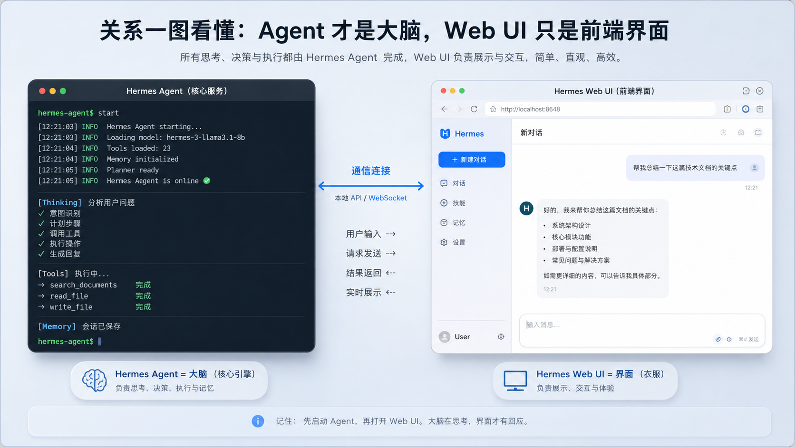
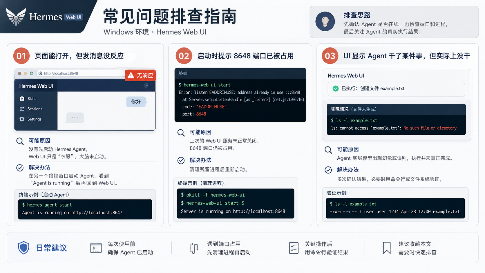

# Windows 上把 Hermes Web UI 跑起来，这一篇就够了

很多人第一次折腾 Hermes，注意力都放在 Agent 本身，等真正想把 Web UI 用起来的时候，才发现麻烦刚刚开始。

不是教程太旧，就是步骤跳得太快；不是 Node 版本不对，就是界面能打开、消息却发不出去。  
最折磨人的还不是“不会”，而是你明明已经装到八成了，却卡在最后那一点点细节上。

所以这篇不讲花活，也不讲概念。

只做一件事：

**把 Windows 上 Hermes Web UI 的安装、启动、后台运行和常见坑位，一次讲清楚。**

如果你只是想把它稳稳跑起来，照着这一篇做就够了。

---

## 先说清楚：你现在到底在装什么

很多人一开始就把这件事理解错了。

Hermes Web UI 不是一个“独立 AI 产品”，它更像是 Hermes Agent 外面那层更好看的操作界面。

你可以把它理解成：

- `Hermes Agent` 是真正干活的大脑
- `Web UI` 是你和这个大脑交互的前台界面

所以后面如果你遇到“页面能打开，但发消息没反应”，大概率不是 UI 坏了，而是 **Agent 根本没启动**。

这件事你越早理解，后面踩坑越少。

---

## 第一步：先把 Node.js 环境装对

Web UI 是基于 `Node.js` 的，所以不管你最终怎么用，Node 环境都得先装好。

如果你是在 Windows 下配合 `WSL / Ubuntu` 用 Hermes，那最稳的方式，就是直接把 Node 装进 Ubuntu 环境里，不要混着装。

建议优先用 `Node.js 18.x`。

原因很简单：

- 太老的版本，很多包会装不上
- 太新的版本，有些教程没验证过，稳定性不一定好
- `18.x` 处在一个比较省心的区间

你可以按这个顺序做：

1. 打开 Ubuntu 终端
2. 更新系统包列表
3. 安装 `Node.js 18.x`
4. 安装完成后，用版本命令检查 `node` 和 `npm`

验证通过的标准也很简单：

- 能看到 `node` 版本号
- 能看到 `npm` 版本号

如果命令报“找不到”，不用怀疑，大概率就是上一步没装成功，重新跑一遍安装流程就行。

这里有两个对新手最友好的提醒：

- 终端里提示你是否继续时，输入 `y` 回车就可以
- Linux 下输入密码时屏幕通常不会显示任何字符，这是正常现象，不是键盘坏了

---

## 第二步：安装 Hermes Web UI

环境装好之后，Web UI 本体的安装反而是最轻的一步。

本质上就是通过 `npm` 把它装下来。

这个阶段最重要的，不是死盯着滚动日志，而是学会看结果：

- 如果最后看到的是正常的依赖安装提示，比如 `added xxx packages`
- 而不是一整屏红色 `ERROR`

那基本就说明装成功了。

如果你在这里报错，最常见的原因通常不是 Web UI 本身，而是下面这几类：

- 网络不稳定
- npm 源太慢
- 之前的 Node / npm 环境没装好

所以这里别急着怀疑项目本体，先排网络和环境。

---

## 第三步：先用最基础的方式跑起来

我比较建议第一次启动时，不要一上来就折腾后台运行。

先用最基础、最容易观察问题的方式，把服务正向跑起来。

启动之后，你要重点盯的是终端输出里有没有这一类信息：

- 服务已启动
- 本地监听地址类似 `http://localhost:8648`

只要你看到这种本地地址，基本就说明 UI 服务本身已经起来了。

接下来做两件事：

1. 不要关掉这个终端窗口
2. 在 Windows 浏览器里打开对应的本地地址

这一步很多人会犯两个错：

- 看到地址就复制了，但顺手把终端关了
- 浏览器打不开，就以为没装成功，其实只是服务已经被自己关掉了

记住一句话就够了：

**第一次启动时，终端窗口就是服务本体。你把它关了，服务也就没了。**

如果你要结束这次运行，在终端里按 `Ctrl + C` 就行。

---

## 第四步：想省事，就让它后台跑

等你确认 Web UI 能正常打开之后，再考虑后台运行。

这是日常使用里最实用的一个小技巧，因为没人想一直挂着一个黑窗口在任务栏上。

后台运行的核心价值只有一个：

**把 Web UI 变成一个更像“常驻服务”的东西。**

这样你下一次再打开浏览器时，直接访问本地地址就能用，不用每次都盯着一个终端窗口。

但后台运行会带来一个新的问题：

**它一旦留在后台，下次你想关，就不能再靠当前窗口里的 `Ctrl + C` 了。**

所以你需要记住一个原则：

- 前台运行时，用 `Ctrl + C`
- 后台运行时，用清理进程的方式停掉它

这也是为什么很多人会碰到“8648 端口已被占用”：

不是 Web UI 坏了，而是你上一次开的后台进程还活着。

---

## 第五步：真正决定你能不能用起来的，不是 UI，而是 Agent

这一步是最关键的，也是最多人忽略的。

再说一遍：

**Hermes Agent 才是大脑，Web UI 只是前台。**

也就是说，你每次准备在网页里发消息之前，都要先确认另一边的 Hermes Agent 已经启动。

如果没有启动，会出现一种很有迷惑性的现象：

- 页面能进
- 历史能看
- 按钮也都在
- 但你发出去的内容没有真正被处理

很多人这时候会开始怀疑：

- 是不是前端坏了
- 是不是端口没通
- 是不是安装少了步骤

其实更常见的答案是：

**Agent 没在线。**

所以最稳的使用习惯是：

1. 先开一个终端，启动 Hermes Agent
2. 再开一个终端，启动 Hermes Web UI
3. 最后去浏览器里用界面

顺序不要反。

---

## 第六步：电脑一重启，为什么一切都像没开过一样

这也是 Windows 用户特别容易误判的地方。

很多人以为自己已经“安装好了”，所以电脑重启之后它应该像普通桌面软件一样自己恢复。

但 Hermes Web UI 在这个阶段更像是你手动拉起来的一组服务，而不是完整的系统自启动应用。

所以重启之后，你通常还是要手动做两件事：

- 启动 Hermes Agent
- 启动 Hermes Web UI

只要你理解了这一点，心理预期就会正常很多。

这不代表你装错了，只代表你现在用的还是“开发者式启动方式”，而不是“桌面软件式启动方式”。

---

## 最容易遇到的 3 个坑，顺手一次讲透

### 1. 页面能打开，但发消息没反应

优先检查 Agent。

这类问题里，最常见的不是 UI 崩了，而是 Hermes Agent 没启动，或者已经断掉了。

判断逻辑很简单：

- UI 能进，说明前台页面大概率没问题
- 交互没反应，优先去查大脑有没有在工作

### 2. 提示端口被占用

这通常意味着你之前启动过后台服务，但没有彻底关掉。

所以不要一看到端口占用就重装。

先清后台进程，再重新启动，往往就解决了。

### 3. UI 显示它做了某件事，但实际没做

这个问题更偏底层 Agent 或模型执行结果，不一定是 UI 的锅。

你可以把它理解成：

- UI 负责把信息展示给你
- 真正要不要执行成功，还是取决于 Agent 和底层模型

所以这里最好的习惯不是“盲信页面反馈”，而是：

**对关键结果做二次确认。**

尤其是涉及文件操作、命令执行、目录修改的时候，更应该确认一次。

---

## 最后给你一个最省事的理解框架

如果你觉得前面内容很多，可以直接记住下面这 4 句话：

1. `Node.js` 先装稳，优先用 `18.x`
2. Web UI 能打开，不代表 Hermes Agent 已经在工作
3. 想长期用，就学会前台启动和后台启动两套方式
4. 端口占用、消息没反应、结果不一致，基本都属于常见坑，不用一上来就重装

说到底，Windows 上跑 Hermes Web UI 真正难的，不是安装命令本身，而是你得知道：

**哪一层是界面，哪一层是服务，哪一层才是真正的大脑。**

这层关系一旦想明白，后面很多问题就不再像“玄学故障”，而只是普通的排查题。

---

## 一句话总结

Hermes Web UI 最容易把人绊住的，不是“装不上”，而是“装上了却没用对”。  
把 Node 环境、UI 服务、Agent 启动顺序和后台进程这几件事捋顺，Windows 上其实完全能用，而且会比纯命令行舒服很多。
