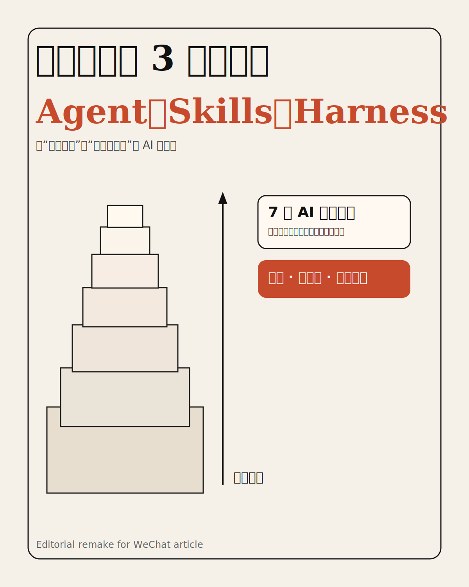
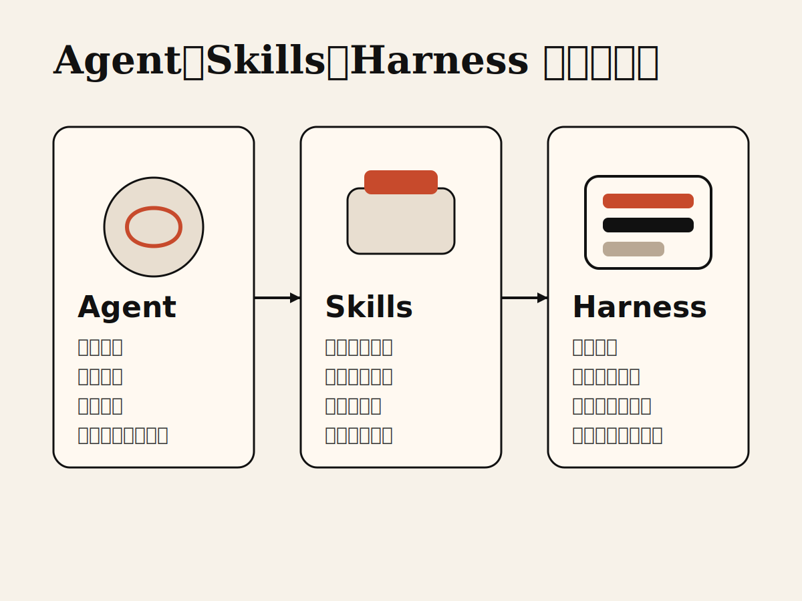
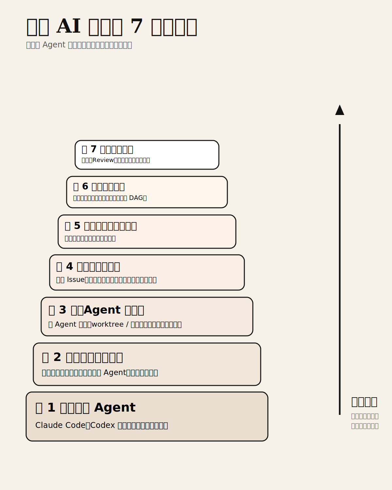
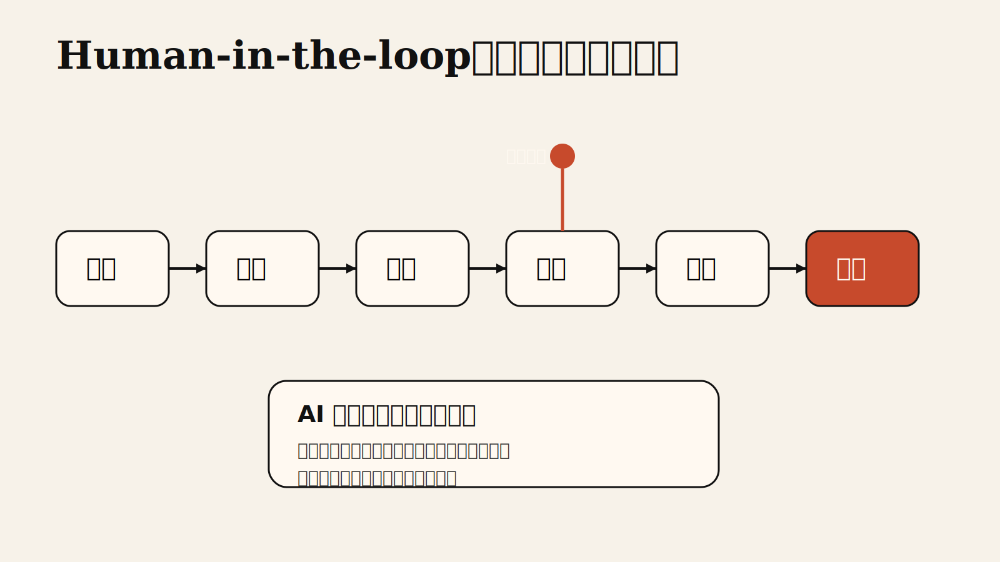

很多人一提到 AI，还停留在“会聊天、会写文案、会回答问题”这个阶段。

但真正开始做 AI 应用，尤其是做能自主执行任务的智能体系统时，你会很快遇到三个绕不开的词：

`Agent`

`Skills`

`Harness`

这三个概念，基本决定了一个 AI 系统是“会说话”，还是“能做事”；是“一次性 demo”，还是“能稳定落地的生产系统”。

这篇文章，我把 X 上那张信息量很大的长图，整理成一个更适合公众号读者理解的版本。

## 先用一句话说清楚三者关系

如果把一个 AI 系统看成一个团队：

- `Agent` 是大脑，负责理解目标、做判断、发起行动。
- `Skills` 是能力包，负责把常见动作做成可重复调用的模块。
- `Harness` 是运行环境，负责给 Agent 提供边界、上下文、工具接入与执行控制。

也就是说：

**Agent 决定“做什么”，Skills 决定“怎么做得更稳”，Harness 决定“在什么规则里做”。**

很多人之所以觉得“智能体不好用”，往往不是模型不够强，而是把这三件事全混在了一起。

结果就是：

- 让 Agent 一边思考，一边记规则，一边拼接工具调用
- 每次都从零提示，没有复用能力
- 执行环境没有边界，流程也没有检查点

系统当然会变得又脆又乱。

## 1. Agent：大脑与决策者

先说最容易理解的部分。

`Agent` 就是智能体本身，它像一个能看懂目标、拆分任务、调用工具、根据结果继续推进的“大脑”。

如果只是普通聊天，模型的任务是“给出回答”。

但一旦进入 Agent 模式，模型的任务就会升级为：

- 理解目标
- 规划步骤
- 选择工具
- 执行动作
- 读取反馈
- 再次决策

这时候，AI 不再只是回答你一句话，而是在一个任务链条里持续推进工作。

像 `Claude Code`、`Codex` 这类编码 Agent，本质上就是把大模型从“问答器”变成了“执行者”。

## 2. Skills：把经验沉淀成可复用能力

光有 Agent 还不够。

因为 Agent 虽然会推理，但并不意味着它每次都能稳定地把同一类任务做好。

这就需要 `Skills`。

你可以把 Skills 理解成：

**一套被整理过、被约束过、可重复调用的能力模块。**

比如：

- 写技术方案时，用固定结构输出
- 做代码审查时，先看风险，再看测试，再看风格
- 做公众号改写时，先重组逻辑，再统一语气，再处理标题和配图位

这些都可以变成 Skills。

有了 Skills，Agent 就不用每次从零开始猜，而是能站在既有方法论上工作。

所以，Skills 的价值并不是“替代模型”，而是**降低随机性，提升稳定性，沉淀组织经验**。

## 3. Harness：真正让系统跑起来的底座

第三个概念最容易被忽略，但往往最关键。

`Harness` 不是某一个模型，也不是某一个技能。

它更像是一个“运行框架”或者“操作系统外壳”，负责把 Agent、Skills、工具、上下文、权限、记忆、调度这些东西组织起来。

它决定的不是 AI 聪不聪明，而是：

- 这个系统能不能持续运行
- 会不会失控
- 能不能多人协作
- 能不能接进真实业务流程

一个成熟的 Harness，通常会处理这些事情：

- 工具接入
- 上下文管理
- 执行边界
- 权限控制
- 结果回传
- 日志记录
- 多 Agent 调度

说得更直白一点：

**没有 Harness，Agent 更像一个聪明的个人；有了 Harness，Agent 才像一个能进公司上班的组织成员。**

## 从“会写代码”到“能交付结果”：7 层能力栈

原图最有价值的地方，在于它没有停留在概念解释，而是把现代 AI 应用的落地过程拆成了 7 层。

我把它翻译成更适合产品、工程和内容从业者理解的话，大概是这样：

### 第 1 层：编码 Agent

这是最底层，也是大众最熟悉的一层。

比如 `Claude Code`、`Codex`，本质上都属于“能直接读写代码、执行命令、修改文件”的编码 Agent。

它解决的是：

“让 AI 真正开始动手。”

### 第 2 层：框架和运行时

当 Agent 不再只是一次性执行，而是要长期工作时，就需要运行时。

这层关注的是：

- 如何管理上下文
- 如何做持久记忆
- 如何做定时任务
- 如何支持多通道通信
- 如何使用子 Agent

也就是说，这一层让 Agent 从“单次调用”变成“持续运行的系统角色”。

### 第 3 层：Agent 编排器

当一个 Agent 不够时，就会出现多个 Agent 的分工协作。

这时需要编排器。

它负责：

- 把不同角色的 Agent 分配到不同任务
- 让多个 Agent 并行工作
- 用沙箱或 worktree 把它们彼此隔离
- 避免相互覆盖和干扰

这一层的本质，是把“单兵作战”升级成“团队协作”。

### 第 4 层：任务运行器

再往上一层，AI 就不只是处理临时命令，而是要接业务任务。

比如接入 `Issue Tracker`、任务池、需求系统。

典型流程会变成：

人创建任务 -> 运行器分配给 Agent -> Agent 执行并提交结果 -> 人类审查。

到这里，AI 已经不再是单纯的辅助工具，而是被接进了真实工作流。

### 第 5 层：全生命周期平台

这一层不只关心“做任务”，而是关心从需求到交付的全链路管理。

它会把这些东西整合起来：

- 需求管理
- Agent 编排
- 人类验证
- 执行结果追踪
- 交付状态管理

这意味着，AI 系统开始承担“平台能力”，而不是单点能力。

### 第 6 层：规格工具

这是很多团队接下来会越来越重视的一层。

为什么？

因为真正贵的，不是“写代码”本身，而是把模糊的人类想法，变成结构化、可执行、可验收的规格。

这层的作用是：

- 把需求整理成规格
- 把规格拆成任务 DAG
- 让 AI 提议任务图
- 让人类只做验证和审批

也就是说，它把“怎么定义问题”这件事开始系统化。

### 第 7 层：人类监督

最顶层不是 AI，而是人。

这点非常重要。

原图最成熟的地方，就在于它没有鼓吹“AI 自主取代人”，而是在最上层明确放回了“人类监督”。

人类在这一层做的事情包括：

- 审批方案
- Review PR
- 设定优先级
- 设计环境
- 审查结果

换句话说：

**AI 可以越来越负责执行，但最后的方向、标准和兜底，依然必须由人掌握。**

## 这张图真正有价值的地方

它最值得反复看的一点，不是概念新，而是它把很多人脑子里模糊的直觉，整理成了一个清晰结构：

不是只有模型就够了。

不是只有 Agent 就够了。

不是加几个工具就等于智能体系统。

真正的现代 AI 应用，往往是一个从下往上逐层抬升的系统：

- 底层是执行能力
- 中层是编排与运行
- 上层是流程接入与人类治理

这也解释了为什么很多“看起来很强的 AI demo”一进真实业务就崩：

因为它只有第 1 层，最多第 2 层；

但真正的企业交付，需要的是一直往上走到第 6、第 7 层。

## 对普通人来说，最该先理解什么？

如果你不是在搭平台，而只是想更好地理解 AI，我建议按这个顺序理解：

1. 先搞懂 `Agent`，理解 AI 为什么从问答变成执行
2. 再搞懂 `Skills`，理解为什么经验要模块化沉淀
3. 最后搞懂 `Harness`，理解为什么系统设计决定了 AI 能否真正落地

只要把这三个概念理顺，你对“智能体”这件事的理解，基本就会从模糊的流行词，升级成一个可落地的系统视角。

## 最后总结

这张图其实讲的不是三个术语，而是 AI 应用的一次角色升级：

- 从聊天，升级到执行
- 从单次调用，升级到持续运行
- 从个人辅助，升级到系统协作
- 从模型能力，升级到组织能力

所以，Agent、Skills、Harness 这三个词，表面上是在讲技术概念；

本质上是在回答同一个问题：

**怎样把一个“大模型”，变成一个“真正能交付结果的系统”。**

如果你今天只记住一句话，我希望是这句：

**Agent 是大脑，Skills 是能力模块，Harness 是把一切组织起来并确保可控运行的底座。**

把这三个词搞懂，你就不只是“认识 AI”，而是开始真正理解 AI 系统了。

---

原始来源：
[Zenzhe99 on X](https://x.com/Zenzhe99/status/2047523725730353362?s=20)
